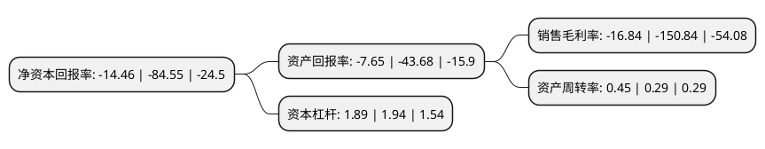

> 本页面由自动化程序生成于 2022年5月20日 01:10
> 内容可能存在错误，如有bug请提交issue至：https://github.com/Eroleice/doc-pi/issues
{.is-warning}

# 上市公司基本情况

## 基本资料

南宁八菱科技股份有限公司（以下简称“ST八菱”）成立于2001年07月17日，南宁市。于2011年11月11日在深交所中小板上市。

ST八菱注册资本28,333.116万元，主要产品:汽车热交换器，保险杠等汽车零部件产品的研发，生产和销售。主营业务:散热器，中冷器，油冷器，冷凝器，HVAC，保险杠等。以下是详细信息：

- 公司名称: 南宁八菱科技股份有限公司
- 股票代码: 002592.SZ
- 所在地: 广西 - 南宁市
- 成立日期: 2001年07月17日
- 注册资本: 28,333.116万元
- 法定代表人: 顾瑜
- 主营业务: 主要产品:汽车热交换器，保险杠等汽车零部件产品的研发，生产和销售主营业务:散热器，中冷器，油冷器，冷凝器，HVAC，保险杠等
- 公司官网: www.baling.com.cn
- 公司介绍: 公司是一家致力于提供汽车热管理方案且具有自主设计、自主创新能力的高新技术企业，主要从事汽车热交换器、保险杠等汽车零部件产品的研发、生产和销售，主要产品包括散热器、中冷器、油冷器、冷凝器、HVAC、保险杠等。公司产品广泛应用于传统燃油汽车、新能源汽车、工程机械、农用机械、发电机组、国防装备、计算机等热交换领域。公司主要市场是国内汽车整车厂商，并服务于整车配套市场。公司开始涉足新材料、游戏和文化业务及其他新型产业，积极布局多元化发展战略。

## 股东及高管情况

上市公司第一大股东为杨竞忠，持股66,433,049股，占比23.45%，**疑似为**上市公司实际控制人。

截至2022年03月31日，上市公司的前十大股东中，共有8名自然人股东，1名机构股东，1个产品账户，其中5%以上大股东共有3名。上市公司前十大股东明细如下：

> 未能通过持股比例判定出上市公司实际控制人（持股30%以上）
> 可能存在通过间接持股、联合持股、协议控制等方式拥有实际控制权的主体，具体请参考上市公司定期公告！
{.is-warning}

> 截至2022年03月31日，上市公司前十大股东信息如下：

| 股东名称 | 持股数量（股） | 持股比例 |
| --- | --- | --- |
| 杨竞忠 | 66,433,049 | 23.45% |
| 顾瑜 | 24,688,427 | 8.71% |
| 南宁八菱科技股份有限公司-第五期员工持股计划 | 16,826,900 | 5.94% |
| 黄志强 | 11,474,571 | 4.05% |
| 烟台安林果业有限公司 | 4,114,000 | 1.45% |
| 陆晖 | 2,701,839 | 0.95% |
| 黄生田 | 1,937,963 | 0.68% |
| 黄显宗 | 1,635,200 | 0.58% |
| 胡仕琼 | 1,543,200 | 0.54% |
| 任宁 | 1,212,500 | 0.43% |

## 利润表分析

上市公司2021年总收入为6.09亿元，净利润为-1.03亿元，**未实现盈利**。

## 杜邦分析

> 数据列示周期：2021年 | 2020年 | 2019年
{.is-info}

上市公司的净资产收益率在近一年有所下降，下降幅度为-82.9%，其变化情况分解如下：
- 上市公司的销售毛利率在近一年下降了-88.84%，可能是生产效率的下降、商品原材料价格上涨或商品价格的下跌所致。
- 上市公司的资产周转率在近一年上升了55.17%，可能是源自于更快的销售回款或库存管理效果提升。
- 上市公司的财务杠杆比率在近一年下降了-2.58%，可能是减少负债降低财务费用。

