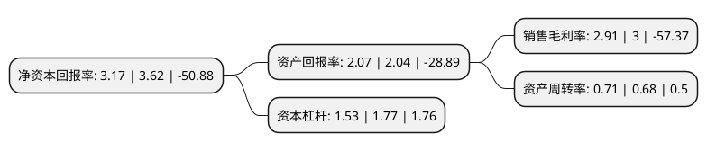

> 本页面由自动化程序生成于 2022年5月20日 01:11
> 内容可能存在错误，如有bug请提交issue至：https://github.com/Eroleice/doc-pi/issues
{.is-warning}

# 上市公司基本情况

## 基本资料

北京威卡威汽车零部件股份有限公司（以下简称“京威股份”）成立于2002年07月03日，北京市。于2012年03月09日在深交所中小板上市。

京威股份注册资本150,000万元，主要产品:乘用车内外饰件系统，其核心技术集中在多材质成型和表面处理工艺环节。主营业务:乘用车内外饰件系统综合制造和综合服务，主要为中高档乘用车提供内外饰件系统，并提供配套研发和相关服务。以下是详细信息：

- 公司名称: 北京威卡威汽车零部件股份有限公司
- 股票代码: 002662.SZ
- 所在地: 北京 - 北京市
- 成立日期: 2002年07月03日
- 注册资本: 150,000万元
- 法定代表人: 李璟瑜
- 主营业务: 主要产品:乘用车内外饰件系统，其核心技术集中在多材质成型和表面处理工艺环节主营业务:乘用车内外饰件系统综合制造和综合服务，主要为中高档乘用车提供内外饰件系统，并提供配套研发和相关服务
- 公司官网: www.beijing-wkw.com
- 公司介绍: 公司是一家中德合资的乘用车内外饰件系统综合制造商和综合服务商，主要为中高档乘用车提供内外饰件系统，并提供配套研发和相关服务。公司具有很强的产品模块化生产制造能力、同步开发能力和整体配套方案设计能力，是中国中高档乘用车内外饰件行业的领先者，尤其在中高档乘用车外饰件行业更具优势。公司一贯坚持“稳健经营、和谐发展”的经营理念，致力于推动中国汽车内外饰件行业达到国际先进水平。面对中国内外饰件行业的整体配套水平难以满足高端乘用车要求的现实，经过不断努力，公司已形成铝合金、不锈钢、冷轧及镀锌钢板、塑料和橡胶等涵盖主流基材的汽车内外饰件系统材料成型和加工的生产制造能力，实现了铝合金氧化、金属喷漆、金属亚光喷粉、金属光亮喷粉、塑料喷漆等表面处理工艺技术的平台化集成，公司已发展成为满足不同市场定位的整车配套需求的内外饰件系统综合制造商。

## 股东及高管情况

上市公司第一大股东为北京中环投资管理有限公司，持股456,000,000股，占比30.4%，为上市公司实际控制人。

截至2022年05月18日，上市公司的前十大股东中，共有4名自然人股东，6名机构股东，其中5%以上大股东共有4名。上市公司前十大股东明细如下：

> 截至2022年05月18日，上市公司前十大股东信息如下：

| 股东名称 | 持股数量（股） | 持股比例 |
| --- | --- | --- |
| 北京中环投资管理有限公司 | 456,000,000 | 30.4% |
| 北京中环投资管理有限公司 | 456,000,000 | 30.4% |
| 德国威卡威股份有限公司 | 273,000,087 | 18.2% |
| 德国威卡威股份有限公司 | 258,000,087 | 17.2% |
| 宁波惠联投资控股有限公司 | 55,600,000 | 3.71% |
| 上海华德信息咨询有限公司 | 14,000,000 | 0.93% |
| 张素芬 | 12,860,000 | 0.86% |
| 陆秋燕 | 9,014,800 | 0.6% |
| 韩娅平 | 7,950,000 | 0.53% |
| 杨龙臣 | 5,056,404 | 0.34% |

## 利润表分析

上市公司2021年总收入为35.08亿元，净利润为1.02亿元，实现盈利。

## 杜邦分析

> 数据列示周期：2021年 | 2020年 | 2019年
{.is-info}

上市公司的净资产收益率在近一年有所下降，下降幅度为-12.43%，其变化情况分解如下：
- 上市公司的销售毛利率在近一年下降了-3%，可能是生产效率的下降、商品原材料价格上涨或商品价格的下跌所致。
- 上市公司的资产周转率在近一年上升了4.41%，可能是源自于更快的销售回款或库存管理效果提升。
- 上市公司的财务杠杆比率在近一年下降了-13.56%，可能是减少负债降低财务费用。

