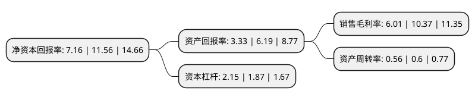

> 本页面由自动化程序生成于 2022年5月20日 01:11
> 内容可能存在错误，如有bug请提交issue至：https://github.com/Eroleice/doc-pi/issues
{.is-warning}

# 上市公司基本情况

## 基本资料

长鹰信质科技股份有限公司（以下简称“长鹰信质”）成立于1990年07月14日，台州市。于2012年03月16日在深交所中小板上市。

长鹰信质注册资本40,388万元，主要产品:汽车发电机定子及总成，微特电机转子，电动自行车定子及总成，电梯曳引机定子，电动工具电机转子，VVT(汽车可变气门正时系统)，家电电机转子等。主营业务:各类电机零部件的自主创新，研发，生产制造和销售。以下是详细信息：

- 公司名称: 长鹰信质科技股份有限公司
- 股票代码: 002664.SZ
- 所在地: 浙江 - 台州市
- 成立日期: 1990年07月14日
- 注册资本: 40,388万元
- 法定代表人: 尹巍
- 主营业务: 主要产品:汽车发电机定子及总成，微特电机转子，电动自行车定子及总成，电梯曳引机定子，电动工具电机转子，VVT(汽车可变气门正时系统)，家电电机转子等主营业务:各类电机零部件的自主创新，研发，生产制造和销售
- 公司官网: www.chinaxinzhi.com
- 公司介绍: 公司是一家集各类电机零部件的自主创新、研发、生产制造和销售为一体的高新技术企业、浙江省绿色企业、中国汽车电子电器行业十强企业，生产的产品主要为国内外众多大型电机电器厂商提供专业配套服务，系全球最大的汽车发电机定子铁芯供应商。公司专注于电机及其核心零部件产品制造的工艺技术创新和新产品研发，主要产品在技术水平、产品质量等方面处于行业领先地位，在市场上具有极强的竞争优势，同时公司产品被评为浙江省名牌产品，公司商标被评为浙江省著名商标，公司多年来产品获得来自法雷奥(Valeo)、博世(Bosch)等优秀供应商荣誉称号。公司从传统的电机零部件制造商，近年来已逐步向科技型企业的转型，并取得丰硕成果。

## 股东及高管情况

上市公司第一大股东为西藏长鹰云启信息科技有限公司，持股104,005,200股，占比25.75%，**疑似为**上市公司实际控制人。

截至2022年03月31日，上市公司的前十大股东中，共有4名自然人股东，2名机构股东，4个产品账户，其中5%以上大股东共有3名。上市公司前十大股东明细如下：

> 未能通过持股比例判定出上市公司实际控制人（持股30%以上）
> 可能存在通过间接持股、联合持股、协议控制等方式拥有实际控制权的主体，具体请参考上市公司定期公告！
{.is-warning}

> 截至2022年03月31日，上市公司前十大股东信息如下：

| 股东名称 | 持股数量（股） | 持股比例 |
| --- | --- | --- |
| 西藏长鹰云启信息科技有限公司 | 104,005,200 | 25.75% |
| 尹兴满 | 43,804,800 | 10.85% |
| 叶小青 | 39,750,000 | 9.84% |
| 上海迎水投资管理有限公司-迎水龙凤呈祥24号私募证券投资基金 | 13,894,050 | 3.44% |
| 尹强 | 11,250,000 | 2.79% |
| 上栗县创鼎投资有限公司 | 10,050,000 | 2.49% |
| 中国建设银行股份有限公司-信达澳银新能源产业股票型证券投资基金 | 6,702,366 | 1.66% |
| 尹巍 | 6,292,550 | 1.56% |
| 广发银行股份有限公司-国泰聚信价值优势灵活配置混合型证券投资基金 | 5,600,000 | 1.39% |
| 童虎(北京)基金管理有限公司-童虎-私募学院菁英8号基金 | 4,705,000 | 1.16% |

## 利润表分析

上市公司2021年总收入为33.55亿元，净利润为2.01亿元，实现盈利。

## 杜邦分析

> 数据列示周期：2021年 | 2020年 | 2019年
{.is-info}

上市公司的净资产收益率在近一年有所下降，下降幅度为-38.06%，其变化情况分解如下：
- 上市公司的销售毛利率在近一年下降了-42.04%，可能是生产效率的下降、商品原材料价格上涨或商品价格的下跌所致。
- 上市公司的资产周转率在近一年下降了-6.67%，可能是源自于更慢的销售回款或库存管理效果下降。
- 上市公司的财务杠杆比率在近一年上升了14.97%，可能是增加负债扩大生产规模。

