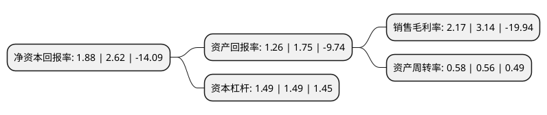

> 本页面由自动化程序生成于 2022年5月20日 01:11
> 内容可能存在错误，如有bug请提交issue至：https://github.com/Eroleice/doc-pi/issues
{.is-warning}

# 上市公司基本情况

## 基本资料

浙江世宝股份有限公司（以下简称“浙江世宝”）成立于1993年06月02日，金华市。于2012年11月02日在深交所中小板上市。

浙江世宝注册资本78,964.464万元，主要产品:应用于商用车的循球球转向器，电子助力转向系统(EPS)，助力油缸，转向垂臂，转向拉杆;应用于乘用车的齿轮齿条转向器，电子助力转向系统(EPS)，转向节，转向管柱，中间轴;应用于自动驾驶和无人驾驶汽车的线控转向，智能转向系统;应用于汽车发动机和底盘的各类精密铸件。主营业务:汽车转向器及其他转向系统关键零部件的研发，设计，制造及销售。以下是详细信息：

- 公司名称: 浙江世宝股份有限公司
- 股票代码: 002703.SZ
- 所在地: 浙江 - 金华市
- 成立日期: 1993年06月02日
- 注册资本: 78,964.464万元
- 法定代表人: 张世权
- 主营业务: 主要产品:应用于商用车的循球球转向器，电子助力转向系统(EPS)，助力油缸，转向垂臂，转向拉杆;应用于乘用车的齿轮齿条转向器，电子助力转向系统(EPS)，转向节，转向管柱，中间轴;应用于自动驾驶和无人驾驶汽车的线控转向，智能转向系统;应用于汽车发动机和底盘的各类精密铸件主营业务:汽车转向器及其他转向系统关键零部件的研发，设计，制造及销售
- 公司官网: www.zjshibao.com
- 公司介绍: 公司是国内率先自主开发汽车液压助力转向系统、汽车电动助力转向系统的企业之一，力争在行业内率先实现智能驾驶技术与系统集成能力，保持公司持续发展的竞争优势。公司在汽车行业积累了超过三十年的系统配套经验，客户资源多元化并且国际化，是众多声誉良好的汽车集团的一级配套商，包括一汽集团、东风集团、江淮汽车、吉利汽车、北汽集团、奇瑞汽车、赛帕汽车、戴姆勒集团、金龙客车、长安马自达、众泰汽车等。

## 股东及高管情况

上市公司第一大股东为浙江世宝控股集团有限公司，持股341,786,098股，占比43.28%，为上市公司实际控制人。

截至2022年03月31日，上市公司的前十大股东中，共有5名自然人股东，2名机构股东，1个产品账户，2个海外主体，其中5%以上大股东共有3名。上市公司前十大股东明细如下：

> 截至2022年03月31日，上市公司前十大股东信息如下：

| 股东名称 | 持股数量（股） | 持股比例 |
| --- | --- | --- |
| 浙江世宝控股集团有限公司 | 341,786,098 | 43.28% |
| 香港中央结算(代理人)有限公司 | 217,855,966 | 27.59% |
| 香港中央结算有限公司(陆股通) | 217,855,966 | 27.59% |
| 张世权 | 26,391,580 | 3.34% |
| 上海浦东发展银行股份有限公司-景顺长城新能源产业股票型证券投资基金 | 8,132,100 | 1.03% |
| 北京弘建恒通投资有限公司 | 4,600,000 | 0.58% |
| 黎虹 | 1,860,000 | 0.24% |
| 黄超 | 1,800,000 | 0.23% |
| 史建娟 | 1,419,100 | 0.18% |
| 何正兴 | 1,337,276 | 0.17% |

## 利润表分析

上市公司2021年总收入为11.77亿元，净利润为0.25亿元，实现盈利。

## 杜邦分析

> 数据列示周期：2021年 | 2020年 | 2019年
{.is-info}

上市公司的净资产收益率在近一年有所下降，下降幅度为-28.24%，其变化情况分解如下：
- 上市公司的销售毛利率在近一年下降了-30.89%，可能是生产效率的下降、商品原材料价格上涨或商品价格的下跌所致。
- 上市公司的资产周转率在近一年上升了3.57%，可能是源自于更快的销售回款或库存管理效果提升。
- 上市公司的财务杠杆比率在近一年下降了0%，可能是减少负债降低财务费用。

