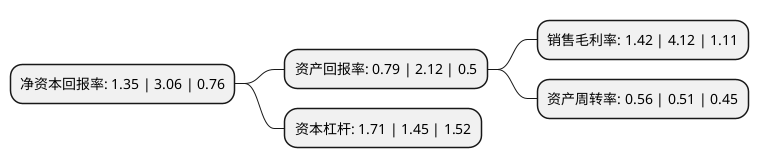

> 本页面由自动化程序生成于 2022年5月20日 01:11
> 内容可能存在错误，如有bug请提交issue至：https://github.com/Eroleice/doc-pi/issues
{.is-warning}

# 上市公司基本情况

## 基本资料

怀集登云汽配股份有限公司（以下简称“登云股份”）成立于1971年05月10日，肇庆市。于2014年02月19日在深交所中小板上市。

登云股份注册资本13,800万元，主要产品:汽车发动机进排气门系列产品。主营业务:汽车发动机进排气门系列产品的研发，生产与销售。以下是详细信息：

- 公司名称: 怀集登云汽配股份有限公司
- 股票代码: 002715.SZ
- 所在地: 广东 - 肇庆市
- 成立日期: 1971年05月10日
- 注册资本: 13,800万元
- 法定代表人: 杨海坤
- 主营业务: 主要产品:汽车发动机进排气门系列产品主营业务:汽车发动机进排气门系列产品的研发，生产与销售
- 公司官网: www.huaijivalve.com
- 公司介绍: 公司是专注于汽车发动机进排气门系列产品的研发、生产与销售，是国内气门行业的龙头企业之一。公司产品覆盖了发电机组、船机、工程机械、重型车、轻卡、大型客车、微车、轿车、混合动力汽车等，产品型号总计达一万多种。公司已为康明斯、大柴、锡柴、潍柴、朝柴、玉柴、东安三菱、海马、奇瑞、比亚迪等近20家国内著名整车及主机制造厂商提供配套生产服务；公司还为大柴、朝柴、东风汽车等公司配套供应军车用气门。出口产品覆盖欧、美、日车系大部分机型；产品远销美国、意大利、英国、日本、巴西、阿根廷、墨西哥、中东及东南亚等国家和地区。公司被认定为“国家汽车零部件出口基地企业”、“国家高新技术企业”、“中国内燃机零部件行业排头兵企业”、“中国汽车零部件气门龙头企业”、“中国优秀民营科技企业”、“广东省创新型企业”、“广东省民营科技企业”、“广东省技术创新优势企业”、“广东省清洁生产企业”。公司多次获国家级、省级新产品奖，所生产的“登云”牌气门被认定为“广东省名牌产品”，所拥有的“登云”商标被认定为“广东省著名商标”，并连续多年获得主机厂商的“A级供应商”、“优秀供应商”等荣誉。

## 股东及高管情况

上市公司第一大股东为益科正润投资集团有限公司，持股29,843,013股，占比21.63%，**疑似为**上市公司实际控制人。

截至2022年03月31日，上市公司的前十大股东中，共有8名自然人股东，2名机构股东，其中5%以上大股东共有3名。上市公司前十大股东明细如下：

> 未能通过持股比例判定出上市公司实际控制人（持股30%以上）
> 可能存在通过间接持股、联合持股、协议控制等方式拥有实际控制权的主体，具体请参考上市公司定期公告！
{.is-warning}

> 截至2022年03月31日，上市公司前十大股东信息如下：

| 股东名称 | 持股数量（股） | 持股比例 |
| --- | --- | --- |
| 益科正润投资集团有限公司 | 29,843,013 | 21.63% |
| 北京维华祥资产管理有限公司 | 11,563,119 | 8.38% |
| 张弢 | 10,024,480 | 7.26% |
| 欧洪先 | 5,366,057 | 3.89% |
| 赵文劼 | 4,378,650 | 3.17% |
| 李盘生 | 3,167,154 | 2.3% |
| 邱子聪 | 2,686,000 | 1.95% |
| 李虹 | 2,400,000 | 1.74% |
| 罗天友 | 2,299,455 | 1.67% |
| 邱佩娜 | 1,665,000 | 1.21% |

## 利润表分析

上市公司2021年总收入为4.85亿元，净利润为0.06亿元，实现盈利。

## 杜邦分析

> 数据列示周期：2021年 | 2020年 | 2019年
{.is-info}

上市公司的净资产收益率在近一年有所下降，下降幅度为-55.88%，其变化情况分解如下：
- 上市公司的销售毛利率在近一年下降了-65.53%，可能是生产效率的下降、商品原材料价格上涨或商品价格的下跌所致。
- 上市公司的资产周转率在近一年上升了9.8%，可能是源自于更快的销售回款或库存管理效果提升。
- 上市公司的财务杠杆比率在近一年上升了17.93%，可能是增加负债扩大生产规模。

