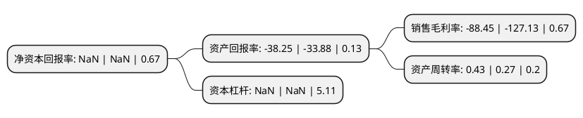

> 本页面由自动化程序生成于 2022年5月20日 01:12
> 内容可能存在错误，如有bug请提交issue至：https://github.com/Eroleice/doc-pi/issues
{.is-warning}

# 上市公司基本情况

## 基本资料

深圳市索菱实业股份有限公司（以下简称“索菱股份”）成立于1997年10月17日，深圳市。于2015年06月11日在深交所中小板上市。

索菱股份注册资本84,350.803万元，主营业务:本公司是一家专业从事CID系统的研发，生产，销售，并以此为基础向客户提供专业车联网服务的国家级高新技术企业。主要产品:为CID系统。以下是详细信息：

- 公司名称: 深圳市索菱实业股份有限公司
- 股票代码: 002766.SZ
- 所在地: 广东 - 深圳市
- 成立日期: 1997年10月17日
- 注册资本: 84,350.803万元
- 法定代表人: 盛家方
- 主营业务: 主营业务:本公司是一家专业从事CID系统的研发，生产，销售，并以此为基础向客户提供专业车联网服务的国家级高新技术企业主要产品:为CID系统
- 公司官网: www.szsoling.com
- 公司介绍: 公司是一家专业从事CID系统的研发、生产、销售、并以此为基础向客户提供专业车联网服务的国家级高新技术企业，属于行业内领先企业之一。公司自主研发的CID系统，是以车载导航为基础功能,并在此基础上将智能化CID系统延伸成为车联网的入口,为客户提供专业化、个性化、智能化的行车解决方案。公司熟练掌握了CID系统从硬件设计、软件开发到系统整合的关键技术，且多项技术达到行业领先水平。2017年4月公司完成收购三旗通信和英卡科技。公司业务模式已经由上市前期的后装业务为主，逐步转型为以前装业务为主，并且在后装市场与腾讯公司合作新业务模式；并且通过持续研发投入以及外延并购，成为具备国际领先“CID系统+车联网软硬件服务+智能座舱平台”的完整车联网产品及智能一体化解决方案的公司。

## 股东及高管情况

上市公司第一大股东为肖行亦，持股143,334,030股，占比16.99%，**疑似为**上市公司实际控制人。

截至2022年04月21日，上市公司的前十大股东中，共有3名自然人股东，6名机构股东，1个产品账户，其中5%以上大股东共有7名。上市公司前十大股东明细如下：

> 未能通过持股比例判定出上市公司实际控制人（持股30%以上）
> 可能存在通过间接持股、联合持股、协议控制等方式拥有实际控制权的主体，具体请参考上市公司定期公告！
{.is-warning}

> 截至2022年04月21日，上市公司前十大股东信息如下：

| 股东名称 | 持股数量（股） | 持股比例 |
| --- | --- | --- |
| 肖行亦 | 143,334,030 | 16.99% |
| 深圳市索菱实业股份有限公司破产企业财产处置专用账户 | 138,627,165 | 16.43% |
| 汤和控股有限公司 | 130,000,000 | 15.41% |
| 深圳市高新投集团有限公司 | 101,252,117 | 12% |
| 深圳市高新投集团有限公司 | 101,252,117 | 12% |
| 中山乐兴企业管理咨询有限公司 | 62,834,096 | 7.45% |
| 霍尔果斯摩山商业保理有限公司 | 43,433,428 | 5.15% |
| 建华建材(中国)有限公司 | 19,857,501 | 2.35% |
| 李梅芳 | 7,900,000 | 0.94% |
| 李丽 | 6,838,400 | 0.81% |

## 利润表分析

上市公司2021年总收入为7.61亿元，净利润为-6.74亿元，**未实现盈利**。

## 杜邦分析

> 数据列示周期：2021年 | 2020年 | 2019年
{.is-info}

上市公司的净资产收益率在近一年有所下降，下降幅度为NaN%，其变化情况分解如下：
- 上市公司的销售毛利率在近一年下降了-30.43%，可能是生产效率的下降、商品原材料价格上涨或商品价格的下跌所致。
- 上市公司的资产周转率在近一年上升了59.26%，可能是源自于更快的销售回款或库存管理效果提升。
- 上市公司的财务杠杆比率在近一年下降了NaN%，可能是减少负债降低财务费用。

