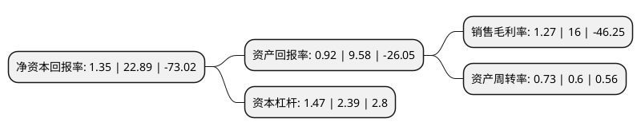

> 本页面由自动化程序生成于 2022年5月20日 01:12
> 内容可能存在错误，如有bug请提交issue至：https://github.com/Eroleice/doc-pi/issues
{.is-warning}

# 上市公司基本情况

## 基本资料

深圳市路畅科技股份有限公司（以下简称“路畅科技”）成立于2006年08月17日，深圳市。于2016年10月12日在深交所中小板上市。

路畅科技注册资本12,000万元，主营业务:主要从事汽车车载导航系统的开发，生产，销售及服务;主要产品为汽车车载数码导航信息系统。以下是详细信息：

- 公司名称: 深圳市路畅科技股份有限公司
- 股票代码: 002813.SZ
- 所在地: 广东 - 深圳市
- 成立日期: 2006年08月17日
- 注册资本: 12,000万元
- 法定代表人: 朱君冰
- 主营业务: 主营业务:主要从事汽车车载导航系统的开发，生产，销售及服务;主要产品为汽车车载数码导航信息系统
- 公司官网: www.roadrover.cn
- 公司介绍: 公司是一家致力于汽车智能化及智能出行产品及解决方案提供的高科技公司，是一家集产品研发、生产、销售和服务于一体的民营高新技术企业、国家火炬计划重点高新技术企业，也是中国较早投身于车载导航、汽车智能驾驶舱及车联网产业的企业。公司拥有基于CSR、飞思卡尔、高通、杰发科、全志等系列嵌入式芯片，基于WINCE、Android、QNX嵌入式操作系统开发的系列平台和面向汽车厂前装的智能车机、液晶仪表、行车记录仪、360度全景及汽车电动尾门等产品。公司是行业内较早开发北斗/GPS双模车载导航产品，较早研发车联网产品和技术的公司,一贯秉承务实、平等、真诚、互惠的原则，积极拓展国内外前装和后装市场。公司是“广东省车联网智能信息系统工程技术研究中心”，“深圳市车联网智能信息系统工程技术研究开发中心”，“深圳市车载多媒体信息娱乐技术工程实验室”，获得“广东省科学技术奖”、“深圳市科技进步奖”、“卫星导航定位科学技术奖”等省部级奖项。

## 股东及高管情况

上市公司第一大股东为中联重科股份有限公司，持股64,584,000股，占比53.82%，为上市公司实际控制人。

截至2022年05月09日，上市公司的前十大股东中，共有6名自然人股东，4名机构股东，其中5%以上大股东共有6名。上市公司前十大股东明细如下：

> 截至2022年05月09日，上市公司前十大股东信息如下：

| 股东名称 | 持股数量（股） | 持股比例 |
| --- | --- | --- |
| 中联重科股份有限公司 | 64,584,000 | 53.82% |
| 中联重科股份有限公司 | 64,584,000 | 53.82% |
| 郭秀梅 | 42,999,690 | 35.83% |
| 郭秀梅 | 42,999,690 | 35.83% |
| 中联重科股份有限公司 | 35,988,000 | 29.99% |
| 郭秀梅 | 14,404,440 | 12% |
| 朱玉光 | 349,910 | 0.29% |
| 林琳 | 262,000 | 0.22% |
| 肖慧芝 | 251,100 | 0.21% |
| 华泰证券股份有限公司 | 232,735 | 0.19% |

## 利润表分析

上市公司2021年总收入为4.1亿元，净利润为0.05亿元，实现盈利。

## 杜邦分析

> 数据列示周期：2021年 | 2020年 | 2019年
{.is-info}

上市公司的净资产收益率在近一年有所下降，下降幅度为-94.1%，其变化情况分解如下：
- 上市公司的销售毛利率在近一年下降了-92.06%，可能是生产效率的下降、商品原材料价格上涨或商品价格的下跌所致。
- 上市公司的资产周转率在近一年上升了21.67%，可能是源自于更快的销售回款或库存管理效果提升。
- 上市公司的财务杠杆比率在近一年下降了-38.49%，可能是减少负债降低财务费用。

