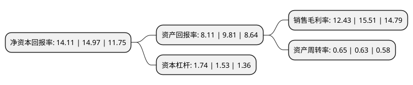

> 本页面由自动化程序生成于 2022年5月20日 01:13
> 内容可能存在错误，如有bug请提交issue至：https://github.com/Eroleice/doc-pi/issues
{.is-warning}

# 上市公司基本情况

## 基本资料

浙江锋龙电气股份有限公司（以下简称“锋龙股份”）成立于2003年06月17日，绍兴市。于2018年04月03日在深交所中小板上市。

锋龙股份注册资本19,914.014万元，主要产品:点火器，飞轮，汽缸等园林机械关键零部件和多种品规的汽车精密铝压铸零部件。主营业务:园林机械零部件及汽车零部件的研发，生产和销售。以下是详细信息：

- 公司名称: 浙江锋龙电气股份有限公司
- 股票代码: 002931.SZ
- 所在地: 浙江 - 绍兴市
- 成立日期: 2003年06月17日
- 注册资本: 19,914.014万元
- 法定代表人: 董剑刚
- 主营业务: 主要产品:点火器，飞轮，汽缸等园林机械关键零部件和多种品规的汽车精密铝压铸零部件主营业务:园林机械零部件及汽车零部件的研发，生产和销售
- 公司官网: www.fenglong.com
- 公司介绍: 公司是专业从事通用汽油机用磁电机研发、制造企业，主要产品为飞轮、点火器，是浙江省科技型中小企业和国家重点扶持的高新技术企业。产品主要出口的到欧美、日本等国家和地区，主要用于房车、机械手臂、园林工具等。公司拥有稳定优质的客户群体和丰富的生产经验，与MTD、TTI、HUSQVARNA、EMAK、STIHL等全球知名园林机械整机生产商以及Dayco、东风汽车零部件等国内外知名汽车零部件制造企业建立了配套关系。产品获得了客户的广泛认可，公司曾被MTD、STIHL、Dayco评为“最佳供应商”、“最佳压铸件供应商”、“优秀质量奖”等。公司拥有较强的研发技术实力，被认定为“高新技术企业”、“省级高新技术研究开发中心”、“浙江省科技型中小企业”、“绍兴市专利示范企业”等，研发项目被列为“国家火炬计划产业化示范项目”、“国家科技型中小企业技术创新基金项目”等，并多次荣获省、市、区级科技成果奖励。“锋龙”商标及相关品牌先后被认定为“浙江省著名商标”、“浙江省知名商号”、“浙江名牌产品”、“浙江出口名牌”。

## 股东及高管情况

上市公司第一大股东为绍兴诚锋实业有限公司，持股86,279,289股，占比43.33%，为上市公司实际控制人。

截至2022年03月31日，上市公司的前十大股东中，共有6名自然人股东，2名机构股东，2个产品账户，其中5%以上大股东共有3名。上市公司前十大股东明细如下：

> 截至2022年03月31日，上市公司前十大股东信息如下：

| 股东名称 | 持股数量（股） | 持股比例 |
| --- | --- | --- |
| 绍兴诚锋实业有限公司 | 86,279,289 | 43.33% |
| 董剑刚 | 21,238,022 | 10.66% |
| 绍兴上虞威龙科技有限公司 | 11,691,018 | 5.87% |
| 易谋建 | 5,173,140 | 2.6% |
| 厉彩霞 | 3,972,000 | 1.99% |
| 桐庐浙富桐君股权投资基金合伙企业(有限合伙) | 3,304,924 | 1.66% |
| 浙江锋龙电气股份有限公司-第一期员工持股计划 | 3,180,077 | 1.6% |
| 雷德友 | 1,521,555 | 0.76% |
| 李中 | 1,521,555 | 0.76% |
| 卢国华 | 1,521,555 | 0.76% |

## 利润表分析

上市公司2021年总收入为7.19亿元，净利润为0.89亿元，实现盈利。

## 杜邦分析

> 数据列示周期：2021年 | 2020年 | 2019年
{.is-info}

上市公司的净资产收益率在近一年有所下降，下降幅度为-5.74%，其变化情况分解如下：
- 上市公司的销售毛利率在近一年下降了-19.86%，可能是生产效率的下降、商品原材料价格上涨或商品价格的下跌所致。
- 上市公司的资产周转率在近一年上升了3.17%，可能是源自于更快的销售回款或库存管理效果提升。
- 上市公司的财务杠杆比率在近一年上升了13.73%，可能是增加负债扩大生产规模。

