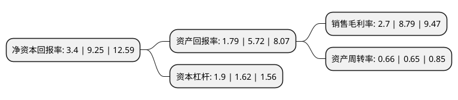

> 本页面由自动化程序生成于 2022年5月20日 01:13
> 内容可能存在错误，如有bug请提交issue至：https://github.com/Eroleice/doc-pi/issues
{.is-warning}

# 上市公司基本情况

## 基本资料

祥鑫科技股份有限公司（以下简称“祥鑫科技”）成立于2004年05月20日，东莞市。于2019年10月25日在深交所中小板上市。

祥鑫科技注册资本15,347.158万元，专业从事精密冲压模具和金属结构件研发，生产和销售的企业，拥有先进的模具制造技术和精密冲压技术，主要为汽车，通信，办公及电子设备等行业客户提供精密冲压模具和金属结构件。以下是详细信息：

- 公司名称: 祥鑫科技股份有限公司
- 股票代码: 002965.SZ
- 所在地: 广东 - 东莞市
- 成立日期: 2004年05月20日
- 注册资本: 15,347.158万元
- 法定代表人: 陈荣
- 主营业务: 专业从事精密冲压模具和金属结构件研发，生产和销售的企业，拥有先进的模具制造技术和精密冲压技术，主要为汽车，通信，办公及电子设备等行业客户提供精密冲压模具和金属结构件
- 公司官网: www.luckyharvest.cn
- 公司介绍: 公司成立于2004年5月20日，公司是专业从事精密冲压模具和金属结构件研发、生产和销售的企业，拥有先进的模具制造技术和精密冲压技术，主要为汽车、通信、办公及电子设备等行业客户提供精密冲压模具和金属结构件。产品已从金属结构件单品逐渐往金属结构件组件乃至总成方向发展；在通信设备领域，公司主要客户包括华为、中兴等知名企业；在办公及电子设备领域，公司主要客户包括东芝、佳能、京瓷美达、爱普生、理光等全球知名厂商。被中国模具工业协会评选为“中国重点骨干模具企业(汽车零部件冲压模具)”和“模具出口重点企业”；于2015年8月获得国家质量监督检验检疫总局授予的“全国五金模具产业知名品牌创建示范区骨干企业”称号；获得中国模具工业协会授予的“2016第一批中国模具行业企业信用等级评价(AAA)”；公司的“广东省汽车大型零部件模具工程技术研究中心”被广东省科学技术厅认定为“省级工程技术研究中心”；公司于2018年1月获得广东省经济和信息化委员会颁发的“广东省高成长中小企业”证书。

## 股东及高管情况

上市公司第一大股东为陈荣，持股38,200,000股，占比24.8904%，**疑似为**上市公司实际控制人。

截至2022年05月13日，上市公司的前十大股东中，共有7名自然人股东，2名机构股东，1个产品账户，其中5%以上大股东共有5名。上市公司前十大股东明细如下：

> 未能通过持股比例判定出上市公司实际控制人（持股30%以上）
> 可能存在通过间接持股、联合持股、协议控制等方式拥有实际控制权的主体，具体请参考上市公司定期公告！
{.is-warning}

> 截至2022年05月13日，上市公司前十大股东信息如下：

| 股东名称 | 持股数量（股） | 持股比例 |
| --- | --- | --- |
| 陈荣 | 38,200,000 | 24.8904% |
| 陈荣 | 38,200,000 | 24.89% |
| 谢祥娃 | 29,300,000 | 19.0914% |
| 谢祥娃 | 29,300,000 | 19.09% |
| 朱祥 | 8,250,083 | 5.38% |
| 徐仙德 | 4,816,500 | 3.14% |
| 东莞市崇辉股权投资企业(有限合伙) | 4,079,203 | 2.66% |
| 东莞市上源实业投资有限公司 | 3,488,940 | 2.27% |
| 深圳市优美利投资管理有限公司-优美利金安12号私募证券投资基金 | 3,013,000 | 1.96% |
| 潘锦山 | 2,545,500 | 1.66% |

## 利润表分析

上市公司2021年总收入为23.7亿元，净利润为0.64亿元，实现盈利。

## 杜邦分析

> 数据列示周期：2021年 | 2020年 | 2019年
{.is-info}

上市公司的净资产收益率在近一年有所下降，下降幅度为-63.24%，其变化情况分解如下：
- 上市公司的销售毛利率在近一年下降了-69.28%，可能是生产效率的下降、商品原材料价格上涨或商品价格的下跌所致。
- 上市公司的资产周转率在近一年上升了1.54%，可能是源自于更快的销售回款或库存管理效果提升。
- 上市公司的财务杠杆比率在近一年上升了17.28%，可能是增加负债扩大生产规模。

