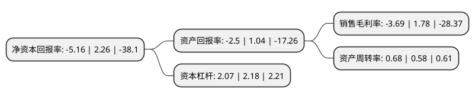

> 本页面由自动化程序生成于 2022年5月20日 01:15
> 内容可能存在错误，如有bug请提交issue至：https://github.com/Eroleice/doc-pi/issues
{.is-warning}

# 上市公司基本情况

## 基本资料

广东派生智能科技股份有限公司（以下简称“派生科技”）成立于2003年07月22日，肇庆市。于2011年02月15日在深交所创业板上市。

派生科技注册资本38,728.08万元，主要产品:油底壳总成，下缸体，变速箱外延室总成，发动机前盖总成，差速器等铝合金压铸件。主营业务:开发，生产和销售用于汽车发动机，变速箱及底盘制造的铝合金精密压铸件及其总成。以下是详细信息：

- 公司名称: 广东派生智能科技股份有限公司
- 股票代码: 300176.SZ
- 所在地: 广东 - 肇庆市
- 成立日期: 2003年07月22日
- 注册资本: 38,728.08万元
- 法定代表人: 卢楚隆
- 主营业务: 主要产品:油底壳总成，下缸体，变速箱外延室总成，发动机前盖总成，差速器等铝合金压铸件主营业务:开发，生产和销售用于汽车发动机，变速箱及底盘制造的铝合金精密压铸件及其总成
- 公司官网: www.hongteo.com.cn
- 公司介绍: 公司是一家专门生产铝合金压铸件的现代化企业。公司主营业务是开发、生产和销售用于汽车发动机、变速箱及底盘制造的铝合金精密压铸件及其总成。公司通过制造技术和生产工艺的持续创新帮助客户维持较低的综合采购成本，获得独特的竞争优势。产品除内销外还直接出口到欧美等国家，是许多世界知名汽车厂家的一级供应商，并且是福特汽车公司的Q1供应商。公司配备了先进的检测设备及工具，包括光谱仪，X光探伤机，三座标测量仪，以及大批专用和通用量检具等。公司取得了TS16949质量体系认证、ISO14001环境体系认证。

## 股东及高管情况

上市公司第一大股东为广东硕博投资发展有限公司，持股91,221,152股，占比23.55%，**疑似为**上市公司实际控制人。

截至2022年03月31日，上市公司的前十大股东中，共有4名自然人股东，3名机构股东，3个产品账户，其中5%以上大股东共有2名。上市公司前十大股东明细如下：

> 未能通过持股比例判定出上市公司实际控制人（持股30%以上）
> 可能存在通过间接持股、联合持股、协议控制等方式拥有实际控制权的主体，具体请参考上市公司定期公告！
{.is-warning}

> 截至2022年03月31日，上市公司前十大股东信息如下：

| 股东名称 | 持股数量（股） | 持股比例 |
| --- | --- | --- |
| 广东硕博投资发展有限公司 | 91,221,152 | 23.55% |
| 周展涛 | 22,000,000 | 5.68% |
| 张林 | 14,856,444 | 3.84% |
| 陕西省国际信托股份有限公司-陕国投·鑫鑫向荣83号证券投资集合资金信托计划 | 13,963,126 | 3.61% |
| 陕西省国际信托股份有限公司-陕国投·聚宝盆26号证券投资集合资金信托计划 | 6,243,910 | 1.61% |
| 唐军 | 5,976,884 | 1.54% |
| 四川国鹏科技发展有限责任公司 | 5,537,625 | 1.43% |
| 张倩 | 3,372,900 | 0.87% |
| 海南中锐投资有限公司 | 2,874,669 | 0.74% |
| 招商银行股份有限公司-东方红远见价值混合型证券投资基金 | 2,824,389 | 0.73% |

## 利润表分析

上市公司2021年总收入为12.86亿元，净利润为-0.48亿元，**未实现盈利**。

## 杜邦分析

> 数据列示周期：2021年 | 2020年 | 2019年
{.is-info}

上市公司的净资产收益率在近一年有所下降，下降幅度为-328.32%，其变化情况分解如下：
- 上市公司的销售毛利率在近一年下降了-307.3%，可能是生产效率的下降、商品原材料价格上涨或商品价格的下跌所致。
- 上市公司的资产周转率在近一年上升了17.24%，可能是源自于更快的销售回款或库存管理效果提升。
- 上市公司的财务杠杆比率在近一年下降了-5.05%，可能是减少负债降低财务费用。

