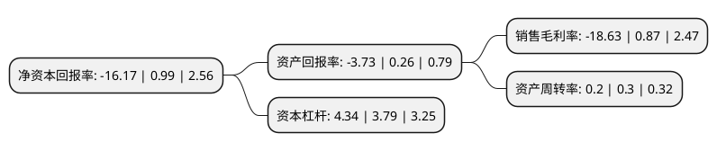

> 本页面由自动化程序生成于 2022年5月20日 01:16
> 内容可能存在错误，如有bug请提交issue至：https://github.com/Eroleice/doc-pi/issues
{.is-warning}

# 上市公司基本情况

## 基本资料

山东美晨生态环境股份有限公司（以下简称“美晨生态”）成立于2004年11月08日，潍坊市。于2011年06月29日在深交所创业板上市。

美晨生态注册资本145,307.251万元，主营业务为橡胶非轮胎与园林绿化业务。主要产品:胶管制品，减震橡胶制品，工程塑料，食品添加剂，地产园林，市政园林，文保古建，绿化苗木，设计服务。以下是详细信息：

- 公司名称: 山东美晨生态环境股份有限公司
- 股票代码: 300237.SZ
- 所在地: 山东 - 潍坊市
- 成立日期: 2004年11月08日
- 注册资本: 145,307.251万元
- 法定代表人: 窦茂功
- 主营业务: 主营业务为橡胶非轮胎与园林绿化业务主要产品:胶管制品，减震橡胶制品，工程塑料，食品添加剂，地产园林，市政园林，文保古建，绿化苗木，设计服务
- 公司官网: www.meichen.cc
- 公司介绍: 公司司秉持“生态环境+科技”的经营方针与策略，经过多年潜心发展与经营，现已形成生态环境和新材料科技高端智能制造为主的集团公司。公司是一家综合性园林企业，专注于高端品质人居环境和景观的建设营造，集规划设计、工程施工、苗木种植于一体，具有园林绿化施工一级、园林古建筑施工一级、文物保护工程施工一级、水环境治理一级、市政公用工程一级、建筑装潢二级、建筑总承包三级、园林设计甲级等资质，国家高新技术企业。是中国花卉协会绿化观赏苗木分会副会长单位、浙江省工商联园林花木商会副会长单位、浙江省花卉协会市场流通分会副会长单位、山东省绿化苗木协会副会长单位、浙江省山东商会副会长单位。

## 股东及高管情况

上市公司第一大股东为潍坊市城市建设发展投资集团有限公司，持股311,802,306股，占比21.46%，**疑似为**上市公司实际控制人。

截至2022年03月31日，上市公司的前十大股东中，共有7名自然人股东，3名机构股东，其中5%以上大股东共有2名。上市公司前十大股东明细如下：

> 未能通过持股比例判定出上市公司实际控制人（持股30%以上）
> 可能存在通过间接持股、联合持股、协议控制等方式拥有实际控制权的主体，具体请参考上市公司定期公告！
{.is-warning}

> 截至2022年03月31日，上市公司前十大股东信息如下：

| 股东名称 | 持股数量（股） | 持股比例 |
| --- | --- | --- |
| 潍坊市城市建设发展投资集团有限公司 | 311,802,306 | 21.46% |
| 诸城市经济开发投资公司 | 78,431,373 | 5.4% |
| 熊进 | 9,090,000 | 0.63% |
| 张秀 | 8,459,600 | 0.58% |
| 米有菊 | 6,095,600 | 0.42% |
| 山东晨德投资有限公司 | 5,576,095 | 0.38% |
| 马骋 | 4,800,068 | 0.33% |
| 郑漓江 | 4,554,800 | 0.31% |
| 鞠方新 | 4,054,342 | 0.28% |
| 郑召伟 | 4,046,020 | 0.28% |

## 利润表分析

上市公司2021年总收入为20.75亿元，净利润为-3.87亿元，**未实现盈利**。

## 杜邦分析

> 数据列示周期：2021年 | 2020年 | 2019年
{.is-info}

上市公司的净资产收益率在近一年有所下降，下降幅度为-1733.33%，其变化情况分解如下：
- 上市公司的销售毛利率在近一年下降了-2241.38%，可能是生产效率的下降、商品原材料价格上涨或商品价格的下跌所致。
- 上市公司的资产周转率在近一年下降了-33.33%，可能是源自于更慢的销售回款或库存管理效果下降。
- 上市公司的财务杠杆比率在近一年上升了14.51%，可能是增加负债扩大生产规模。

