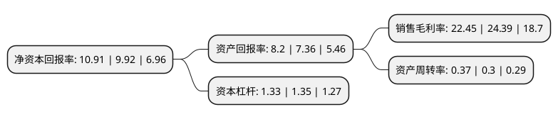

> 本页面由自动化程序生成于 2022年5月20日 01:16
> 内容可能存在错误，如有bug请提交issue至：https://github.com/Eroleice/doc-pi/issues
{.is-warning}

# 上市公司基本情况

## 基本资料

江苏云意电气股份有限公司（以下简称“云意电气”）成立于2007年04月27日，徐州市。于2012年03月21日在深交所创业板上市。

云意电气注册资本86,603.602万元，主要产品:车用整流器，调节器和车用大功率二极管等。主营业务:车用智能电源控制器，智能电机及控制系统，新能源车用电机及控制系统等汽车智能核心电子产品的研发，生产和销售。以下是详细信息：

- 公司名称: 江苏云意电气股份有限公司
- 股票代码: 300304.SZ
- 所在地: 江苏 - 徐州市
- 成立日期: 2007年04月27日
- 注册资本: 86,603.602万元
- 法定代表人: 张晶
- 主营业务: 主要产品:车用整流器，调节器和车用大功率二极管等主营业务:车用智能电源控制器，智能电机及控制系统，新能源车用电机及控制系统等汽车智能核心电子产品的研发，生产和销售
- 公司官网: www.yunyi-china.com
- 公司介绍: 公司自成立以来一直致力于汽车智能核心电子产品的研发和生产，是国家级高新技术企业、江苏省技术改造先进企业、建有江苏省汽车智能电压调节器工程技术研究中心、江苏省认定企业技术中心等一系列高规格、高水平的研发平台。凭借突出的研发实力，公司参与起草中国内燃机和机动车用整流器行业标准和大功率车用二极管行业标准。公司凭借较强的研发创新能力和技术实力，产品质量和性能处于行业领先地位，持续通过国内外客户的产品认证程序，并与整车厂商建立了长期稳定的战略合作配套关系，积累了大量优质的客户资源，为众多汽车品牌进行配套。公司已在大功率车用二极管、高度集成的模块化芯片和精密嵌件注塑件等关键零部件上掌握了核心技术，具备集智能电源控制器深度结构设计、精密嵌件模具设计、制造及注塑于一体的垂直整合能力。公司是国内规模领先的行业龙头企业，规模化生产使公司具备较强的规模优势。

## 股东及高管情况

上市公司第一大股东为徐州云意科技发展有限公司，持股352,098,880股，占比40.66%，为上市公司实际控制人。

截至2022年03月31日，上市公司的前十大股东中，共有8名自然人股东，2名机构股东，其中5%以上大股东共有1名。上市公司前十大股东明细如下：

> 截至2022年03月31日，上市公司前十大股东信息如下：

| 股东名称 | 持股数量（股） | 持股比例 |
| --- | --- | --- |
| 徐州云意科技发展有限公司 | 352,098,880 | 40.66% |
| 徐州德展贸易有限公司 | 40,985,660 | 4.73% |
| 李成忠 | 26,285,045 | 3.04% |
| 付红玲 | 2,452,500 | 0.28% |
| 江富琴 | 2,290,500 | 0.26% |
| 陈力军 | 2,151,900 | 0.25% |
| 廖茜 | 1,628,900 | 0.19% |
| 胡易珏 | 1,490,040 | 0.17% |
| 徐勇 | 1,138,300 | 0.13% |
| 叶大青 | 1,120,000 | 0.13% |

## 利润表分析

上市公司2021年总收入为10.99亿元，净利润为2.46亿元，实现盈利。

## 杜邦分析

> 数据列示周期：2021年 | 2020年 | 2019年
{.is-info}

上市公司的净资产收益率在近一年有所上升，上升幅度为9.98%，其变化情况分解如下：
- 上市公司的销售毛利率在近一年下降了-7.95%，可能是生产效率的下降、商品原材料价格上涨或商品价格的下跌所致。
- 上市公司的资产周转率在近一年上升了23.33%，可能是源自于更快的销售回款或库存管理效果提升。
- 上市公司的财务杠杆比率在近一年下降了-1.48%，可能是减少负债降低财务费用。

