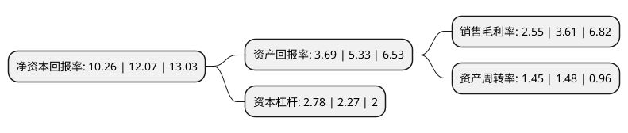

> 本页面由自动化程序生成于 2022年5月20日 01:17
> 内容可能存在错误，如有bug请提交issue至：https://github.com/Eroleice/doc-pi/issues
{.is-warning}

# 上市公司基本情况

## 基本资料

立中四通轻合金集团股份有限公司（以下简称“立中集团”）成立于1998年07月28日，保定市。于2015年03月19日在深交所创业板上市。

立中集团注册资本61,695.697万元，主营业务;功能性中间合金新材料和铝合金车轮轻量化的研发，生产，销售以下是详细信息：

- 公司名称: 立中四通轻合金集团股份有限公司
- 股票代码: 300428.SZ
- 所在地: 河北 - 保定市
- 成立日期: 1998年07月28日
- 注册资本: 61,695.697万元
- 法定代表人: 臧永兴
- 主营业务: 主营业务;功能性中间合金新材料和铝合金车轮轻量化的研发，生产，销售
- 公司官网: www.stnm.com.cn
- 公司介绍: 公司是专业研发、制造、销售金属晶粒细化、金相变质、元素添加和金属净化等功能性中间合金新材料的国家级高新技术企业，是国内最大的中间合金生产企业之一。经过多年的技术研究和产品开发，部分产品在技术指标上达到了国际先进水平，取得了较高的国内市场份额，并逐步替代部分进口产品。公司是国家火炬计划重点高新技术企业，河北省创新型企业，河北省第七届最具成长性企业，拥有省级的“企业技术中心”，是“中国有色金属工业协会”会员单位、“钛工业进展”常务理事单位、“中国材料进展”常务理事单位。2018年，公司收购天津企管100%的股权和立中股份4.52%的股权，新增铝合金车轮的研发、设计、制造和销售业务，天津企管是目前国内最大车轮生产企业之一，其中90%以上的车轮销往全球各大知名汽车制造商，如通用、克莱斯勒、福特、宝马、菲亚特、现代、马自达、长城、吉利、上汽等，客户遍布北美、欧洲、亚洲等汽车工业发达国家和地区，在国际市场上积累了较高的信誉，具有较强的国际竞争力和广阔的发展前景。

## 股东及高管情况

上市公司第一大股东为天津东安兄弟有限公司，持股227,971,910股，占比36.95%，为上市公司实际控制人。

截至2022年03月31日，上市公司的前十大股东中，共有3名自然人股东，2名机构股东，4个产品账户，1名其他股东，其中5%以上大股东共有2名。上市公司前十大股东明细如下：

> 截至2022年03月31日，上市公司前十大股东信息如下：

| 股东名称 | 持股数量（股） | 持股比例 |
| --- | --- | --- |
| 天津东安兄弟有限公司 | 227,971,910 | 36.95% |
| 臧娜 | 32,400,000 | 5.25% |
| 臧立国 | 28,814,400 | 4.67% |
| 日本金属株式会社 | 13,435,917 | 2.18% |
| 刘霞 | 5,032,800 | 0.82% |
| 南方天辰(北京)投资管理有限公司-南方天辰景晟20期私募证券投资基金 | 2,874,891 | 0.47% |
| 中国银行股份有限公司-易方达资源行业混合型证券投资基金 | 2,172,100 | 0.35% |
| 保定安盛企业管理咨询有限公司 | 2,058,382 | 0.33% |
| 平安银行股份有限公司-平安转型创新灵活配置混合型证券投资基金 | 1,846,000 | 0.3% |
| 北京清和泉资本管理有限公司-清和泉成长2期证券投资基金 | 1,776,385 | 0.29% |

## 利润表分析

上市公司2021年总收入为186.33亿元，净利润为4.74亿元，实现盈利。

## 杜邦分析

> 数据列示周期：2021年 | 2020年 | 2019年
{.is-info}

上市公司的净资产收益率在近一年有所下降，下降幅度为-15%，其变化情况分解如下：
- 上市公司的销售毛利率在近一年下降了-29.36%，可能是生产效率的下降、商品原材料价格上涨或商品价格的下跌所致。
- 上市公司的资产周转率在近一年下降了-2.03%，可能是源自于更慢的销售回款或库存管理效果下降。
- 上市公司的财务杠杆比率在近一年上升了22.47%，可能是增加负债扩大生产规模。

