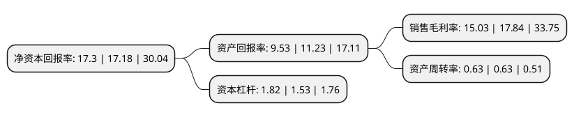

> 本页面由自动化程序生成于 2022年5月20日 01:17
> 内容可能存在错误，如有bug请提交issue至：https://github.com/Eroleice/doc-pi/issues
{.is-warning}

# 上市公司基本情况

## 基本资料

绵阳富临精工股份有限公司（以下简称“富临精工”）成立于1997年11月10日，绵阳市。于2015年03月19日在深交所创业板上市。

富临精工注册资本80,996.014万元，主要产品:气门挺柱(机械挺柱，液压挺柱)，液压张紧器，摇臂，喷嘴，发动机可变气门系统(VVT，VVL电磁阀)，精密零部件及其他等六大类系列产品。主营业务:汽车发动机精密零部件，新能源锂电池正极材料的研发，生产和销售。以下是详细信息：

- 公司名称: 绵阳富临精工股份有限公司
- 股票代码: 300432.SZ
- 所在地: 四川 - 绵阳市
- 成立日期: 1997年11月10日
- 注册资本: 80,996.014万元
- 法定代表人: 藤明波
- 主营业务: 主要产品:气门挺柱(机械挺柱，液压挺柱)，液压张紧器，摇臂，喷嘴，发动机可变气门系统(VVT，VVL电磁阀)，精密零部件及其他等六大类系列产品主营业务:汽车发动机精密零部件，新能源锂电池正极材料的研发，生产和销售
- 公司官网: www.fulinpm.com
- 公司介绍: 公司为专业从事汽车发动机精密零部件的研发、生产和销售的高新技术企业。公司在发动机零部件领域形成了以液压挺柱、机械挺柱、液压张紧器、摇臂、喷嘴、发动机可变气门系统(VVT、VVL)、缸内直喷系统用高压油泵挺柱和泵壳、自动变速器及燃油喷射器精密零部件等产品系列，产销量已经位居国内市场前列，具有较高的市场知名度。公司产品系列核心技术国内领先，部分技术已达到国际同行业先进水平，实现了替代进口、填补了国内空白，已成为国内具有较高影响力和知名度的汽车发动机精密零部件供应商之一。

## 股东及高管情况

上市公司第一大股东为四川富临实业集团有限公司，持股247,496,008股，占比30.56%，为上市公司实际控制人。

截至2022年03月31日，上市公司的前十大股东中，共有4名自然人股东，1名机构股东，3个产品账户，2个海外主体，其中5%以上大股东共有2名。上市公司前十大股东明细如下：

> 截至2022年03月31日，上市公司前十大股东信息如下：

| 股东名称 | 持股数量（股） | 持股比例 |
| --- | --- | --- |
| 四川富临实业集团有限公司 | 247,496,008 | 30.56% |
| 安治富 | 88,732,714 | 10.96% |
| 丛菱令 | 9,990,011 | 1.23% |
| 中国建设银行股份有限公司-信达澳银新能源产业股票型证券投资基金 | 7,963,107 | 0.98% |
| 聂丹 | 6,885,000 | 0.85% |
| 曾广生 | 6,441,131 | 0.8% |
| 香港中央结算有限公司(陆股通) | 6,412,953 | 0.79% |
| 诺德基金-山东铁路发展基金有限公司-诺德基金浦江70号单一资产管理计划 | 5,326,231 | 0.66% |
| UBS AG | 3,982,001 | 0.49% |
| 中国工商银行股份有限公司-汇添富中证新能源汽车产业指数型发起式证券投资基金(LOF) | 3,707,200 | 0.46% |

## 利润表分析

上市公司2021年总收入为26.56亿元，净利润为3.99亿元，实现盈利。

## 杜邦分析

> 数据列示周期：2021年 | 2020年 | 2019年
{.is-info}

上市公司的净资产收益率在近一年有所上升，上升幅度为0.7%，其变化情况分解如下：
- 上市公司的销售毛利率在近一年下降了-15.75%，可能是生产效率的下降、商品原材料价格上涨或商品价格的下跌所致。
- 上市公司的资产周转率在近一年下降了0%，可能是源自于更慢的销售回款或库存管理效果下降。
- 上市公司的财务杠杆比率在近一年上升了18.95%，可能是增加负债扩大生产规模。

