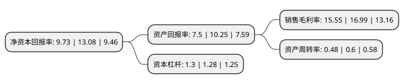

> 本页面由自动化程序生成于 2022年5月20日 01:18
> 内容可能存在错误，如有bug请提交issue至：https://github.com/Eroleice/doc-pi/issues
{.is-warning}

# 上市公司基本情况

## 基本资料

江苏奥力威传感高科股份有限公司（以下简称“苏奥传感”）成立于1993年11月19日，扬州市。于2016年04月29日在深交所创业板上市。

苏奥传感注册资本49,470.557万元，主要产品:传感器及配件，燃油系统附件及汽车内饰件。主营业务:研发，生产和销售汽车零部件。以下是详细信息：

- 公司名称: 江苏奥力威传感高科股份有限公司
- 股票代码: 300507.SZ
- 所在地: 江苏 - 扬州市
- 成立日期: 1993年11月19日
- 注册资本: 49,470.557万元
- 法定代表人: 李宏庆
- 主营业务: 主要产品:传感器及配件，燃油系统附件及汽车内饰件主营业务:研发，生产和销售汽车零部件
- 公司官网: null
- 公司介绍: 公司是一家以汽车油位传感器的研发和生产为核心业务的高新技术企业，是国内最大的汽车油位传感器生产厂家之一。主营业务是研发、生产和销售汽车零部件，主要产品分为三大类，分别为传感器及配件、燃油系统附件及汽车内饰件。汽车传感器及配件主要包括油位传感器及配件和水位传感器；燃油系统附件主要包括加油管总成、进口控制阀、通风阀、锁闭接管总成、滤清器支架、锁紧螺母、燃油泵固定嵌环、燃油泵锁紧环等产品；汽车内饰件包括气囊盖板、仪表板、空调风管等产品。公司生产的汽车油位传感器包括双回路厚膜电路汽车用油位传感器、双接触点厚膜电路汽车用油位传感器及新型多爪式耐磨耐油液位传感器等多种产品，均被认定为江苏省高新技术产品。

## 股东及高管情况

上市公司第一大股东为李宏庆，持股181,950,440股，占比36.78%，为上市公司实际控制人。

截至2022年05月05日，上市公司的前十大股东中，共有7名自然人股东，3个产品账户，其中5%以上大股东共有4名。上市公司前十大股东明细如下：

> 截至2022年05月05日，上市公司前十大股东信息如下：

| 股东名称 | 持股数量（股） | 持股比例 |
| --- | --- | --- |
| 李宏庆 | 181,950,440 | 36.78% |
| 李宏庆 | 181,950,440 | 36.78% |
| 汪文巧 | 30,199,814 | 6.1% |
| 汪文巧 | 25,416,834 | 5.1378% |
| 滕飞 | 17,334,403 | 3.5% |
| 张旻 | 11,186,246 | 2.26% |
| 郑晓青 | 4,655,300 | 0.94% |
| 中信证券股份有限公司-建信兴润一年持有期混合型证券投资基金 | 4,504,197 | 0.91% |
| 上海迎水投资管理有限公司-迎水泰顺1号私募证券投资基金 | 3,827,645 | 0.77% |
| 兴业银行股份有限公司-万家成长优选灵活配置混合型证券投资基金 | 3,260,900 | 0.66% |

## 利润表分析

上市公司2021年总收入为8.57亿元，净利润为1.33亿元，实现盈利。

## 杜邦分析

> 数据列示周期：2021年 | 2020年 | 2019年
{.is-info}

上市公司的净资产收益率在近一年有所下降，下降幅度为-25.61%，其变化情况分解如下：
- 上市公司的销售毛利率在近一年下降了-8.48%，可能是生产效率的下降、商品原材料价格上涨或商品价格的下跌所致。
- 上市公司的资产周转率在近一年下降了-20%，可能是源自于更慢的销售回款或库存管理效果下降。
- 上市公司的财务杠杆比率在近一年上升了1.56%，可能是增加负债扩大生产规模。

