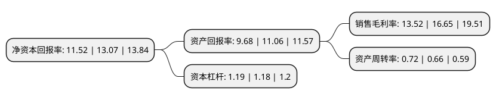

> 本页面由自动化程序生成于 2022年5月20日 01:18
> 内容可能存在错误，如有bug请提交issue至：https://github.com/Eroleice/doc-pi/issues
{.is-warning}

# 上市公司基本情况

## 基本资料

四川川环科技股份有限公司（以下简称“川环科技”）成立于2002年06月21日，达州市。于2016年09月30日在深交所创业板上市。

川环科技注册资本21,690.617万元，主营业务:专注于车用软管系列产品的研发，生产和销售，核心业务是采用高分子材料加工应用技术为各大汽车整车制造厂商提供配套汽车橡胶软管产品，主要产品为燃油系统胶管和冷却系统胶管。以下是详细信息：

- 公司名称: 四川川环科技股份有限公司
- 股票代码: 300547.SZ
- 所在地: 四川 - 达州市
- 成立日期: 2002年06月21日
- 注册资本: 21,690.617万元
- 法定代表人: 文琦超
- 主营业务: 主营业务:专注于车用软管系列产品的研发，生产和销售，核心业务是采用高分子材料加工应用技术为各大汽车整车制造厂商提供配套汽车橡胶软管产品，主要产品为燃油系统胶管和冷却系统胶管
- 公司官网: www.chuanhuan.com
- 公司介绍: 公司是集科研、生产、销售和自营进出口业于一体的国家火炬计划重点高新技术企业。专注于研发、生产和销售车用胶管系列产品，核心业务是为各大汽车整车制造厂商提供配套汽车橡胶软管产品，产品范围涵盖燃油系统胶管、冷却系统胶管、制动系统胶管、动力转向胶管、车身附件系统胶管、进排气系统胶管。公司是目前国内市场领先、具备了较大规模的汽车胶管专业生产企业之一。同时，公司也是国内摩托车胶管产品的主流供应商。产品以优异的性价比，受到了国内外广大汽车、摩托车生产企业的认可。公司建立完善的质量保证体系，先后通过了ISO9002质量管理体系认证、中国汽车认证委员会CCC产品质量认证、美国CARB和欧盟的ROHS产品环保认证等，为公司产品进入国际市场建立了绿色通道。公司获得国家创新型企业、全国重合同守信用企业、全国实施卓越绩效模式先进企业、全国模范职工之家、全国劳动关系和谐企业、全国工人先锋号等荣誉称号。

## 股东及高管情况

上市公司第一大股东为文建树，持股24,255,896股，占比11.18%，**疑似为**上市公司实际控制人。

截至2022年03月31日，上市公司的前十大股东中，共有8名自然人股东，2名机构股东，其中5%以上大股东共有3名。上市公司前十大股东明细如下：

> 未能通过持股比例判定出上市公司实际控制人（持股30%以上）
> 可能存在通过间接持股、联合持股、协议控制等方式拥有实际控制权的主体，具体请参考上市公司定期公告！
{.is-warning}

> 截至2022年03月31日，上市公司前十大股东信息如下：

| 股东名称 | 持股数量（股） | 持股比例 |
| --- | --- | --- |
| 文建树 | 24,255,896 | 11.18% |
| 文琦超 | 18,109,571 | 8.35% |
| 王欣 | 11,153,950 | 5.14% |
| 文秀琼 | 7,200,000 | 3.32% |
| 邹定全 | 5,554,000 | 2.56% |
| 文秀兰 | 4,839,962 | 2.23% |
| 四川省国有资产经营投资管理有限责任公司 | 4,643,309 | 2.14% |
| 达州市中贸粮油有限公司 | 4,606,333 | 2.12% |
| 王春 | 4,238,730 | 1.95% |
| 王荣 | 4,191,930 | 1.93% |

## 利润表分析

上市公司2021年总收入为7.76亿元，净利润为1.04亿元，实现盈利。

## 杜邦分析

> 数据列示周期：2021年 | 2020年 | 2019年
{.is-info}

上市公司的净资产收益率在近一年有所下降，下降幅度为-11.86%，其变化情况分解如下：
- 上市公司的销售毛利率在近一年下降了-18.8%，可能是生产效率的下降、商品原材料价格上涨或商品价格的下跌所致。
- 上市公司的资产周转率在近一年上升了9.09%，可能是源自于更快的销售回款或库存管理效果提升。
- 上市公司的财务杠杆比率在近一年上升了0.85%，可能是增加负债扩大生产规模。

