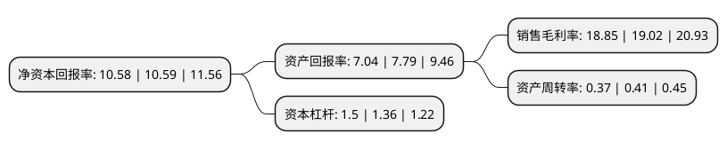

> 本页面由自动化程序生成于 2022年5月20日 01:18
> 内容可能存在错误，如有bug请提交issue至：https://github.com/Eroleice/doc-pi/issues
{.is-warning}

# 上市公司基本情况

## 基本资料

无锡贝斯特精机股份有限公司（以下简称“贝斯特”）成立于1997年04月16日，无锡市。于2017年01月11日在深交所创业板上市。

贝斯特注册资本20,001.079万元，主要产品:涡轮增压器精密轴承件，涡轮增压器叶轮，涡轮增压器中间壳，发动机缸体等关键汽车零部件，座椅构件等飞机机舱零部件，用于汽车，轨道交通等领域的工装夹具，以及飞机机身自动化钻铆系统，自动化工业生产线等智能制造系统集成产品。主营业务:精密零部件和工装及自动化产品的研发，生产及销售。以下是详细信息：

- 公司名称: 无锡贝斯特精机股份有限公司
- 股票代码: 300580.SZ
- 所在地: 江苏 - 无锡市
- 成立日期: 1997年04月16日
- 注册资本: 20,001.079万元
- 法定代表人: 曹余华
- 主营业务: 主要产品:涡轮增压器精密轴承件，涡轮增压器叶轮，涡轮增压器中间壳，发动机缸体等关键汽车零部件，座椅构件等飞机机舱零部件，用于汽车，轨道交通等领域的工装夹具，以及飞机机身自动化钻铆系统，自动化工业生产线等智能制造系统集成产品主营业务:精密零部件和工装及自动化产品的研发，生产及销售
- 公司官网: www.wuxibest.com
- 公司介绍: 公司一直专注于精密零部件和工装及自动化产品的研发、生产及销售，近年，公司利用在工装及自动化领域的各类先发优势，已将业务延伸至高端航空装备制造以及工业自动化装备领域，主要产品包括涡轮增压器精密轴承件、涡轮增压器叶轮、涡轮增压器中间壳、发动机缸体等关键汽车零部件，座椅构件等飞机机舱零部件，用于汽车、轨道交通等领域的工装夹具，以及飞机机身自动化钻铆系统、自动化工业生产线等智能制造系统集成产品。公司先后获得江苏省高新技术企业、江苏省五一劳动奖状、江苏省著名商标、江苏省企业技术中心，江苏省信息化与工业化融合示范企业、无锡市十佳民营企业等荣誉称号。

## 股东及高管情况

上市公司第一大股东为无锡贝斯特投资有限公司，持股112,743,600股，占比56.37%，为上市公司实际控制人。

截至2022年03月31日，上市公司的前十大股东中，共有3名自然人股东，2名机构股东，5个产品账户，其中5%以上大股东共有2名。上市公司前十大股东明细如下：

> 截至2022年03月31日，上市公司前十大股东信息如下：

| 股东名称 | 持股数量（股） | 持股比例 |
| --- | --- | --- |
| 无锡贝斯特投资有限公司 | 112,743,600 | 56.37% |
| 曹余华 | 11,632,500 | 5.82% |
| 曹逸 | 6,345,000 | 3.17% |
| 无锡市鑫石投资合伙企业(有限合伙) | 5,506,400 | 2.75% |
| 上海浦东发展银行股份有限公司-易方达裕祥回报债券型证券投资基金 | 4,866,200 | 2.43% |
| 谢似玄 | 3,172,500 | 1.59% |
| 中国工商银行股份有限公司-海富通改革驱动灵活配置混合型证券投资基金 | 2,806,500 | 1.4% |
| 上海浦东发展银行股份有限公司-易方达瑞程灵活配置混合型证券投资基金 | 1,864,600 | 0.93% |
| 中国工商银行股份有限公司-易方达安心回馈混合型证券投资基金 | 1,369,200 | 0.68% |
| 大家资产-民生银行-大家资产-盛世精选2号集合资产管理产品(第二期) | 1,304,449 | 0.65% |

## 利润表分析

上市公司2021年总收入为10.57亿元，净利润为1.99亿元，实现盈利。

## 杜邦分析

> 数据列示周期：2021年 | 2020年 | 2019年
{.is-info}

上市公司的净资产收益率在近一年有所下降，下降幅度为-0.09%，其变化情况分解如下：
- 上市公司的销售毛利率在近一年下降了-0.89%，可能是生产效率的下降、商品原材料价格上涨或商品价格的下跌所致。
- 上市公司的资产周转率在近一年下降了-9.76%，可能是源自于更慢的销售回款或库存管理效果下降。
- 上市公司的财务杠杆比率在近一年上升了10.29%，可能是增加负债扩大生产规模。

