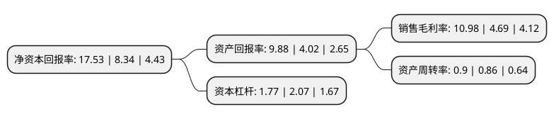

> 本页面由自动化程序生成于 2022年5月20日 01:19
> 内容可能存在错误，如有bug请提交issue至：https://github.com/Eroleice/doc-pi/issues
{.is-warning}

# 上市公司基本情况

## 基本资料

万通智控科技股份有限公司（以下简称“万通智控”）成立于1993年12月25日，杭州市。于2017年05月05日在深交所创业板上市。

万通智控注册资本23,000万元，主要产品:轮胎气门嘴，轮胎气压监测系统(TPMS)和工具及配件等。主营业务:轮胎气门嘴，轮胎气压监测系统(TPMS)以及相关工具及配件研发，生产和销售。以下是详细信息：

- 公司名称: 万通智控科技股份有限公司
- 股票代码: 300643.SZ
- 所在地: 浙江 - 杭州市
- 成立日期: 1993年12月25日
- 注册资本: 23,000万元
- 法定代表人: 张健儿
- 主营业务: 主要产品:轮胎气门嘴，轮胎气压监测系统(TPMS)和工具及配件等主营业务:轮胎气门嘴，轮胎气压监测系统(TPMS)以及相关工具及配件研发，生产和销售
- 公司官网: www.hamaton.com.cn
- 公司介绍: 公司是一家集研发、生产、销售为一体的汽车零部件企业。公司目前主要用汽车电子、轮胎气门嘴、工具三大产品模块。在国内TPMS系统行业和气门嘴行业处于领军地位，是上汽通用、大众、北汽、广汽、长安等诸多知名主机厂的配套供应商。公司产品主要销往欧洲、北美、澳大利亚等地区。

## 股东及高管情况

上市公司第一大股东为杭州万通智控控股有限公司，持股100,495,279股，占比43.69%，为上市公司实际控制人。

截至2022年03月31日，上市公司的前十大股东中，共有7名自然人股东，3名机构股东，其中5%以上大股东共有2名。上市公司前十大股东明细如下：

> 截至2022年03月31日，上市公司前十大股东信息如下：

| 股东名称 | 持股数量（股） | 持股比例 |
| --- | --- | --- |
| 杭州万通智控控股有限公司 | 100,495,279 | 43.69% |
| 杭州市金融投资集团有限公司 | 15,120,967 | 6.57% |
| 杨富金 | 8,050,000 | 3.5% |
| 杭州富阳锦通股权投资合伙企业(有限合伙) | 6,103,980 | 2.65% |
| 丁茂国 | 1,833,500 | 0.8% |
| 黄瑶芳 | 1,443,336 | 0.63% |
| 张黄靖 | 1,433,336 | 0.62% |
| 邓小山 | 963,900 | 0.42% |
| 徐淅埜 | 854,500 | 0.37% |
| 侯立强 | 720,000 | 0.31% |

## 利润表分析

上市公司2021年总收入为10.22亿元，净利润为1.12亿元，实现盈利。

## 杜邦分析

> 数据列示周期：2021年 | 2020年 | 2019年
{.is-info}

上市公司的净资产收益率在近一年有所上升，上升幅度为110.19%，其变化情况分解如下：
- 上市公司的销售毛利率在近一年上升了134.12%，可能是生产效率的提升、商品原材料价格下跌或商品价格的上涨所致。
- 上市公司的资产周转率在近一年上升了4.65%，可能是源自于更快的销售回款或库存管理效果提升。
- 上市公司的财务杠杆比率在近一年下降了-14.49%，可能是减少负债降低财务费用。

