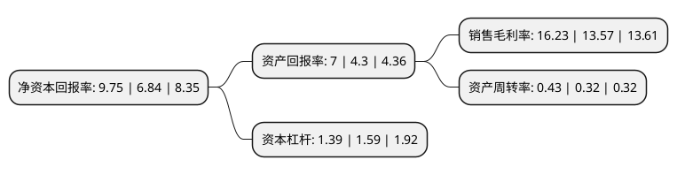

> 本页面由自动化程序生成于 2022年5月20日 01:19
> 内容可能存在错误，如有bug请提交issue至：https://github.com/Eroleice/doc-pi/issues
{.is-warning}

# 上市公司基本情况

## 基本资料

杭州雷迪克节能科技股份有限公司（以下简称“雷迪克”）成立于2002年11月20日，杭州市。于2017年05月16日在深交所创业板上市。

雷迪克注册资本9,408.201万元，主要产品:汽车轴承，包括轮毂轴承，轮毂轴承单元，圆锥轴承，涨紧轮，离合器分离轴承和三球销万向节;主营业务:研发，生产和销售汽车轴承。以下是详细信息：

- 公司名称: 杭州雷迪克节能科技股份有限公司
- 股票代码: 300652.SZ
- 所在地: 浙江 - 杭州市
- 成立日期: 2002年11月20日
- 注册资本: 9,408.201万元
- 法定代表人: 沈仁荣
- 主营业务: 主要产品:汽车轴承，包括轮毂轴承，轮毂轴承单元，圆锥轴承，涨紧轮，离合器分离轴承和三球销万向节;主营业务:研发，生产和销售汽车轴承
- 公司官网: www.radical.cn
- 公司介绍: 公司是以研发、生产和销售汽车轴承为主营业务的高新技术企业，主要产品为汽车轴承，包括轮毂轴承、轮毂轴承单元、圆锥轴承、涨紧轮、离合器分离轴承和三球销万向节。公司产品主要出口国际市场，并以AM市场为主。

## 股东及高管情况

上市公司第一大股东为北京科坚控股有限公司，持股29,700,071股，占比31.57%，为上市公司实际控制人。

截至2022年03月31日，上市公司的前十大股东中，共有7名自然人股东，3名机构股东，其中5%以上大股东共有5名。上市公司前十大股东明细如下：

> 截至2022年03月31日，上市公司前十大股东信息如下：

| 股东名称 | 持股数量（股） | 持股比例 |
| --- | --- | --- |
| 北京科坚控股有限公司 | 29,700,071 | 31.57% |
| 北京思泉企业管理有限公司 | 7,920,000 | 8.42% |
| 沈仁荣 | 6,600,000 | 7.01% |
| 於彩君 | 5,280,000 | 5.61% |
| 北京福韵通企业管理有限公司 | 5,280,000 | 5.61% |
| 胡柏安 | 2,143,226 | 2.28% |
| 冯飞飞 | 1,969,403 | 2.09% |
| 王树平 | 554,900 | 0.59% |
| 李春丽 | 349,700 | 0.37% |
| 林少燕 | 322,900 | 0.34% |

## 利润表分析

上市公司2021年总收入为5.91亿元，净利润为0.95亿元，实现盈利。

## 杜邦分析

> 数据列示周期：2021年 | 2020年 | 2019年
{.is-info}

上市公司的净资产收益率在近一年有所上升，上升幅度为42.54%，其变化情况分解如下：
- 上市公司的销售毛利率在近一年上升了19.6%，可能是生产效率的提升、商品原材料价格下跌或商品价格的上涨所致。
- 上市公司的资产周转率在近一年上升了34.38%，可能是源自于更快的销售回款或库存管理效果提升。
- 上市公司的财务杠杆比率在近一年下降了-12.58%，可能是减少负债降低财务费用。

