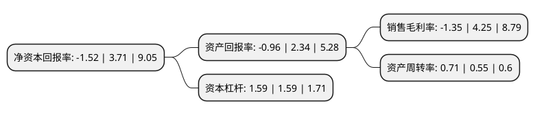

> 本页面由自动化程序生成于 2022年5月20日 01:19
> 内容可能存在错误，如有bug请提交issue至：https://github.com/Eroleice/doc-pi/issues
{.is-warning}

# 上市公司基本情况

## 基本资料

无锡蠡湖增压技术股份有限公司（以下简称“蠡湖股份”）成立于1994年04月11日，无锡市。于2018年10月15日在深交所创业板上市。

蠡湖股份注册资本21,531.698万元，主要产品为压气机壳，涡轮壳。主营业务为涡轮增压器关键零部件的研发，生产与销售以下是详细信息：

- 公司名称: 无锡蠡湖增压技术股份有限公司
- 股票代码: 300694.SZ
- 所在地: 江苏 - 无锡市
- 成立日期: 1994年04月11日
- 注册资本: 21,531.698万元
- 法定代表人: 王洪其
- 主营业务: 主要产品为压气机壳，涡轮壳主营业务为涡轮增压器关键零部件的研发，生产与销售
- 公司官网: www.chinalihu.com
- 公司介绍: 公司主营业务为涡轮增压器两大关键零部件：压气机壳和涡轮壳的研发、生产与销售。涡轮增压器作为汽车等领域内燃机的重要配件，可提高汽油发动机近20%的燃油效率、柴油发动机近40%的燃油效率，从而有效实现“节能减排”的目的，符合国家规划方向。公司自成立以来，始终专注于涡轮增压器零部件的研发、生产与销售，已经掌握模具设计开发、产品铸造、机加工、检测、装配等各个生产环节的核心技术，具备较强的产品研发和制造能力,能够满足下游客户的同步开发要求。公司是高新技术企业、国家火炬计划重点高新技术企业、江苏省科技型中小企业；公司设立的工程技术中心被江苏省科学技术厅认定为“江苏省涡轮增压器壳体工程技术中心”和“江苏省企业技术中心”；公司开发的转盘式重力浇注汽车涡轮增压器压气机壳项目，获“国家火炬计划产业化示范项目”证书。

## 股东及高管情况

上市公司第一大股东为无锡市蠡湖至真投资有限公司，持股74,814,280股，占比34.75%，为上市公司实际控制人。

截至2022年03月31日，上市公司的前十大股东中，共有6名自然人股东，3名机构股东，1个产品账户，其中5%以上大股东共有2名。上市公司前十大股东明细如下：

> 截至2022年03月31日，上市公司前十大股东信息如下：

| 股东名称 | 持股数量（股） | 持股比例 |
| --- | --- | --- |
| 无锡市蠡湖至真投资有限公司 | 74,814,280 | 34.75% |
| 无锡金茂二号新兴产业创业投资企业(有限合伙) | 12,205,403 | 5.67% |
| 王晓君 | 6,383,410 | 2.96% |
| 扬州经信新兴产业创业投资中心(有限合伙) | 3,428,892 | 1.59% |
| 陆柯 | 2,851,619 | 1.32% |
| 刘静华 | 2,384,866 | 1.11% |
| 无锡蠡湖增压技术股份有限公司-第一期员工持股计划 | 2,192,000 | 1.02% |
| 陆瑞兴 | 2,123,746 | 0.99% |
| 王悍 | 1,748,079 | 0.81% |
| 王利军 | 1,360,051 | 0.63% |

## 利润表分析

上市公司2021年总收入为13.93亿元，净利润为-0.19亿元，**未实现盈利**。

## 杜邦分析

> 数据列示周期：2021年 | 2020年 | 2019年
{.is-info}

上市公司的净资产收益率在近一年有所下降，下降幅度为-140.97%，其变化情况分解如下：
- 上市公司的销售毛利率在近一年下降了-131.76%，可能是生产效率的下降、商品原材料价格上涨或商品价格的下跌所致。
- 上市公司的资产周转率在近一年上升了29.09%，可能是源自于更快的销售回款或库存管理效果提升。
- 上市公司的财务杠杆比率在近一年下降了0%，可能是减少负债降低财务费用。

