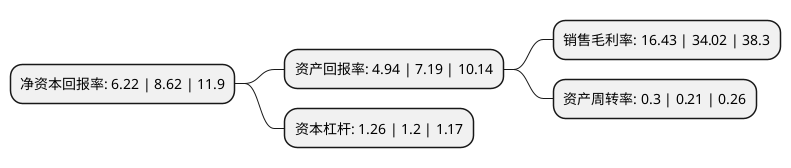

> 本页面由自动化程序生成于 2022年5月20日 01:19
> 内容可能存在错误，如有bug请提交issue至：https://github.com/Eroleice/doc-pi/issues
{.is-warning}

# 上市公司基本情况

## 基本资料

浙江兆丰机电股份有限公司（以下简称“兆丰股份”）成立于2002年11月28日，杭州市。于2017年09月08日在深交所创业板上市。

兆丰股份注册资本7,092.987万元，主营业务为汽车轮毂轴承单元的研发，生产和销售。主要产品为汽车轮毂轴承单元。以下是详细信息：

- 公司名称: 浙江兆丰机电股份有限公司
- 股票代码: 300695.SZ
- 所在地: 浙江 - 杭州市
- 成立日期: 2002年11月28日
- 注册资本: 7,092.987万元
- 法定代表人: 孔爱祥
- 主营业务: 主营业务为汽车轮毂轴承单元的研发，生产和销售主要产品为汽车轮毂轴承单元
- 公司官网: www.hzfb.com
- 公司介绍: 公司是商务部与发改委联合授牌的全国首批百家“汽车零部件出口基地企业”，是中国汽车轮毂轴承单元行业的龙头制造企业，产品销量和出口额均居国内前列。专业生产第一、二、三代汽车轮毂轴承单元及各类精密轴承，注册商标“HZF”是浙江省名牌，现有产品型号多达1400余种(其中第三代轮毂轴承单元近600余种)，产品广泛应用于各类中高级轿车及商务用车、卡车，产品远销美国、加拿大、德国、意大利、韩国等三十多个国家和地区。

## 股东及高管情况

上市公司第一大股东为杭州大兆丰实业集团有限公司，持股24,089,286股，占比33.96%，为上市公司实际控制人。

截至2022年03月31日，上市公司的前十大股东中，共有2名自然人股东，5名机构股东，3个产品账户，其中5%以上大股东共有3名。上市公司前十大股东明细如下：

> 截至2022年03月31日，上市公司前十大股东信息如下：

| 股东名称 | 持股数量（股） | 持股比例 |
| --- | --- | --- |
| 杭州大兆丰实业集团有限公司 | 24,089,286 | 33.96% |
| 杭州寰宇工业互联网有限公司 | 13,392,857 | 18.88% |
| 香港弘泰控股有限公司 | 12,517,857 | 17.65% |
| 叶向东 | 556,000 | 0.78% |
| UBSAG | 462,448 | 0.65% |
| 华夏基金-邮储银行-华夏基金秋实混合策略1号集合资产管理计划 | 462,193 | 0.65% |
| 北京时间投资管理股份公司-时间方舟5号私募证券投资基金 | 369,754 | 0.52% |
| 泰康人寿保险有限责任公司-投连-平衡配置 | 369,754 | 0.52% |
| 泰康资产聚鑫股票专项型养老金产品-中国银行股份有限公司 | 369,754 | 0.52% |
| 泰康人寿保险有限责任公司-投连-安盈回报 | 369,754 | 0.52% |

## 利润表分析

上市公司2021年总收入为7.18亿元，净利润为1.18亿元，实现盈利。

## 杜邦分析

> 数据列示周期：2021年 | 2020年 | 2019年
{.is-info}

上市公司的净资产收益率在近一年有所下降，下降幅度为-27.84%，其变化情况分解如下：
- 上市公司的销售毛利率在近一年下降了-51.7%，可能是生产效率的下降、商品原材料价格上涨或商品价格的下跌所致。
- 上市公司的资产周转率在近一年上升了42.86%，可能是源自于更快的销售回款或库存管理效果提升。
- 上市公司的财务杠杆比率在近一年上升了5%，可能是增加负债扩大生产规模。

