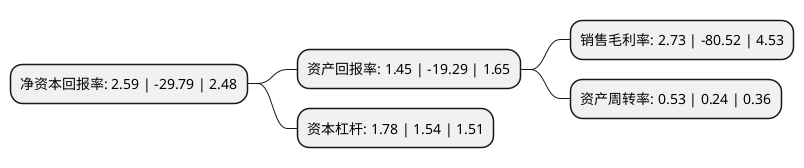

> 本页面由自动化程序生成于 2022年5月20日 01:20
> 内容可能存在错误，如有bug请提交issue至：https://github.com/Eroleice/doc-pi/issues
{.is-warning}

# 上市公司基本情况

## 基本资料

深圳欣锐科技股份有限公司（以下简称“欣锐科技”）成立于2005年01月11日，深圳市。于2018年05月23日在深交所创业板上市。

欣锐科技注册资本12,475.468万元，主要产品:车载DC/DC变换器，车载充电机及以车载DC/DC变换器，车载充电机为核心的车载电源集成产品等。主营业务:新能源汽车车载电源的研发，生产，销售和技术服务。以下是详细信息：

- 公司名称: 深圳欣锐科技股份有限公司
- 股票代码: 300745.SZ
- 所在地: 广东 - 深圳市
- 成立日期: 2005年01月11日
- 注册资本: 12,475.468万元
- 法定代表人: 吴壬华
- 主营业务: 主要产品:车载DC/DC变换器，车载充电机及以车载DC/DC变换器，车载充电机为核心的车载电源集成产品等主营业务:新能源汽车车载电源的研发，生产，销售和技术服务
- 公司官网: www.shinry.com
- 公司介绍: 公司是专注于新能源汽车车载电源的研发、生产、销售和技术服务的国家高新技术企业。目前公司主要为新能源汽车行业提供车载电源整体解决方案，产品包括车载DC/DC变换器、车载充电机及以车载DC/DC变换器、车载充电机为核心的车载电源集成产品等。公司车载电源产品可广泛应用于乘用车、客车、专用车等各类新能源汽车领域。公司具有较强的自主研发能力。公司自2006年初进入新能源汽车产业，专注新能源汽车高压“电控”解决方案(其主要技术集中在车载DC/DC变换器和车载充电机，统称为车载电源)，欣锐科技拥有车载电源原创性核心技术的全部自主知识产权，在车载电源和大功率充电领域积累了丰富的研发及产业经验，拥有业界领先的研发创新能力及工程制造能力，产品技术水平居行业前列。欣锐科技的车载电源配套了国内外众多主流车型，是车载电源细分领域的龙头企业，促进国内新能源汽车朝产业化方向发展。

## 股东及高管情况

上市公司第一大股东为吴壬华，持股35,259,533股，占比28.26%，**疑似为**上市公司实际控制人。

截至2022年03月31日，上市公司的前十大股东中，共有4名自然人股东，2名机构股东，3个产品账户，1个海外主体，其中5%以上大股东共有1名。上市公司前十大股东明细如下：

> 未能通过持股比例判定出上市公司实际控制人（持股30%以上）
> 可能存在通过间接持股、联合持股、协议控制等方式拥有实际控制权的主体，具体请参考上市公司定期公告！
{.is-warning}

> 截至2022年03月31日，上市公司前十大股东信息如下：

| 股东名称 | 持股数量（股） | 持股比例 |
| --- | --- | --- |
| 吴壬华 | 35,259,533 | 28.26% |
| 彭胜文 | 4,700,000 | 3.77% |
| 永丰县奇斯科技有限公司 | 4,451,164 | 3.57% |
| 唐冬元 | 3,195,695 | 2.56% |
| 永丰县鑫奇迪科技有限公司 | 2,771,604 | 2.22% |
| 中国工商银行-汇添富均衡增长混合型证券投资基金 | 2,232,504 | 1.79% |
| UBS   AG | 2,023,753 | 1.62% |
| 毛丽萍 | 1,725,419 | 1.38% |
| 中国工商银行股份有限公司-汇添富科技创新灵活配置混合型证券投资基金 | 1,274,901 | 1.02% |
| 安徽中珏投资管理有限公司-中珏增利2号私募证券投资基金 | 1,258,119 | 1.01% |

## 利润表分析

上市公司2021年总收入为9.34亿元，净利润为0.25亿元，实现盈利。

## 杜邦分析

> 数据列示周期：2021年 | 2020年 | 2019年
{.is-info}

上市公司的净资产收益率在近一年有所下降，下降幅度为-108.69%，其变化情况分解如下：
- 上市公司的销售毛利率在近一年下降了-103.39%，可能是生产效率的下降、商品原材料价格上涨或商品价格的下跌所致。
- 上市公司的资产周转率在近一年上升了120.83%，可能是源自于更快的销售回款或库存管理效果提升。
- 上市公司的财务杠杆比率在近一年上升了15.58%，可能是增加负债扩大生产规模。

