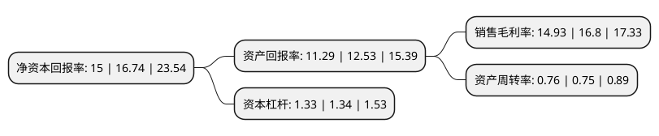

> 本页面由自动化程序生成于 2022年5月20日 01:21
> 内容可能存在错误，如有bug请提交issue至：https://github.com/Eroleice/doc-pi/issues
{.is-warning}

# 上市公司基本情况

## 基本资料

浙江松原汽车安全系统股份有限公司（以下简称“松原股份”）成立于2001年07月06日，宁波市。于2020年09月24日在深交所创业板上市。

松原股份注册资本15,000万元，专业从事汽车安全带总成及零部件等汽车被动安全系统产品及特殊座椅安全装置的研发，设计，生产，销售及服务。主要产品可分为简易式安全带，普通紧急锁止式安全带，紧急锁止限力式安全带，单边预张紧限力式安全带和双边预张紧限力式安全带。以下是详细信息：

- 公司名称: 浙江松原汽车安全系统股份有限公司
- 股票代码: 300893.SZ
- 所在地: 浙江 - 宁波市
- 成立日期: 2001年07月06日
- 注册资本: 15,000万元
- 法定代表人: 胡铲明
- 主营业务: 专业从事汽车安全带总成及零部件等汽车被动安全系统产品及特殊座椅安全装置的研发，设计，生产，销售及服务主要产品可分为简易式安全带，普通紧急锁止式安全带，紧急锁止限力式安全带，单边预张紧限力式安全带和双边预张紧限力式安全带
- 公司官网: www.songyuansafety.com
- 公司介绍: 公司是国内领先的汽车被动安全系统一级供应商之一，专业从事汽车安全带总成及零部件等汽车被动安全系统产品及特殊座椅安全装置的研发、设计、生产、销售及服务。公司同时为国内外主流汽车整车厂及座椅厂提供汽车被动安全系统解决方案及特殊座椅安全装置。公司汽车安全带总成具有紧急锁止、单边和双边预张紧、单边和双边限力、噪音抑制、儿童锁、防反锁等多重先进功能，广泛应用于紧凑型车、中型车、运动型多用途汽车(SUV)、多用途汽车(MPV)、客车、卡车等众多主流车型；特殊座椅安全装置是应用于不同特殊场景的座椅安全装置。由于特殊座椅应用场景的特殊性，通常对安全装置有个性化的设计和制造要求，如车载轮椅、儿童座椅、农用机械座椅等。公司致力于国内汽车被动安全系统自主品牌的发展，坚持“舒适、安全、可靠、环保”的经营理念，为交通出行提供满足安全创想的汽车被动安全系统解决方案。

## 股东及高管情况

上市公司第一大股东为胡铲明，持股70,312,500股，占比46.88%，为上市公司实际控制人。

截至2022年03月31日，上市公司的前十大股东中，共有2名自然人股东，1名机构股东，7个产品账户，其中5%以上大股东共有3名。上市公司前十大股东明细如下：

> 截至2022年03月31日，上市公司前十大股东信息如下：

| 股东名称 | 持股数量（股） | 持股比例 |
| --- | --- | --- |
| 胡铲明 | 70,312,500 | 46.88% |
| 沈燕燕 | 30,133,929 | 20.09% |
| 宁波梅山保税港区明凯股权投资合伙企业(有限合伙) | 12,053,571 | 8.04% |
| 中国建设银行股份有限公司-中欧悦享生活混合型证券投资基金 | 2,072,950 | 1.38% |
| 中国工商银行股份有限公司-中欧消费主题股票型证券投资基金 | 1,380,809 | 0.92% |
| 中国工商银行股份有限公司-易方达新常态灵活配置混合型证券投资基金 | 1,081,650 | 0.72% |
| 中国建设银行股份有限公司-华泰柏瑞富利灵活配置混合型证券投资基金 | 920,100 | 0.61% |
| 易方达鑫享股票型养老金产品-中国工商银行股份有限公司 | 805,622 | 0.54% |
| 易方达泰丰股票型养老金产品-中国工商银行股份有限公司 | 786,164 | 0.52% |
| 上海浦东发展银行股份有限公司-易方达稳健回报一年封闭运作混合型证券投资基金 | 527,764 | 0.35% |

## 利润表分析

上市公司2021年总收入为7.45亿元，净利润为1.11亿元，实现盈利。

## 杜邦分析

> 数据列示周期：2021年 | 2020年 | 2019年
{.is-info}

上市公司的净资产收益率在近一年有所下降，下降幅度为-10.39%，其变化情况分解如下：
- 上市公司的销售毛利率在近一年下降了-11.13%，可能是生产效率的下降、商品原材料价格上涨或商品价格的下跌所致。
- 上市公司的资产周转率在近一年上升了1.33%，可能是源自于更快的销售回款或库存管理效果提升。
- 上市公司的财务杠杆比率在近一年下降了-0.75%，可能是减少负债降低财务费用。

