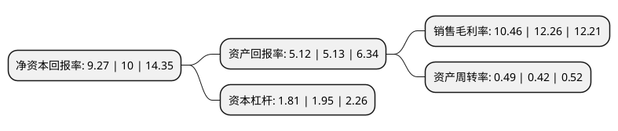

> 本页面由自动化程序生成于 2022年5月20日 01:21
> 内容可能存在错误，如有bug请提交issue至：https://github.com/Eroleice/doc-pi/issues
{.is-warning}

# 上市公司基本情况

## 基本资料

江苏博俊工业科技股份有限公司（以下简称“博俊科技”）成立于2011年03月29日，苏州市。于2021年01月07日在深交所创业板上市。

博俊科技注册资本14,213.34万元，主要从事汽车精密零部件和精密模具的研发，设计，生产和销售。主要产品冲压零部件，模具盈利能力均较强。以下是详细信息：

- 公司名称: 江苏博俊工业科技股份有限公司
- 股票代码: 300926.SZ
- 所在地: 江苏 - 苏州市
- 成立日期: 2011年03月29日
- 注册资本: 14,213.34万元
- 法定代表人: 伍亚林
- 主营业务: 主要从事汽车精密零部件和精密模具的研发，设计，生产和销售主要产品冲压零部件，模具盈利能力均较强
- 公司官网: www.sh-bojun.com
- 公司介绍: 公司是汽车精密零部件和精密模具的专业制造企业，主要从事汽车精密零部件和精密模具的研发、设计、生产和销售。公司注重技术研发与创新，掌握了模具设计与制造、冲压、激光焊接、注塑及装配等关键生产工艺和环节的技术。公司具有较强的精密模具开发、制造与销售能力，零部件产品种类丰富，覆盖了框架类、传动类、其他类等。公司是国家高新技术企业，通过了IATF16949:2016质量管理体系认证(认证范围：金属冲压件、金属焊接件和注塑件的制造，除8.3产品设计)、GB/T24001-2016/IOS14001:2015环境管理体系认证(认证范围：汽车零件的冲压、焊接、注塑生产)以及邓白氏注册认证。公司是“江苏省认定企业技术中心”、“江苏省民营科技企业”、“昆山市科技研发机构”和“苏州市博俊高精密汽车冲压模具工程技术研究中心”、“江苏省企业研究生工作站”。公司拥有严格的质量控制体系、完整的研发设计体系，致力于为客户提供高性能、专业化的精密零部件和精密模具。经过多年的发展和积累，公司在精密零部件和精密模具行业形成了一定的竞争优势。

## 股东及高管情况

上市公司第一大股东为伍亚林，持股56,875,000股，占比40.02%，为上市公司实际控制人。

截至2022年03月31日，上市公司的前十大股东中，共有6名自然人股东，4名机构股东，其中5%以上大股东共有3名。上市公司前十大股东明细如下：

> 截至2022年03月31日，上市公司前十大股东信息如下：

| 股东名称 | 持股数量（股） | 持股比例 |
| --- | --- | --- |
| 伍亚林 | 56,875,000 | 40.02% |
| 上海富智投资有限公司 | 27,500,000 | 19.35% |
| 昆山嘉恒投资管理咨询中心(有限合伙) | 13,100,000 | 9.22% |
| 伍阿凤 | 5,625,000 | 3.96% |
| 曹洪华 | 2,397,500 | 1.69% |
| 宁波马扎罗投资管理有限责任公司 | 1,102,500 | 0.78% |
| 刘芷孜 | 551,151 | 0.39% |
| 张数忠 | 278,400 | 0.2% |
| 华泰证券股份有限公司 | 238,032 | 0.17% |
| 蒋小明 | 236,000 | 0.17% |

## 利润表分析

上市公司2021年总收入为8.05亿元，净利润为0.84亿元，实现盈利。

## 杜邦分析

> 数据列示周期：2021年 | 2020年 | 2019年
{.is-info}

上市公司的净资产收益率在近一年有所下降，下降幅度为-7.3%，其变化情况分解如下：
- 上市公司的销售毛利率在近一年下降了-14.68%，可能是生产效率的下降、商品原材料价格上涨或商品价格的下跌所致。
- 上市公司的资产周转率在近一年上升了16.67%，可能是源自于更快的销售回款或库存管理效果提升。
- 上市公司的财务杠杆比率在近一年下降了-7.18%，可能是减少负债降低财务费用。

