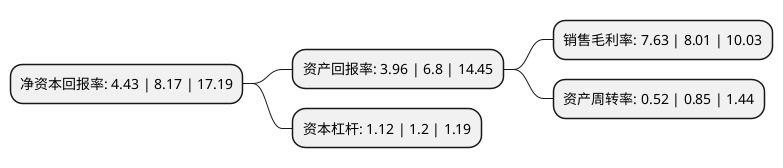

> 本页面由自动化程序生成于 2022年5月20日 01:21
> 内容可能存在错误，如有bug请提交issue至：https://github.com/Eroleice/doc-pi/issues
{.is-warning}

# 上市公司基本情况

## 基本资料

华安鑫创控股(北京)股份有限公司（以下简称“华安鑫创”）成立于2013年01月25日，北京市。于2021年01月06日在深交所创业板上市。

华安鑫创注册资本8,000万元，公司的业务范围涵盖核心显示器件定制，软件系统开发以及通用器件的销售，主营业务为汽车智能座舱电子的核心显示器件定制，软件系统开发及配套器件的销售。以下是详细信息：

- 公司名称: 华安鑫创控股(北京)股份有限公司
- 股票代码: 300928.SZ
- 所在地: 北京 - 北京市
- 成立日期: 2013年01月25日
- 注册资本: 8,000万元
- 法定代表人: 何攀
- 主营业务: 公司的业务范围涵盖核心显示器件定制，软件系统开发以及通用器件的销售，主营业务为汽车智能座舱电子的核心显示器件定制，软件系统开发及配套器件的销售
- 公司官网: www.haxc.com.cn
- 公司介绍: 公司是一家汽车智能座舱电子综合服务商，主营业务为汽车智能座舱电子的核心显示器件定制、软件系统开发及配套器件的销售。公司的产品及服务主要围绕汽车座舱电子系统，具体包括汽车仪表,中控等车用显示屏及触摸屏的定制开发，全液晶仪表系统开发，一机多屏智能交互系统开发，AR HUD抬头显示系统开发，裸眼3D显示系统开发，360°环视系统解决方案及ADAS高级辅助驾驶系统应用开发，汽车大数据及智能网联系统开发(含智能终端)，智能人机交互界面(HMI)设计，用户交互界面(UI/UE)设计,显示驱动技术方案设计服务，同时配套代理销售通用显示屏和其他通用电子元器件。自公司成立以来，产品及服务逐步被广泛应用于国内外各类车型，直接或间接服务车厂超过50家，服务车型超过200个，公司以为客户提供综合性服务为导向，在北京、深圳、中国香港、上海、重庆、青岛、桂林及柳州设立了分支机构，良好的业务基础、定制的产品设计、前沿的技术开发、硬软的完美结合、高效的市场服务，形成了公司独特的经营模式，通过全面参与汽车智能化发展进程，为我国汽车智能产业增添一份力量。公司已申请注册多项专利和商标，获得CMMI三级认证、高新技术企业证书等。

## 股东及高管情况

上市公司第一大股东为何信义，持股17,597,754股，占比22%，**疑似为**上市公司实际控制人。

截至2022年05月12日，上市公司的前十大股东中，共有6名自然人股东，4名机构股东，其中5%以上大股东共有6名。上市公司前十大股东明细如下：

> 未能通过持股比例判定出上市公司实际控制人（持股30%以上）
> 可能存在通过间接持股、联合持股、协议控制等方式拥有实际控制权的主体，具体请参考上市公司定期公告！
{.is-warning}

> 截至2022年05月12日，上市公司前十大股东信息如下：

| 股东名称 | 持股数量（股） | 持股比例 |
| --- | --- | --- |
| 何信义 | 17,597,754 | 22% |
| 肖炎 | 13,937,275 | 17.42% |
| 何攀 | 8,044,688 | 10.06% |
| 杨磊 | 6,010,336 | 7.51% |
| 杨磊 | 6,010,336 | 7.51% |
| 宁波君度尚左股权投资合伙企业(有限合伙) | 4,965,930 | 6.2074% |
| 黄锐光 | 1,122,905 | 1.4% |
| 上海联创永沂二期创业投资合伙企业(有限合伙) | 1,083,543 | 1.35% |
| 宁波梅山保税港区加泽北瑞创业投资合伙企业(有限合伙) | 1,005,586 | 1.26% |
| 上海祥禾涌安股权投资合伙企业(有限合伙) | 1,005,586 | 1.26% |

## 利润表分析

上市公司2021年总收入为7.24亿元，净利润为0.55亿元，实现盈利。

## 杜邦分析

> 数据列示周期：2021年 | 2020年 | 2019年
{.is-info}

上市公司的净资产收益率在近一年有所下降，下降幅度为-45.78%，其变化情况分解如下：
- 上市公司的销售毛利率在近一年下降了-4.74%，可能是生产效率的下降、商品原材料价格上涨或商品价格的下跌所致。
- 上市公司的资产周转率在近一年下降了-38.82%，可能是源自于更慢的销售回款或库存管理效果下降。
- 上市公司的财务杠杆比率在近一年下降了-6.67%，可能是减少负债降低财务费用。

