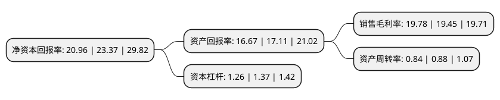

> 本页面由自动化程序生成于 2022年5月20日 01:21
> 内容可能存在错误，如有bug请提交issue至：https://github.com/Eroleice/doc-pi/issues
{.is-warning}

# 上市公司基本情况

## 基本资料

宁波恒帅股份有限公司（以下简称“恒帅股份”）成立于2001年02月21日，宁波市。于2021年04月12日在深交所创业板上市。

恒帅股份注册资本8,000万元，主要从事车用微电机及以微电机为核心组件的汽车清洗泵，清洗系统产品的研发，生产与销售，公司目前主要产品为各类车用微电机及以微电机为核心组件的汽车清洗泵，清洗系统等产品。以下是详细信息：

- 公司名称: 宁波恒帅股份有限公司
- 股票代码: 300969.SZ
- 所在地: 浙江 - 宁波市
- 成立日期: 2001年02月21日
- 注册资本: 8,000万元
- 法定代表人: 许宁宁
- 主营业务: 主要从事车用微电机及以微电机为核心组件的汽车清洗泵，清洗系统产品的研发，生产与销售，公司目前主要产品为各类车用微电机及以微电机为核心组件的汽车清洗泵，清洗系统等产品
- 公司官网: www.motorpump.com
- 公司介绍: 公司主要从事车用微电机及以微电机为核心组件的汽车清洗泵、清洗系统产品的研发、生产与销售，致力于成为全球领先的汽车微电机技术解决方案供应商。公司以微电机技术为核心，开发了应用于不同领域的产品：一是微电机技术产品，包括后备箱及侧门电机、风扇电机、ABS电机等；二是基于微电机技术开发的流体技术产品，包括清洗系统、清洗泵等产品。自成立以来，公司一直专注于为整车厂和汽车零部件供应商提供稳定性高、品质可靠的车用微电机、清洗泵、清洗系统产品；有着深厚的技术沉淀和丰富的生产经验，熟悉汽车行业对汽车零部件在一致性、功能性与稳定性方面的高要求；具备与客户同步研发的能力，为客户在自动化、智能化以及清晰视觉等应用领域提供系统的解决方案，在行业内拥有较强的竞争力。

## 股东及高管情况

上市公司第一大股东为宁波恒帅投资管理有限公司，持股42,868,113股，占比53.59%，为上市公司实际控制人。

截至2022年03月31日，上市公司的前十大股东中，共有1名自然人股东，3名机构股东，6个产品账户，其中5%以上大股东共有2名。上市公司前十大股东明细如下：

> 截至2022年03月31日，上市公司前十大股东信息如下：

| 股东名称 | 持股数量（股） | 持股比例 |
| --- | --- | --- |
| 宁波恒帅投资管理有限公司 | 42,868,113 | 53.59% |
| 俞国梅 | 14,289,371 | 17.86% |
| 宁波玉米股权投资管理合伙企业(有限合伙) | 2,842,516 | 3.55% |
| 招商银行股份有限公司-交银施罗德新成长混合型证券投资基金 | 1,564,271 | 1.96% |
| 中国农业银行股份有限公司-交银施罗德精选混合型证券投资基金 | 1,105,060 | 1.38% |
| 招商银行股份有限公司-鹏华新兴成长混合型证券投资基金 | 672,136 | 0.84% |
| 交银施罗德基金-中国人寿保险股份有限公司-分红险-交银施罗德基金国寿股份均衡股票型组合单一资产管理计划(可供出售) | 486,399 | 0.61% |
| 交银施罗德基金-中国人寿保险股份有限公司-传统险-交银施罗德国寿股份均衡股票传统可供出售单一资产管理计划 | 379,199 | 0.47% |
| 中国建设银行股份有限公司-鹏华研究精选灵活配置混合型证券投资基金 | 360,624 | 0.45% |
| 中信证券股份有限公司 | 301,739 | 0.38% |

## 利润表分析

上市公司2021年总收入为5.84亿元，净利润为1.15亿元，实现盈利。

## 杜邦分析

> 数据列示周期：2021年 | 2020年 | 2019年
{.is-info}

上市公司的净资产收益率在近一年有所下降，下降幅度为-10.31%，其变化情况分解如下：
- 上市公司的销售毛利率在近一年上升了1.7%，可能是生产效率的提升、商品原材料价格下跌或商品价格的上涨所致。
- 上市公司的资产周转率在近一年下降了-4.55%，可能是源自于更慢的销售回款或库存管理效果下降。
- 上市公司的财务杠杆比率在近一年下降了-8.03%，可能是减少负债降低财务费用。

