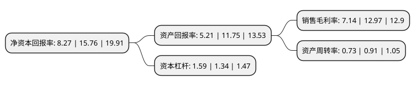

> 本页面由自动化程序生成于 2022年5月20日 01:22
> 内容可能存在错误，如有bug请提交issue至：https://github.com/Eroleice/doc-pi/issues
{.is-warning}

# 上市公司基本情况

## 基本资料

广东东箭汽车科技股份有限公司（以下简称“东箭科技”）成立于2003年07月04日，佛山市。于2021年04月26日在深交所创业板上市。

东箭科技注册资本42,270.274万元，主要产品类别包括车侧承载装饰系统产品，车辆前后防护系统产品，车载互联智能机电系统产品，车顶装载系统产品及车辆其他系统产品，主要从事车侧承载装饰系统产品，车辆前后防护系统产品，车载互联智能机电系统产品，车顶装载系统产品及车辆其他系统产品的工业设计，研发，生产和销售。以下是详细信息：

- 公司名称: 广东东箭汽车科技股份有限公司
- 股票代码: 300978.SZ
- 所在地: 广东 - 佛山市
- 成立日期: 2003年07月04日
- 注册资本: 42,270.274万元
- 法定代表人: 马永涛
- 主营业务: 主要产品类别包括车侧承载装饰系统产品，车辆前后防护系统产品，车载互联智能机电系统产品，车顶装载系统产品及车辆其他系统产品，主要从事车侧承载装饰系统产品，车辆前后防护系统产品，车载互联智能机电系统产品，车顶装载系统产品及车辆其他系统产品的工业设计，研发，生产和销售
- 公司官网: www.dongjian.cc
- 公司介绍: 公司是一家专注于汽车智能、安全、健康、个性化定制等提升汽车驾乘体验的科技公司，主要从事车侧承载装饰系统产品、车辆前后防护系统产品、车载互联智能机电系统产品、车顶装载系统产品及车辆其他系统产品的工业设计、研发、生产和销售，产品系列以汽车后市场为主延伸至汽车前装市场领域，广泛应用于SUV、轿车、MPV、越野车、皮卡等各类车型，并适配众多豪华及中高档汽车品牌。公司未来将立足于汽车后市场，并以车载互联智能机电系统产品为主开拓汽车前装市场，以创新驱动企业发展，并借助“智能+”，努力为消费者提供高品质的汽车生活解决方案，力争成为全球领先的汽车科技企业。随着经营规模的逐步扩大和持续的研发投入，公司的综合竞争力和品牌影响力得到持续提升，公司于2014年获得“海关AEO高级认证企业”、于2016年被国家知识产权局列入“国家级知识产权优势企业”、于2017年被广东省知识产权局列入“广东省知识产权保护重点企业”，于2017年获得佛山市人民政府设立的辖区内最高质量荣誉奖“佛山市政府质量奖”等一系列荣誉称号。

## 股东及高管情况

上市公司第一大股东为马永涛，持股107,044,131股，占比25.32%，**疑似为**上市公司实际控制人。

截至2022年03月31日，上市公司的前十大股东中，共有5名自然人股东，5名机构股东，其中5%以上大股东共有4名。上市公司前十大股东明细如下：

> 未能通过持股比例判定出上市公司实际控制人（持股30%以上）
> 可能存在通过间接持股、联合持股、协议控制等方式拥有实际控制权的主体，具体请参考上市公司定期公告！
{.is-warning}

> 截至2022年03月31日，上市公司前十大股东信息如下：

| 股东名称 | 持股数量（股） | 持股比例 |
| --- | --- | --- |
| 马永涛 | 107,044,131 | 25.32% |
| 广东东箭汇盈投资有限公司 | 65,448,000 | 15.48% |
| 马汇洋 | 47,456,999 | 11.23% |
| 罗军 | 23,623,783 | 5.59% |
| 夏炎华 | 16,158,784 | 3.82% |
| 陈梓佳 | 16,158,784 | 3.82% |
| 北京浩远企业投资管理中心(有限合伙)-宁波梅山保税港区浩远德樟投资管理合伙企业(有限合伙) | 14,942,465 | 3.53% |
| 新余东裕投资合伙企业(有限合伙) | 14,526,184 | 3.44% |
| 上海泓成创业投资合伙企业(有限合伙) | 13,978,042 | 3.31% |
| 上海聚澄创业投资合伙企业(有限合伙) | 13,978,042 | 3.31% |

## 利润表分析

上市公司2021年总收入为16.36亿元，净利润为1.16亿元，实现盈利。

## 杜邦分析

> 数据列示周期：2021年 | 2020年 | 2019年
{.is-info}

上市公司的净资产收益率在近一年有所下降，下降幅度为-47.53%，其变化情况分解如下：
- 上市公司的销售毛利率在近一年下降了-44.95%，可能是生产效率的下降、商品原材料价格上涨或商品价格的下跌所致。
- 上市公司的资产周转率在近一年下降了-19.78%，可能是源自于更慢的销售回款或库存管理效果下降。
- 上市公司的财务杠杆比率在近一年上升了18.66%，可能是增加负债扩大生产规模。

