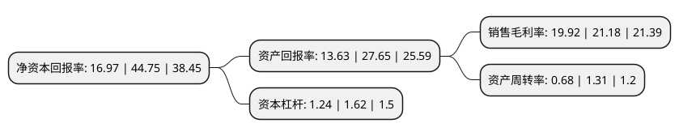

> 本页面由自动化程序生成于 2022年5月20日 01:22
> 内容可能存在错误，如有bug请提交issue至：https://github.com/Eroleice/doc-pi/issues
{.is-warning}

# 上市公司基本情况

## 基本资料

上海肇民新材料科技股份有限公司（以下简称“肇民科技”）成立于2011年10月27日，上海市。于2021年05月28日在深交所创业板上市。

肇民科技注册资本5,333.35万元，主营业务为精密注塑件及配套精密注塑模具的研发，生产和销售。公司主要产品为精密注塑件和精密注塑模具。以下是详细信息：

- 公司名称: 上海肇民新材料科技股份有限公司
- 股票代码: 301000.SZ
- 所在地: 上海 - 上海市
- 成立日期: 2011年10月27日
- 注册资本: 5,333.35万元
- 法定代表人: 邵雄辉
- 主营业务: 主营业务为精密注塑件及配套精密注塑模具的研发，生产和销售公司主要产品为精密注塑件和精密注塑模具
- 公司官网: www.hps-sh.com
- 公司介绍: 公司是以特种工程塑料的应用开发为核心，专注于为客户提供高品质工程塑料精密件的制造商，主营业务为精密注塑件及配套精密注塑模具的研发、生产和销售。公司的产品聚焦于乘用车、商用车、新能源车、高端厨卫家电等领域，为客户提供具有高安全性、重要功能性的核心零部件，具有较高附加值，产品系列包括汽车发动机周边部件、汽车传动系统部件、汽车制动系统部件、智能座便器功能部件、家用热水器功能部件、家用净水器功能部件、精密工业部件、医疗器械部件、新能源车部件等。公司自成立以来一直践行精益求精的“工匠精神”，秉承崇尚“匠人”的企业文化，不断提升精密制造水平，现已磨练出拥有高品质精密制造能力的优秀团队。同时，公司拥有完整的研发设计体系和严格的质量控制体系，现已取得78项专利，其中4项发明专利、72项实用新型专利以及2项外观设计专利。公司已通过IATF16949:2016质量管理体系认证、GB/T24001-2016/ISO14001:2015环境管理体系认证、GB/T28001-2011/OHSAS18001:2007职业健康安全管理体系认证以及邓白氏注册认证。

## 股东及高管情况

上市公司第一大股东为上海济兆实业发展有限公司，持股20,000,000股，占比37.5%，为上市公司实际控制人。

截至2022年03月31日，上市公司的前十大股东中，共有4名自然人股东，6名机构股东，其中5%以上大股东共有5名。上市公司前十大股东明细如下：

> 截至2022年03月31日，上市公司前十大股东信息如下：

| 股东名称 | 持股数量（股） | 持股比例 |
| --- | --- | --- |
| 上海济兆实业发展有限公司 | 20,000,000 | 37.5% |
| 宁波梅山保税港区华肇股权投资合伙企业(有限合伙) | 4,000,000 | 7.5% |
| 宁波梅山保税港区百肇投资管理合伙企业(有限合伙) | 4,000,000 | 7.5% |
| 浙北大厦集团有限公司 | 4,000,000 | 7.5% |
| 邵雄辉 | 4,000,000 | 7.5% |
| 曹文洁 | 2,000,000 | 3.75% |
| 苏州中和春生三号投资中心(有限合伙) | 1,052,000 | 1.97% |
| 嘉兴市兴和股权投资合伙企业(有限合伙) | 948,000 | 1.78% |
| 左孝顺 | 99,200 | 0.19% |
| 徐锡峰 | 82,535 | 0.15% |

## 利润表分析

上市公司2021年总收入为5.84亿元，净利润为1.16亿元，实现盈利。

## 杜邦分析

> 数据列示周期：2021年 | 2020年 | 2019年
{.is-info}

上市公司的净资产收益率在近一年有所下降，下降幅度为-62.08%，其变化情况分解如下：
- 上市公司的销售毛利率在近一年下降了-5.95%，可能是生产效率的下降、商品原材料价格上涨或商品价格的下跌所致。
- 上市公司的资产周转率在近一年下降了-48.09%，可能是源自于更慢的销售回款或库存管理效果下降。
- 上市公司的财务杠杆比率在近一年下降了-23.46%，可能是减少负债降低财务费用。

