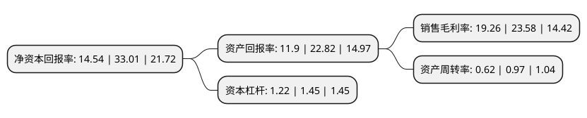

> 本页面由自动化程序生成于 2022年5月20日 01:22
> 内容可能存在错误，如有bug请提交issue至：https://github.com/Eroleice/doc-pi/issues
{.is-warning}

# 上市公司基本情况

## 基本资料

超捷紧固系统(上海)股份有限公司（以下简称“超捷股份”）成立于2001年12月28日，上海市。于2021年06月01日在深交所创业板上市。

超捷股份注册资本5,712.69万元，高强度精密紧固件，异形连接件等产品的研发，生产与销售以下是详细信息：

- 公司名称: 超捷紧固系统(上海)股份有限公司
- 股票代码: 301005.SZ
- 所在地: 上海 - 上海市
- 成立日期: 2001年12月28日
- 注册资本: 5,712.69万元
- 法定代表人: 宋广东
- 主营业务: 高强度精密紧固件，异形连接件等产品的研发，生产与销售
- 公司官网: www.shchaojie.com.cn
- 公司介绍: 公司长期致力于高强度精密紧固件、异形连接件等产品的研发、生产与销售，产品主要应用于汽车发动机涡轮增压系统，换档驻车控制系统，汽车排气系统，汽车座椅、车灯与后视镜等内外饰系统的汽车关键零部件的连接、紧固。此外，公司的紧固件产品还应用于电子电器、通信等行业。经过多年的研发投入和持续积累，公司与下游主要的零部件一级供应商及整车厂建立了良好的合作关系，产品主要供给国内外知名汽车零部件一级供应商如富奥石川岛、华域视觉、盖瑞特、博世、佛吉亚、麦格纳、法雷奥、海拉、安道拓、德韧、上海菱重、宁波丰沃、博马科技、法雷奥西门子等，终端OEM为大众、通用、吉利、长城、日产、广汽菲克、蔚来等整车生产厂商。

## 股东及高管情况

上市公司第一大股东为上海毅宁投资有限公司，持股27,459,054股，占比48.07%，为上市公司实际控制人。

截至2022年03月31日，上市公司的前十大股东中，共有6名自然人股东，4名机构股东，其中5%以上大股东共有2名。上市公司前十大股东明细如下：

> 截至2022年03月31日，上市公司前十大股东信息如下：

| 股东名称 | 持股数量（股） | 持股比例 |
| --- | --- | --- |
| 上海毅宁投资有限公司 | 27,459,054 | 48.07% |
| 上海祥禾涌原股权投资合伙企业(有限合伙) | 2,913,472 | 5.1% |
| 上海誉威投资有限公司 | 2,181,200 | 3.82% |
| 曾立丰 | 1,780,560 | 3.12% |
| 吕海军 | 1,669,280 | 2.92% |
| 王胜永 | 1,528,716 | 2.68% |
| 周家乐 | 1,518,078 | 2.66% |
| 宋毅博 | 1,372,510 | 2.4% |
| 赵何钢 | 856,903 | 1.5% |
| 上海文超投资有限公司 | 708,500 | 1.24% |

## 利润表分析

上市公司2021年总收入为3.93亿元，净利润为0.75亿元，实现盈利。

## 杜邦分析

> 数据列示周期：2021年 | 2020年 | 2019年
{.is-info}

上市公司的净资产收益率在近一年有所下降，下降幅度为-55.95%，其变化情况分解如下：
- 上市公司的销售毛利率在近一年下降了-18.32%，可能是生产效率的下降、商品原材料价格上涨或商品价格的下跌所致。
- 上市公司的资产周转率在近一年下降了-36.08%，可能是源自于更慢的销售回款或库存管理效果下降。
- 上市公司的财务杠杆比率在近一年下降了-15.86%，可能是减少负债降低财务费用。

