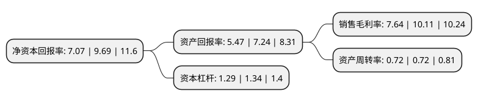

> 本页面由自动化程序生成于 2022年5月20日 01:22
> 内容可能存在错误，如有bug请提交issue至：https://github.com/Eroleice/doc-pi/issues
{.is-warning}

# 上市公司基本情况

## 基本资料

江苏中捷精工科技股份有限公司（以下简称“中捷精工”）成立于1998年08月11日，无锡市。于2021年09月29日在深交所创业板上市。

中捷精工注册资本10,505.48万元，公司主营业务为汽车精密零部件的研发，生产和销售。公司主要产品为减震零部件产品。以下是详细信息：

- 公司名称: 江苏中捷精工科技股份有限公司
- 股票代码: 301072.SZ
- 所在地: 江苏 - 无锡市
- 成立日期: 1998年08月11日
- 注册资本: 10,505.48万元
- 法定代表人: 魏忠
- 主营业务: 公司主营业务为汽车精密零部件的研发，生产和销售公司主要产品为减震零部件产品
- 公司官网: www.jiangsuzhongjie.com
- 公司介绍: 公司主营业务为汽车精密零部件的研发、生产和销售。公司主要产品为减震零部件产品，用于消除来自汽车动力总成、路面及空气的振动和噪声，提升汽车行驶过程中的平顺性及舒适性。公司是经江苏省科技厅、江苏省财政厅、江苏省国税局和江苏省地税局联合认定的高新技术企业，是江苏省经济和信息化委员会认定的江苏省信息化与工业化融合试点企业。公司拥有经江苏省科技厅、江苏省财政厅认定的汽车焊接冲压应用工程技术研究中心，经无锡市经济和信息化委员会认定的无锡市企业技术中心。公司研发的“汽车前桥与转向连接扭力支架”、“连续模的防误送料联动装置”和“变速箱内嵌橡胶支承减震器”、“汽车发动机连杆缓冲减震保护装置”等产品被江苏省科学技术厅评定为高新技术产品。

## 股东及高管情况

上市公司第一大股东为魏鹤良，持股25,500,000股，占比24.27%，**疑似为**上市公司实际控制人。

截至2022年03月31日，上市公司的前十大股东中，共有5名自然人股东，5名机构股东，其中5%以上大股东共有4名。上市公司前十大股东明细如下：

> 未能通过持股比例判定出上市公司实际控制人（持股30%以上）
> 可能存在通过间接持股、联合持股、协议控制等方式拥有实际控制权的主体，具体请参考上市公司定期公告！
{.is-warning}

> 截至2022年03月31日，上市公司前十大股东信息如下：

| 股东名称 | 持股数量（股） | 持股比例 |
| --- | --- | --- |
| 魏鹤良 | 25,500,000 | 24.27% |
| 魏忠 | 24,500,000 | 23.32% |
| 无锡普贤投资合伙企业(有限合伙) | 12,000,000 | 11.42% |
| 无锡东明天昱投资合伙企业(有限合伙) | 6,000,000 | 5.71% |
| 无锡宝宁投资合伙企业(有限合伙) | 3,700,000 | 3.52% |
| 无锡市玄同投资合伙企业(有限合伙) | 3,151,600 | 3% |
| 无锡金投信安投资企业(有限合伙) | 2,363,700 | 2.25% |
| 王建明 | 787,900 | 0.75% |
| 张丽华 | 647,863 | 0.62% |
| 王鹏飞 | 393,950 | 0.37% |

## 利润表分析

上市公司2021年总收入为6.22亿元，净利润为0.47亿元，实现盈利。

## 杜邦分析

> 数据列示周期：2021年 | 2020年 | 2019年
{.is-info}

上市公司的净资产收益率在近一年有所下降，下降幅度为-27.04%，其变化情况分解如下：
- 上市公司的销售毛利率在近一年下降了-24.43%，可能是生产效率的下降、商品原材料价格上涨或商品价格的下跌所致。
- 上市公司的资产周转率在近一年下降了0%，可能是源自于更慢的销售回款或库存管理效果下降。
- 上市公司的财务杠杆比率在近一年下降了-3.73%，可能是减少负债降低财务费用。

