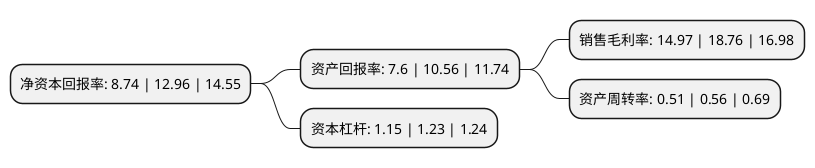

> 本页面由自动化程序生成于 2022年5月20日 01:23
> 内容可能存在错误，如有bug请提交issue至：https://github.com/Eroleice/doc-pi/issues
{.is-warning}

# 上市公司基本情况

## 基本资料

杭州正强传动股份有限公司（以下简称“正强股份”）成立于1997年08月12日，杭州市。于2021年11月22日在深交所创业板上市。

正强股份注册资本8,000万元，主要从事汽车十字轴万向节总成，节叉及其相关零部件的研发，生产和销售，主要产品为十字轴万向节总成，节叉和十字轴，其中，十字轴是十字轴万向节总成的关键零部件之一。以下是详细信息：

- 公司名称: 杭州正强传动股份有限公司
- 股票代码: 301119.SZ
- 所在地: 浙江 - 杭州市
- 成立日期: 1997年08月12日
- 注册资本: 8,000万元
- 法定代表人: 许正庆
- 主营业务: 主要从事汽车十字轴万向节总成，节叉及其相关零部件的研发，生产和销售，主要产品为十字轴万向节总成，节叉和十字轴，其中，十字轴是十字轴万向节总成的关键零部件之一
- 公司官网: www.zhengqiang.com
- 公司介绍: 公司主要从事汽车十字轴万向节总成、节叉及其相关零部件的研发、生产和销售，主要产品为十字轴万向节总成、节叉和十字轴，其中，十字轴是十字轴万向节总成的关键零部件之一。公司产品主要应用于汽车转向系统和传动系统，属于汽车安全件和易损件。公司是国家高新技术企业，在十字轴万向节总成细分领域具有较强的自主研发能力。公司成立至今先后有26项产品曾被评为省级工业新产品。公司及子公司拥有发明专利19项、实用新型专利14项。2006年8月，公司被中华人民共和国商务部与国家发展与改革委员会评为“国家汽车零部件出口基地企业”；2011年12月，公司被浙江省科学技术厅认定为“省级高新技术企业研究开发中心依托单位”；2013年1月，公司被杭州市科学技术委员会、杭州市知识产权局授予“2012年度杭州市专利试点企业”；2014年9月，公司被杭州市经济和信息化委员会授予“杭州市市级工业设计中心”；2017年12月，公司的汽车十字轴万向节总成产品被浙江省质量技术监督局授予“浙江名牌产品”；2018年1月，公司分别被浙江省汽车行业协会、浙江省商务厅授予“2017年浙江省汽车工业百强企业”、“浙江出口名牌”。

## 股东及高管情况

上市公司第一大股东为杭州正强控股有限公司，持股30,600,000股，占比38.25%，为上市公司实际控制人。

截至2022年03月31日，上市公司的前十大股东中，共有7名自然人股东，3名机构股东，其中5%以上大股东共有3名。上市公司前十大股东明细如下：

> 截至2022年03月31日，上市公司前十大股东信息如下：

| 股东名称 | 持股数量（股） | 持股比例 |
| --- | --- | --- |
| 杭州正强控股有限公司 | 30,600,000 | 38.25% |
| 许正庆 | 12,240,000 | 15.3% |
| 傅强 | 8,160,000 | 10.2% |
| 杭州达辉投资管理合伙企业(有限合伙) | 3,500,000 | 4.38% |
| 许正环 | 1,500,000 | 1.88% |
| 许震彪 | 1,500,000 | 1.88% |
| 傅建权 | 1,500,000 | 1.88% |
| 杭州筋斗云投资管理合伙企业(有限合伙) | 1,000,000 | 1.25% |
| 苗素华 | 252,200 | 0.32% |
| 徐标 | 238,283 | 0.3% |

## 利润表分析

上市公司2021年总收入为3.54亿元，净利润为0.53亿元，实现盈利。

## 杜邦分析

> 数据列示周期：2021年 | 2020年 | 2019年
{.is-info}

上市公司的净资产收益率在近一年有所下降，下降幅度为-32.56%，其变化情况分解如下：
- 上市公司的销售毛利率在近一年下降了-20.2%，可能是生产效率的下降、商品原材料价格上涨或商品价格的下跌所致。
- 上市公司的资产周转率在近一年下降了-8.93%，可能是源自于更慢的销售回款或库存管理效果下降。
- 上市公司的财务杠杆比率在近一年下降了-6.5%，可能是减少负债降低财务费用。

