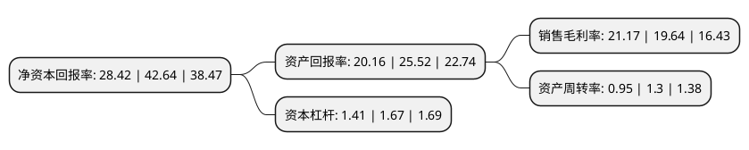

> 本页面由自动化程序生成于 2022年5月20日 01:23
> 内容可能存在错误，如有bug请提交issue至：https://github.com/Eroleice/doc-pi/issues
{.is-warning}

# 上市公司基本情况

## 基本资料

江阴标榜汽车部件股份有限公司（以下简称“标榜股份”）成立于2009年07月29日，无锡市。于2022年02月21日在深交所创业板上市。

标榜股份注册资本9,000万元，主营业务为汽车尼龙管路及连接件等系列产品的研发，生产和销售，主要产品包括动力系统连接管路，冷却系统连接管路，连接件等。以下是详细信息：

- 公司名称: 江阴标榜汽车部件股份有限公司
- 股票代码: 301181.SZ
- 所在地: 江苏 - 无锡市
- 成立日期: 2009年07月29日
- 注册资本: 9,000万元
- 法定代表人: 沈皓
- 主营业务: 主营业务为汽车尼龙管路及连接件等系列产品的研发，生产和销售，主要产品包括动力系统连接管路，冷却系统连接管路，连接件等
- 公司官网: www.pivotautomotive.com
- 公司介绍: 公司是国内少数进入合资品牌整车厂供应体系的汽车尼龙管路优势企业之一,是经江苏省科学技术厅、江苏省财政厅、国家税务总局江苏省税务局认定的高新技术企业，专注于乘用车市场的零部件配套领域，为客户提供具有高安全性、重要功能性的核心零部件。公司主营业务为汽车尼龙管路及连接件等系列产品的研发、生产和销售，主要产品包括动力系统连接管路、冷却系统连接管路、连接件等，先后被评为江苏省科技型中小企业、江苏省民营科技企业、江阴市专精特新科技小巨人企业，公司技术中心被认定为江苏省认定企业技术中心。公司曾荣获无锡市科学技术进步三等奖，并成功申报“国六汽车用高阻燃性管路系统项目”江苏省投资项目、“新能源汽车用耐高低温轻质冷却管路系统的研发”科技创新专项资金重点项目,公司主要产品已广泛配套于上汽大众、一汽大众、奥迪汽车、宝沃汽车、上汽大通、福特汽车、标致汽车等知名品牌的众多车型，与国内知名的汽车整车厂和优秀的汽车零部件制造企业建立了稳定的战略合作关系，在汽车尼龙管路制造行业具有较高的品牌知名度与行业地位。

## 股东及高管情况

上市公司第一大股东为江阴标榜网络科技有限公司，持股30,000,000股，占比33.33%，为上市公司实际控制人。

截至2022年03月31日，上市公司的前十大股东中，共有7名自然人股东，3名机构股东，其中5%以上大股东共有3名。上市公司前十大股东明细如下：

> 截至2022年03月31日，上市公司前十大股东信息如下：

| 股东名称 | 持股数量（股） | 持股比例 |
| --- | --- | --- |
| 江阴标榜网络科技有限公司 | 30,000,000 | 33.33% |
| 赵奇 | 14,850,000 | 16.5% |
| 沈皓 | 7,200,000 | 8% |
| 江苏标榜贸易有限公司 | 3,000,000 | 3.33% |
| 朱裕金 | 2,580,000 | 2.87% |
| 李逵 | 2,000,000 | 2.22% |
| 蒋昶 | 2,000,000 | 2.22% |
| 沈炎 | 2,000,000 | 2.22% |
| 上海石雀投资管理有限公司 | 1,500,000 | 1.67% |
| 施明刚 | 1,380,000 | 1.53% |

## 利润表分析

上市公司2021年总收入为4.78亿元，净利润为1.01亿元，实现盈利。

## 杜邦分析

> 数据列示周期：2021年 | 2020年 | 2019年
{.is-info}

上市公司的净资产收益率在近一年有所下降，下降幅度为-33.35%，其变化情况分解如下：
- 上市公司的销售毛利率在近一年上升了7.79%，可能是生产效率的提升、商品原材料价格下跌或商品价格的上涨所致。
- 上市公司的资产周转率在近一年下降了-26.92%，可能是源自于更慢的销售回款或库存管理效果下降。
- 上市公司的财务杠杆比率在近一年下降了-15.57%，可能是减少负债降低财务费用。

