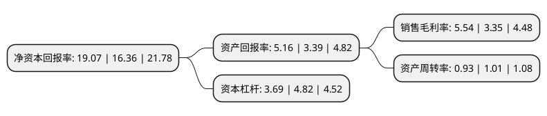

> 本页面由自动化程序生成于 2022年5月20日 01:24
> 内容可能存在错误，如有bug请提交issue至：https://github.com/Eroleice/doc-pi/issues
{.is-warning}

# 上市公司基本情况

## 基本资料

东风电子科技股份有限公司（以下简称“东风科技”）成立于1998年04月29日，上海市。于1997年07月03日在上交所主板上市。

东风科技注册资本47,041.891万元，主要产品:汽车仪表系统，饰件系统，制动系统，汽车电子系统及金属铸件产品。主营业务:研发，开发，采购，制造，销售汽车仪表系统，饰件系统，制动系统(含ABS气压防抱死制动系统)，供油系统产品，GPS车载导航系统部件及车身控制系统等汽车电子系统产品;汽车，摩托车及其他领域的传感器及其他部件产品，塑料零件，有色金属压铸件的设计，制造和销售，自营和代理各类商品和技术的进出口。以下是详细信息：

- 公司名称: 东风电子科技股份有限公司
- 股票代码: 600081.SH
- 所在地: 上海 - 上海市
- 成立日期: 1998年04月29日
- 注册资本: 47,041.891万元
- 法定代表人: 陈兴林
- 主营业务: 主要产品:汽车仪表系统，饰件系统，制动系统，汽车电子系统及金属铸件产品主营业务:研发，开发，采购，制造，销售汽车仪表系统，饰件系统，制动系统(含ABS气压防抱死制动系统)，供油系统产品，GPS车载导航系统部件及车身控制系统等汽车电子系统产品;汽车，摩托车及其他领域的传感器及其他部件产品，塑料零件，有色金属压铸件的设计，制造和销售，自营和代理各类商品和技术的进出口
- 公司官网: www.detc.com.cn
- 公司介绍: 公司经营范围为研究、开发、采购、制造、销售汽车仪表系统、饰件系统、制动系统、供油系统产品，车身控制器等汽车电子系统产品；汽车、摩托车及其他领域的传感器及其他部件产品、塑料零件、有色金属压铸件的设计、制造和销售，自营和代理各类商品和技术的进出口，但国家限定公司经营或禁止进出口的商品及技术除外(涉及许可经营的凭许可证经营)。公司主要产品包括汽车仪表系统、饰件系统、制动系统、汽车电子系统及金属铸件产品。公司电子业务、饰件业务、制动业务与国内外行业实力企业合资合作，使公司在运营管理、产品技术、市场竞争方面的优势得以快速提升。

## 股东及高管情况

上市公司第一大股东为东风汽车零部件(集团)有限公司，持股360,672,905股，占比76.67%，为上市公司实际控制人。

截至2022年03月31日，上市公司的前十大股东中，共有8名自然人股东，1名机构股东，1个产品账户，其中5%以上大股东共有1名。上市公司前十大股东明细如下：

> 截至2022年03月31日，上市公司前十大股东信息如下：

| 股东名称 | 持股数量（股） | 持股比例 |
| --- | --- | --- |
| 东风汽车零部件(集团)有限公司 | 360,672,905 | 76.67% |
| 罗金苏 | 1,369,348 | 0.29% |
| 胡启民 | 1,151,200 | 0.24% |
| 虞金龙 | 988,000 | 0.21% |
| 吴军 | 699,500 | 0.15% |
| 贾晓放 | 656,100 | 0.14% |
| 章木秀 | 628,500 | 0.13% |
| 谷立志 | 588,879 | 0.13% |
| 许强 | 400,077 | 0.09% |
| 深圳前海金信达股权投资有限公司-金信达1号私募证券投资基金 | 390,400 | 0.08% |

## 利润表分析

上市公司2021年总收入为78.61亿元，净利润为4.35亿元，实现盈利。

## 杜邦分析

> 数据列示周期：2021年 | 2020年 | 2019年
{.is-info}

上市公司的净资产收益率在近一年有所上升，上升幅度为16.56%，其变化情况分解如下：
- 上市公司的销售毛利率在近一年上升了65.37%，可能是生产效率的提升、商品原材料价格下跌或商品价格的上涨所致。
- 上市公司的资产周转率在近一年下降了-7.92%，可能是源自于更慢的销售回款或库存管理效果下降。
- 上市公司的财务杠杆比率在近一年下降了-23.44%，可能是减少负债降低财务费用。

