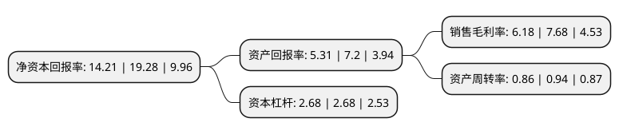

> 本页面由自动化程序生成于 2022年5月20日 01:24
> 内容可能存在错误，如有bug请提交issue至：https://github.com/Eroleice/doc-pi/issues
{.is-warning}

# 上市公司基本情况

## 基本资料

长春一东离合器股份有限公司（以下简称“长春一东”）成立于1998年05月07日，长春市。于1998年05月20日在上交所主板上市。

长春一东注册资本14,151.64万元，主要产品:汽车离合器。以下是详细信息：

- 公司名称: 长春一东离合器股份有限公司
- 股票代码: 600148.SH
- 所在地: 吉林 - 长春市
- 成立日期: 1998年05月07日
- 注册资本: 14,151.64万元
- 法定代表人: 高汝森
- 主营业务: 主要产品:汽车离合器
- 公司官网: www.ccyd.com.cn
- 公司介绍: 公司主要从事汽车离合器及液压举升机构等汽车零部件的研发、生产与销售。公司是国内主要汽车零部件生产企业，是中国汽车工业协会离合器委员会理事长单位，拥有国家级企业技术中心和博士后流动工作站，是中国离合器行业标准起草单位。配套车型主要覆盖商用车及乘用车。公司是一汽解放、一汽大众、柳州柳机、上汽五菱、长安集团、江淮汽车、渝安小康、东风柳汽、绵阳新晨、保定长城、沈阳新光、郑州宇通、北汽福田、陕西重汽、山西大运、华菱汽车等五十余家国内整车厂、主机厂的配套供应商，同时还为国外巴西大众、俄罗斯卡玛斯、通用零件、戴姆勒奔驰、沃尔沃、塔塔大宇等国际厂商配套供货。

## 股东及高管情况

上市公司第一大股东为吉林东光集团有限公司，持股33,963,948股，占比24%，**疑似为**上市公司实际控制人。

截至2022年03月31日，上市公司的前十大股东中，共有5名自然人股东，5名机构股东，其中5%以上大股东共有3名。上市公司前十大股东明细如下：

> 未能通过持股比例判定出上市公司实际控制人（持股30%以上）
> 可能存在通过间接持股、联合持股、协议控制等方式拥有实际控制权的主体，具体请参考上市公司定期公告！
{.is-warning}

> 截至2022年03月31日，上市公司前十大股东信息如下：

| 股东名称 | 持股数量（股） | 持股比例 |
| --- | --- | --- |
| 吉林东光集团有限公司 | 33,963,948 | 24% |
| 一汽股权投资(天津)有限公司 | 31,864,231 | 22.52% |
| 中兵投资管理有限责任公司 | 11,414,971 | 8.07% |
| 于雪丽 | 3,245,001 | 2.29% |
| 烟台北方安德利果汁股份有限公司 | 2,293,065 | 1.62% |
| 海通证券股份有限公司 | 1,771,802 | 1.25% |
| 郑建刚 | 1,111,101 | 0.79% |
| 曲峻葳 | 905,100 | 0.64% |
| 张永涛 | 701,000 | 0.5% |
| 晏世德 | 600,000 | 0.42% |

## 利润表分析

上市公司2021年总收入为11.23亿元，净利润为0.69亿元，实现盈利。

## 杜邦分析

> 数据列示周期：2021年 | 2020年 | 2019年
{.is-info}

上市公司的净资产收益率在近一年有所下降，下降幅度为-26.3%，其变化情况分解如下：
- 上市公司的销售毛利率在近一年下降了-19.53%，可能是生产效率的下降、商品原材料价格上涨或商品价格的下跌所致。
- 上市公司的资产周转率在近一年下降了-8.51%，可能是源自于更慢的销售回款或库存管理效果下降。
- 上市公司的财务杠杆比率在近一年下降了0%，可能是减少负债降低财务费用。

