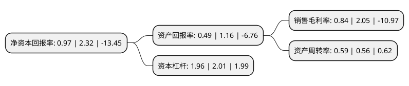

> 本页面由自动化程序生成于 2022年5月20日 01:24
> 内容可能存在错误，如有bug请提交issue至：https://github.com/Eroleice/doc-pi/issues
{.is-warning}

# 上市公司基本情况

## 基本资料

上海航天汽车机电股份有限公司（以下简称“航天机电”）成立于1998年05月28日，上海市。于1998年06月05日在上交所主板上市。

航天机电注册资本143,425.229万元，主要产品:硅片，电池片，组件制造。主营业务:硅片，电池片，组件环节的技术研发，制造以及销售，电站投资，开发，EPC建设。以下是详细信息：

- 公司名称: 上海航天汽车机电股份有限公司
- 股票代码: 600151.SH
- 所在地: 上海 - 上海市
- 成立日期: 1998年05月28日
- 注册资本: 143,425.229万元
- 法定代表人: 荆怀靖
- 主营业务: 主要产品:硅片，电池片，组件制造主营业务:硅片，电池片，组件环节的技术研发，制造以及销售，电站投资，开发，EPC建设
- 公司官网: www.ht-saae.com
- 公司介绍: 上海航天汽车机电股份有限公司成立于1998年5月28日，股票代码600151，是中国首家以“航天”命名的上市公司，是航天技术应用产业化的重要平台。依托央企资源，把握国家战略性产业发展方向，经过多年不懈努力，航天机电现已形成新能源光伏、汽车热系统和军民融合三大产业格局，创建了上海、内蒙古、江苏三大产研基地，拥有五家高新技术企业和七个国家级、省市级技术研发中心。航天机电主要从事多晶硅、太阳能电池、电池组件及“光伏+储能”新型系统集成；空调热系统、EPS等汽车电子系统产品；军民融合领域的应用产品的研发、生产和销售。旗下品牌广泛享有国际国内市场盛誉，先后与众多世界知名企业建立了战略合作伙伴关系。秉承“用心创造未来”的企业文化，航天机电始终致力航天技术应用产业的发展，为中国乃至全球提供优质的产品和服务，并努力打造“可持续发展，有社会责任感，给股东合理回报的优质上市公司”。在企业科学发展的同时，积极履行节能环保的全球性社会责任，用心创造人类可持续发展的美好未来。

## 股东及高管情况

上市公司第一大股东为上海航天技术研究院，持股379,350,534股，占比26.45%，**疑似为**上市公司实际控制人。

截至2022年03月31日，上市公司的前十大股东中，共有6名机构股东，3个产品账户，1名其他股东，其中5%以上大股东共有1名。上市公司前十大股东明细如下：

> 未能通过持股比例判定出上市公司实际控制人（持股30%以上）
> 可能存在通过间接持股、联合持股、协议控制等方式拥有实际控制权的主体，具体请参考上市公司定期公告！
{.is-warning}

> 截至2022年03月31日，上市公司前十大股东信息如下：

| 股东名称 | 持股数量（股） | 持股比例 |
| --- | --- | --- |
| 上海航天技术研究院 | 379,350,534 | 26.45% |
| 航天投资控股有限公司 | 63,891,829 | 4.45% |
| 上海新上广经济发展有限公司 | 35,617,029 | 2.48% |
| 上海航天智能装备有限公司 | 35,054,498 | 2.44% |
| 上海航天工业(集团)有限公司 | 27,149,321 | 1.89% |
| 瑞士信贷(香港)有限公司 | 14,450,597 | 1.01% |
| 中国银行股份有限公司-华泰柏瑞中证光伏产业交易型开放式指数证券投资基金 | 12,088,400 | 0.84% |
| 中信建投证券股份有限公司-天弘中证光伏产业指数型发起式证券投资基金 | 9,242,219 | 0.64% |
| 招商证券国际有限公司-客户资金 | 9,000,000 | 0.63% |
| 上海磐耀资产管理有限公司-磐耀三期证券投资基金 | 8,891,276 | 0.62% |

## 利润表分析

上市公司2021年总收入为62.92亿元，净利润为0.52亿元，实现盈利。

## 杜邦分析

> 数据列示周期：2021年 | 2020年 | 2019年
{.is-info}

上市公司的净资产收益率在近一年有所下降，下降幅度为-58.19%，其变化情况分解如下：
- 上市公司的销售毛利率在近一年下降了-59.02%，可能是生产效率的下降、商品原材料价格上涨或商品价格的下跌所致。
- 上市公司的资产周转率在近一年上升了5.36%，可能是源自于更快的销售回款或库存管理效果提升。
- 上市公司的财务杠杆比率在近一年下降了-2.49%，可能是减少负债降低财务费用。

