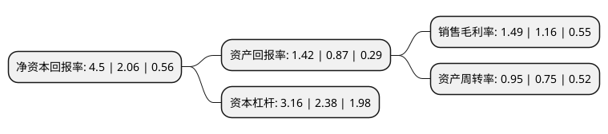

> 本页面由自动化程序生成于 2022年5月20日 01:24
> 内容可能存在错误，如有bug请提交issue至：https://github.com/Eroleice/doc-pi/issues
{.is-warning}

# 上市公司基本情况

## 基本资料

哈尔滨东安汽车动力股份有限公司（以下简称“东安动力”）成立于1998年10月08日，哈尔滨市。于1998年10月14日在上交所主板上市。

东安动力注册资本46,208万元，主要产品:462系列(含变速器)，465系列(含变速器)。以下是详细信息：

- 公司名称: 哈尔滨东安汽车动力股份有限公司
- 股票代码: 600178.SH
- 所在地: 黑龙江 - 哈尔滨市
- 成立日期: 1998年10月08日
- 注册资本: 46,208万元
- 法定代表人: 陈笠宝
- 主营业务: 主要产品:462系列(含变速器)，465系列(含变速器)
- 公司官网: www.daae.com.cn
- 公司介绍: 公司主要业务为汽车发动机及其他零部件的生产、销售及其相关服务，同时从事汽车整车销售业务。发动机包括M系列自然吸气、增压直喷和新能源混合动力三大平台，发动机排量覆盖1.0L～1.6L，涵盖FF、FR、MR布置，可满足乘用车四阶段油耗各阶段导入期目标值、商车三阶段油耗限值、国六排放法规限值以及未来更加严苛的行业法规要求。变速器包括前驱、后驱和电动车减速器三大平台，可承载150N.m～300N.m的传输扭矩，电动车减速器覆盖中高级轿车、电动物流车。零部件包括有色铸造和黑色铸造两大业务板块。公司主要客户包括哈飞汽车，吉林轻型汽车厂，昌河汽车以及奇瑞汽车等。公司拥有黑龙江省级企业技术中心，积累了多年的发动机设计开发经验，承担着公司发动机系列产品的设计、开发、试验工作，基于M系列自吸、增压、新能源三大平台持续升级开发新产品，为公司现阶段和未来发展提供强有力的支持。作为黑龙江省“高新技术企业”，公司同时也是国家“创优质名牌”企业称号的获得者。

## 股东及高管情况

上市公司第一大股东为中国长安汽车集团有限公司，持股237,593,000股，占比51.42%，为上市公司实际控制人。

截至2022年03月31日，上市公司的前十大股东中，共有9名自然人股东，1名机构股东，其中5%以上大股东共有1名。上市公司前十大股东明细如下：

> 截至2022年03月31日，上市公司前十大股东信息如下：

| 股东名称 | 持股数量（股） | 持股比例 |
| --- | --- | --- |
| 中国长安汽车集团有限公司 | 237,593,000 | 51.42% |
| 许丰 | 9,215,000 | 1.99% |
| 申韬 | 2,968,600 | 0.64% |
| 方丽 | 2,292,100 | 0.5% |
| 顾安琪 | 1,914,200 | 0.41% |
| 邱立平 | 1,558,435 | 0.34% |
| 沈爱清 | 1,470,800 | 0.32% |
| 林国伟 | 1,383,000 | 0.3% |
| 宋文 | 1,355,900 | 0.29% |
| 许超 | 1,320,000 | 0.29% |

## 利润表分析

上市公司2021年总收入为65.85亿元，净利润为0.98亿元，实现盈利。

## 杜邦分析

> 数据列示周期：2021年 | 2020年 | 2019年
{.is-info}

上市公司的净资产收益率在近一年有所上升，上升幅度为118.45%，其变化情况分解如下：
- 上市公司的销售毛利率在近一年上升了28.45%，可能是生产效率的提升、商品原材料价格下跌或商品价格的上涨所致。
- 上市公司的资产周转率在近一年上升了26.67%，可能是源自于更快的销售回款或库存管理效果提升。
- 上市公司的财务杠杆比率在近一年上升了32.77%，可能是增加负债扩大生产规模。

