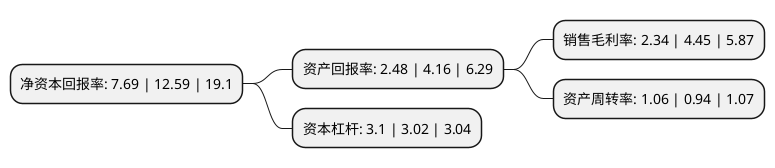

> 本页面由自动化程序生成于 2022年5月20日 01:24
> 内容可能存在错误，如有bug请提交issue至：https://github.com/Eroleice/doc-pi/issues
{.is-warning}

# 上市公司基本情况

## 基本资料

佳通轮胎股份有限公司（以下简称“S*ST佳通”）成立于1993年06月08日，牡丹江市。于1999年05月07日在上交所主板上市。

S*ST佳通注册资本34,000万元，主营业务一直为生产销售轮胎产品。主要产品:轮胎。以下是详细信息：

- 公司名称: 佳通轮胎股份有限公司
- 股票代码: 600182.SH
- 所在地: 黑龙江 - 牡丹江市
- 成立日期: 1993年06月08日
- 注册资本: 34,000万元
- 法定代表人: 李怀靖
- 主营业务: 主营业务一直为生产销售轮胎产品主要产品:轮胎
- 公司官网: www.gititirecorp.com
- 公司介绍: 公司是一家主营生产销售各类汽车轮胎的企业。公司拥有的福建佳通作为佳通轮胎的重要出口生产基地，从美国、日本、德国、中国台湾等国家和地区引进世界一流的轮胎生产设备，享有集团内最先进的轮胎生产工艺和技术。近年一直保持较高发展速度，并根据市场形势调整产品结构，不断向高档轿车子午胎延伸，依托佳通轮胎强大的研发能力和销售网络，以及佳通一贯的务实和创新精神，公司树立了轮胎优质品牌，并为投资者带来稳定增长的回报。

## 股东及高管情况

上市公司第一大股东为佳通轮胎(中国)投资有限公司，持股151,070,000股，占比44.43%，为上市公司实际控制人。

截至2022年03月31日，上市公司的前十大股东中，共有4名自然人股东，5名机构股东，1个产品账户，其中5%以上大股东共有1名。上市公司前十大股东明细如下：

> 截至2022年03月31日，上市公司前十大股东信息如下：

| 股东名称 | 持股数量（股） | 持股比例 |
| --- | --- | --- |
| 佳通轮胎(中国)投资有限公司 | 151,070,000 | 44.43% |
| 黑龙江省天九投资控股有限公司 | 5,200,000 | 1.53% |
| 李陆军 | 5,021,425 | 1.48% |
| 中国能源建设集团黑龙江省火电第一工程有限公司 | 3,000,000 | 0.88% |
| 牡丹江市国有资本运营有限公司 | 2,500,000 | 0.74% |
| 中国信达资产管理股份有限公司 | 2,000,000 | 0.59% |
| 丁德渝 | 1,250,001 | 0.37% |
| 上海艾方资产管理有限公司-星辰之艾方多策略11号私募证券投资基金 | 1,213,300 | 0.36% |
| 丁晓磊 | 1,186,100 | 0.35% |
| 薛耀兴 | 1,183,300 | 0.35% |

## 利润表分析

上市公司2021年总收入为33.41亿元，净利润为0.78亿元，实现盈利。

## 杜邦分析

> 数据列示周期：2021年 | 2020年 | 2019年
{.is-info}

上市公司的净资产收益率在近一年有所下降，下降幅度为-38.92%，其变化情况分解如下：
- 上市公司的销售毛利率在近一年下降了-47.42%，可能是生产效率的下降、商品原材料价格上涨或商品价格的下跌所致。
- 上市公司的资产周转率在近一年上升了12.77%，可能是源自于更快的销售回款或库存管理效果提升。
- 上市公司的财务杠杆比率在近一年上升了2.65%，可能是增加负债扩大生产规模。

