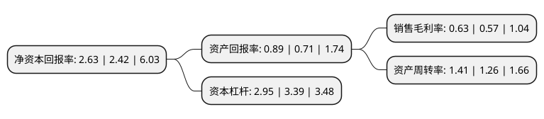

> 本页面由自动化程序生成于 2022年5月20日 01:26
> 内容可能存在错误，如有bug请提交issue至：https://github.com/Eroleice/doc-pi/issues
{.is-warning}

# 上市公司基本情况

## 基本资料

国机汽车股份有限公司（以下简称“国机汽车”）成立于1999年03月26日，天津市。于2001年03月05日在上交所主板上市。

国机汽车注册资本145,687.535万元，主营业务为汽车贸易综合服务以下是详细信息：

- 公司名称: 国机汽车股份有限公司
- 股票代码: 600335.SH
- 所在地: 天津 - 天津市
- 成立日期: 1999年03月26日
- 注册资本: 145,687.535万元
- 法定代表人: 彭原璞
- 主营业务: 主营业务为汽车贸易综合服务
- 公司官网: www.sinomach-auto.com
- 公司介绍: 公司是世界500强企业国机集团旗下一家大型汽车综合服务企业。凭借多年专注于进口汽车市场的丰富经验，公司自重组上市以来，逐步构建起以进口汽车贸易服务为核心业务，汽车零售、汽车后市场为重点拓展业务的全新业务结构；培育出覆盖进口汽车贸易服务全链条的核心能力体系，先后与克莱斯勒、进口大众、通用、福特、捷豹路虎、雷诺等跨国汽车公司建立起了良好合作关系。公司以完善的治理结构、高质量的信息披露、良好的投资者关系管理体系、高效的资本运作能力赢得了监管机构及资本市场的广泛认可，树立了合规、透明、高效的“标杆公司”的良好形象及公司在行业及资本市场的地位与影响力。

## 股东及高管情况

上市公司第一大股东为中国机械工业集团有限公司，持股1,027,608,282股，占比70.54%，为上市公司实际控制人。

截至2022年03月31日，上市公司的前十大股东中，共有7名自然人股东，2名机构股东，1个产品账户，其中5%以上大股东共有1名。上市公司前十大股东明细如下：

> 截至2022年03月31日，上市公司前十大股东信息如下：

| 股东名称 | 持股数量（股） | 持股比例 |
| --- | --- | --- |
| 中国机械工业集团有限公司 | 1,027,608,282 | 70.54% |
| 唐建平 | 18,161,700 | 1.25% |
| 朱文 | 17,104,600 | 1.17% |
| 中国电子财务有限责任公司 | 12,800,000 | 0.88% |
| 于美艳 | 9,056,200 | 0.62% |
| 匡立武 | 6,336,528 | 0.43% |
| 朱向军 | 5,534,300 | 0.38% |
| 誉辉资本管理(北京)有限责任公司-誉辉元贞11号私募证券投资基金 | 5,462,400 | 0.37% |
| 颜微微 | 5,180,000 | 0.36% |
| 吴芳 | 5,000,000 | 0.34% |

## 利润表分析

上市公司2021年总收入为439.45亿元，净利润为2.77亿元，实现盈利。

## 杜邦分析

> 数据列示周期：2021年 | 2020年 | 2019年
{.is-info}

上市公司的净资产收益率在近一年有所上升，上升幅度为8.68%，其变化情况分解如下：
- 上市公司的销售毛利率在近一年上升了10.53%，可能是生产效率的提升、商品原材料价格下跌或商品价格的上涨所致。
- 上市公司的资产周转率在近一年上升了11.9%，可能是源自于更快的销售回款或库存管理效果提升。
- 上市公司的财务杠杆比率在近一年下降了-12.98%，可能是减少负债降低财务费用。

