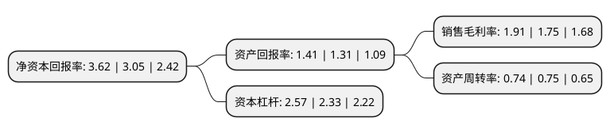

> 本页面由自动化程序生成于 2022年5月20日 01:26
> 内容可能存在错误，如有bug请提交issue至：https://github.com/Eroleice/doc-pi/issues
{.is-warning}

# 上市公司基本情况

## 基本资料

航天晨光股份有限公司（以下简称“航天晨光”）成立于1999年09月30日，南京市。于2001年06月15日在上交所主板上市。

航天晨光注册资本42,128.36万元，主要产品:专用车类产品，波纹管类产品，压力容器类产品。以下是详细信息：

- 公司名称: 航天晨光股份有限公司
- 股票代码: 600501.SH
- 所在地: 江苏 - 南京市
- 成立日期: 1999年09月30日
- 注册资本: 42,128.36万元
- 法定代表人: 薛亮
- 主营业务: 主要产品:专用车类产品，波纹管类产品，压力容器类产品
- 公司官网: www.aerosun.cn
- 公司介绍: 公司建有研究开发中心、信息中心、检测实验中心、企业院士工作站和覆盖全国的营销服务网络，具有强大的产品研究、设计、开发和生产能力，在南京、北京、上海、重庆、沈阳等城市建有工业园区，形成了以装备制造为主业、五大主导产品为支柱、九大工业园区为基地、全国营销网络为平台的的控股型集团发展格局。公司是国内最大的专用汽车科研生产基地之一，中国首家获得民航机场加油车生产许可证的单位和中国军用油料特种车定点研制和生产企业；也是亚洲最大的金属软管和波纹补偿器研究生产基地，全球第五个研制生产RTP管的厂家，拥有国家核安全局颁发的《民用核安全设备设计\制造许可证》，并且是亚洲唯一一家参加美国波纹管标准化组织(EJMA)的企业；公司的卫星通讯产品多次承担并圆满完成国家重大事件的通讯保障任务；公司拥有美国《ASME》规范产品“U”和“U2”类授权证书及钢印，是国家权威部门批准的AR1级、AR2级压力容器和CR2级汽车罐车制造企业。

## 股东及高管情况

上市公司第一大股东为中国航天科工集团有限公司，持股106,160,000股，占比25.2%，**疑似为**上市公司实际控制人。

截至2022年03月31日，上市公司的前十大股东中，共有1名自然人股东，3名机构股东，6个产品账户，其中5%以上大股东共有2名。上市公司前十大股东明细如下：

> 未能通过持股比例判定出上市公司实际控制人（持股30%以上）
> 可能存在通过间接持股、联合持股、协议控制等方式拥有实际控制权的主体，具体请参考上市公司定期公告！
{.is-warning}

> 截至2022年03月31日，上市公司前十大股东信息如下：

| 股东名称 | 持股数量（股） | 持股比例 |
| --- | --- | --- |
| 中国航天科工集团有限公司 | 106,160,000 | 25.2% |
| 南京晨光集团有限责任公司 | 89,633,772 | 21.28% |
| 广发证券股份有限公司-中庚小盘价值股票型证券投资基金 | 10,191,489 | 2.42% |
| 申万菱信基金-工商银行-华融信托-正弘2号权益投资集合资金信托计划 | 6,600,000 | 1.57% |
| 天治基金-工商银行-华融信托-华融·海西晟乾7号权益投资集合资金信托计划 | 6,597,500 | 1.57% |
| 光大永明资管-兴业银行-光大永明资产聚财121号定向资产管理产品 | 4,540,643 | 1.08% |
| 招商银行股份有限公司-东方红远见价值混合型证券投资基金 | 3,504,400 | 0.83% |
| 海通证券股份有限公司 | 2,627,200 | 0.62% |
| 颜美琴 | 2,259,000 | 0.54% |
| 平安银行股份有限公司-中庚价值灵动灵活配置混合型证券投资基金 | 2,232,801 | 0.53% |

## 利润表分析

上市公司2021年总收入为40.79亿元，净利润为0.77亿元，实现盈利。

## 杜邦分析

> 数据列示周期：2021年 | 2020年 | 2019年
{.is-info}

上市公司的净资产收益率在近一年有所上升，上升幅度为18.69%，其变化情况分解如下：
- 上市公司的销售毛利率在近一年上升了9.14%，可能是生产效率的提升、商品原材料价格下跌或商品价格的上涨所致。
- 上市公司的资产周转率在近一年下降了-1.33%，可能是源自于更慢的销售回款或库存管理效果下降。
- 上市公司的财务杠杆比率在近一年上升了10.3%，可能是增加负债扩大生产规模。

