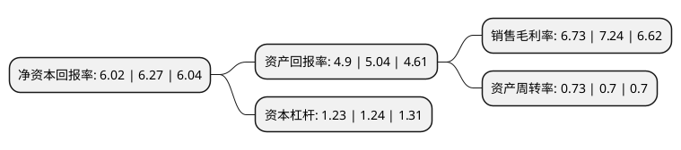

> 本页面由自动化程序生成于 2022年5月20日 01:27
> 内容可能存在错误，如有bug请提交issue至：https://github.com/Eroleice/doc-pi/issues
{.is-warning}

# 上市公司基本情况

## 基本资料

贵州贵航汽车零部件股份有限公司（以下简称“贵航股份”）成立于1999年12月29日，贵阳市。于2001年12月27日在上交所主板上市。

贵航股份注册资本40,431.132万元，主营业务;汽车，摩托车零部件的开发，制造，销售;橡胶，塑料制品的开发，制造，销售及与其产品相关的进出口业务，技术开发研究;航空零部件的开发，制造，销售。以下是详细信息：

- 公司名称: 贵州贵航汽车零部件股份有限公司
- 股票代码: 600523.SH
- 所在地: 贵州 - 贵阳市
- 成立日期: 1999年12月29日
- 注册资本: 40,431.132万元
- 法定代表人: 雷自力
- 主营业务: 主营业务;汽车，摩托车零部件的开发，制造，销售;橡胶，塑料制品的开发，制造，销售及与其产品相关的进出口业务，技术开发研究;航空零部件的开发，制造，销售
- 公司官网: www.gzghgf.com
- 公司介绍: 公司是中国航空工业集团公司的成员单位，直属中国航空汽车系统控股有限公司领导。公司从国外引进橡胶、塑料挤出线、复合挤出线、汽车软管生产线、汽车电器开关生产线、散热器生产线、空滤生产线、汽车门窗玻璃升降器、雨刮电机、雨刮片等多条先进生产线。公司建有比较完善的产品检测和实验设备。公司汽车零部件主要产品：密封件、组合开关、电动窗开关、特种开关、锁匙总体、门把手、雨刮器、玻璃升降器、铝质散热器、滤清器、中冷器、暖风器、汽车空调座椅天窗冲压件和焊接件、汽车开关控制电路、工程机械冷却系统、工业空调冷凝器等。公司主要外贸产品：汽车密封条，汽车电器开关和锁匙总体，汽车雨刮器、玻璃升降器，汽车散热器，CPU散热器等。公司的主要客户是自主品牌和合资品牌汽车厂家。

## 股东及高管情况

上市公司第一大股东为中国航空汽车系统控股有限公司，持股149,623,188股，占比37.01%，为上市公司实际控制人。

截至2022年04月23日，上市公司的前十大股东中，共有2名自然人股东，5名机构股东，3个产品账户，其中5%以上大股东共有4名。上市公司前十大股东明细如下：

> 截至2022年04月23日，上市公司前十大股东信息如下：

| 股东名称 | 持股数量（股） | 持股比例 |
| --- | --- | --- |
| 中国航空汽车系统控股有限公司 | 149,623,188 | 37.01% |
| 中国航空汽车系统控股有限公司 | 149,623,188 | 37.01% |
| 中国贵州航空工业(集团)有限责任公司 | 37,524,155 | 9.28% |
| 中国贵州航空工业(集团)有限责任公司 | 37,524,155 | 9.28% |
| 廖勇祥 | 2,924,500 | 0.72% |
| 上海磐耀资产管理有限公司-磐耀三期证券投资基金 | 2,804,360 | 0.69% |
| 上海磐耀资产管理有限公司-磐耀持国私募证券投资基金 | 2,769,980 | 0.69% |
| 玲珑集团有限公司 | 2,280,000 | 0.56% |
| 王铭 | 1,950,000 | 0.48% |
| 上海磐耀资产管理有限公司-磐耀永达私募证券投资基金 | 1,204,900 | 0.3% |

## 利润表分析

上市公司2021年总收入为23.94亿元，净利润为1.61亿元，实现盈利。

## 杜邦分析

> 数据列示周期：2021年 | 2020年 | 2019年
{.is-info}

上市公司的净资产收益率在近一年有所下降，下降幅度为-3.99%，其变化情况分解如下：
- 上市公司的销售毛利率在近一年下降了-7.04%，可能是生产效率的下降、商品原材料价格上涨或商品价格的下跌所致。
- 上市公司的资产周转率在近一年上升了4.29%，可能是源自于更快的销售回款或库存管理效果提升。
- 上市公司的财务杠杆比率在近一年下降了-0.81%，可能是减少负债降低财务费用。

