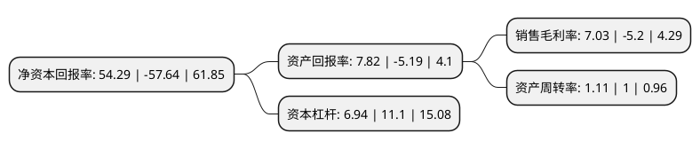

> 本页面由自动化程序生成于 2022年5月20日 01:27
> 内容可能存在错误，如有bug请提交issue至：https://github.com/Eroleice/doc-pi/issues
{.is-warning}

# 上市公司基本情况

## 基本资料

金杯汽车股份有限公司（以下简称“金杯汽车”）成立于1984年05月14日，沈阳市。于1992年07月24日在上交所主板上市。

金杯汽车注册资本109,266万元，主营业务:汽车及零部件制造。以下是详细信息：

- 公司名称: 金杯汽车股份有限公司
- 股票代码: 600609.SH
- 所在地: 辽宁 - 沈阳市
- 成立日期: 1984年05月14日
- 注册资本: 109,266万元
- 法定代表人: 刘同富
- 主营业务: 主营业务:汽车及零部件制造
- 公司官网: www.jinbei.com.cn
- 公司介绍: 公司是辽宁省最大的汽车生产企业，也是国内最大的轻型客车制造企业之一。公司的主营业务是设计、生产和销售汽车零部件，主要产品包括汽车内饰件、座椅、橡胶件等。主要客户包括华晨宝马、华晨中华等多家汽车主机生产企业。公司在轻型货车和汽车零部件生产制造方面拥有多年的丰富经验以及较高的品牌知名度。“金杯”牌商标是中国驰名商标。经过多年的潜心经营，公司与众多客户建立了稳固的合作关系，在业内树立了良好的品牌形象，具有一定的竞争能力和市场份额。公司目前拥有轻型货车和零部件的生产能力能够满足公司客户的需求，且零部件产品为宝马等高端车的配套能力在不断提升。

## 股东及高管情况

上市公司第一大股东为沈阳市汽车工业资产经营有限公司，持股242,967,345股，占比18.53%，**疑似为**上市公司实际控制人。

截至2022年03月31日，上市公司的前十大股东中，共有5名自然人股东，4名机构股东，1个产品账户，其中5%以上大股东共有2名。上市公司前十大股东明细如下：

> 未能通过持股比例判定出上市公司实际控制人（持股30%以上）
> 可能存在通过间接持股、联合持股、协议控制等方式拥有实际控制权的主体，具体请参考上市公司定期公告！
{.is-warning}

> 截至2022年03月31日，上市公司前十大股东信息如下：

| 股东名称 | 持股数量（股） | 持股比例 |
| --- | --- | --- |
| 沈阳市汽车工业资产经营有限公司 | 242,967,345 | 18.53% |
| 辽宁并购股权投资基金合伙企业(有限合伙) | 218,533,426 | 16.67% |
| 沈阳工业国有资产经营有限公司 | 63,910,268 | 4.87% |
| 钟革 | 20,133,174 | 1.54% |
| 周晓宇 | 15,989,324 | 1.22% |
| 沈阳正达企业管理有限公司 | 15,861,000 | 1.21% |
| 肖裕福 | 12,614,286 | 0.96% |
| 彭璐 | 11,005,610 | 0.84% |
| 梅莉 | 8,479,314 | 0.65% |
| 北京光谷科技有限公司 | 8,445,400 | 0.64% |

## 利润表分析

上市公司2021年总收入为51.9亿元，净利润为3.64亿元，实现盈利。

## 杜邦分析

> 数据列示周期：2021年 | 2020年 | 2019年
{.is-info}

上市公司的净资产收益率在近一年有所下降，下降幅度为-194.19%，其变化情况分解如下：
- 上市公司的销售毛利率在近一年下降了-235.19%，可能是生产效率的下降、商品原材料价格上涨或商品价格的下跌所致。
- 上市公司的资产周转率在近一年上升了11%，可能是源自于更快的销售回款或库存管理效果提升。
- 上市公司的财务杠杆比率在近一年下降了-37.48%，可能是减少负债降低财务费用。

