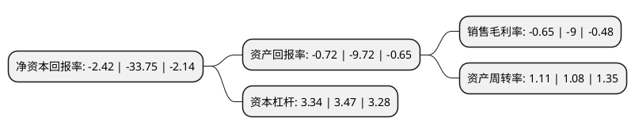

> 本页面由自动化程序生成于 2022年5月20日 01:27
> 内容可能存在错误，如有bug请提交issue至：https://github.com/Eroleice/doc-pi/issues
{.is-warning}

# 上市公司基本情况

## 基本资料

上海申达股份有限公司（以下简称“申达股份”）成立于1986年12月11日，上海市。于1993年01月07日在上交所主板上市。

申达股份注册资本110,797.871万元，以汽车内饰和纺织新材料业务为主的产业用纺织品业务，以及纺织品为主的外贸进出口和国内贸易业务以下是详细信息：

- 公司名称: 上海申达股份有限公司
- 股票代码: 600626.SH
- 所在地: 上海 - 上海市
- 成立日期: 1986年12月11日
- 注册资本: 110,797.871万元
- 法定代表人: 姚明华
- 主营业务: 以汽车内饰和纺织新材料业务为主的产业用纺织品业务，以及纺织品为主的外贸进出口和国内贸易业务
- 公司官网: www.sh-shenda.com
- 公司介绍: 公司前身系1986年成立的上海申达纺织服装(集团)公司。1992年4月，改制为上海申达纺织服装股份有限公司，是上海第一家由企业集团改制的外向型股份公司。，历经20余载的发展壮大，公司从单一传统的纺织企业完全转变为现代化、多种经营的上市公司，成为一个集内外贸、纺织新材料、汽车内饰、房产物业等多产业于一体的跨行业、跨地区、外向型、多功能的综合性企业。目前公司主要业务包括以纺织品为主的外贸进出口和国内贸易业务、以汽车内饰和纺织新材料业务为主的产业用纺织品业务。

## 股东及高管情况

上市公司第一大股东为上海申达(集团)有限公司，持股520,514,373股，占比46.98%，为上市公司实际控制人。

截至2022年03月31日，上市公司的前十大股东中，共有4名自然人股东，3名机构股东，3个产品账户，其中5%以上大股东共有1名。上市公司前十大股东明细如下：

> 截至2022年03月31日，上市公司前十大股东信息如下：

| 股东名称 | 持股数量（股） | 持股比例 |
| --- | --- | --- |
| 上海申达(集团)有限公司 | 520,514,373 | 46.98% |
| 上海君和立成投资管理中心(有限合伙)-上海临港东方君和科创产业股权投资基金合伙企业(有限合伙) | 22,479,966 | 2.03% |
| 上海国盛资本管理有限公司-上海国企改革发展股权投资基金合伙企业(有限合伙) | 13,383,954 | 1.21% |
| 江苏国泰国际集团国贸股份有限公司 | 11,857,707 | 1.07% |
| 张煜 | 8,331,256 | 0.75% |
| 顾鹤富 | 3,839,400 | 0.35% |
| 王桂英 | 3,719,898 | 0.34% |
| 中国工商银行股份有限公司-中证上海国企交易型开放式指数证券投资基金 | 2,822,300 | 0.25% |
| 廖向杰 | 2,700,000 | 0.24% |
| 上海金桥(集团)有限公司 | 2,439,360 | 0.22% |

## 利润表分析

上市公司2021年总收入为105.5亿元，净利润为-0.69亿元，**未实现盈利**。

## 杜邦分析

> 数据列示周期：2021年 | 2020年 | 2019年
{.is-info}

上市公司的净资产收益率在近一年有所下降，下降幅度为-92.83%，其变化情况分解如下：
- 上市公司的销售毛利率在近一年下降了-92.78%，可能是生产效率的下降、商品原材料价格上涨或商品价格的下跌所致。
- 上市公司的资产周转率在近一年上升了2.78%，可能是源自于更快的销售回款或库存管理效果提升。
- 上市公司的财务杠杆比率在近一年下降了-3.75%，可能是减少负债降低财务费用。

