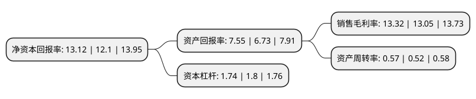

> 本页面由自动化程序生成于 2022年5月20日 01:28
> 内容可能存在错误，如有bug请提交issue至：https://github.com/Eroleice/doc-pi/issues
{.is-warning}

# 上市公司基本情况

## 基本资料

福耀玻璃工业集团股份有限公司（以下简称“福耀玻璃”）成立于1992年06月21日，福州市。于1993年06月10日在上交所主板上市。

福耀玻璃注册资本260,974.353万元，主营业务:从事浮法玻璃及汽车用玻璃制品的生产及销售。以下是详细信息：

- 公司名称: 福耀玻璃工业集团股份有限公司
- 股票代码: 600660.SH
- 所在地: 福建 - 福州市
- 成立日期: 1992年06月21日
- 注册资本: 260,974.353万元
- 法定代表人: 曹德旺
- 主营业务: 主营业务:从事浮法玻璃及汽车用玻璃制品的生产及销售
- 公司官网: www.fuyaogroup.com
- 公司介绍: 公司是一家专注于汽车玻璃生产的供应商，主要从事浮法玻璃及汽车用玻璃制品的生产及销售，产品不但配套国内汽车品牌，更已成为德国奥迪、德国大众、南韩现代、澳大利亚Holden、日本铃木、日本三菱、捷克途胜的合格供应商，并批量供货。公司是“国家认定企业技术中心”，是国家知识产权局授牌“专利工作交流站”，是国家科技部、中华全国总工会确认的“全国第三批创新型试点企业”。

## 股东及高管情况

上市公司第一大股东为香港中央结算(代理人)有限公司，持股595,872,359股，占比22.83%，**疑似为**上市公司实际控制人。

截至2022年03月31日，上市公司的前十大股东中，共有3名自然人股东，3名机构股东，2个产品账户，2个海外主体，其中5%以上大股东共有4名。上市公司前十大股东明细如下：

> 未能通过持股比例判定出上市公司实际控制人（持股30%以上）
> 可能存在通过间接持股、联合持股、协议控制等方式拥有实际控制权的主体，具体请参考上市公司定期公告！
{.is-warning}

> 截至2022年03月31日，上市公司前十大股东信息如下：

| 股东名称 | 持股数量（股） | 持股比例 |
| --- | --- | --- |
| 香港中央结算(代理人)有限公司 | 595,872,359 | 22.83% |
| 三益发展有限公司 | 390,578,816 | 14.97% |
| 香港中央结算有限公司(陆股通) | 215,539,839 | 8.26% |
| 河仁慈善基金会 | 169,512,888 | 6.5% |
| 中国农业银行股份有限公司-易方达消费行业股票型证券投资基金 | 45,104,281 | 1.73% |
| 白永丽 | 34,653,315 | 1.33% |
| 中国证券金融股份有限公司 | 28,095,485 | 1.08% |
| 福建省耀华工业村开发有限公司 | 24,077,800 | 0.92% |
| 李海清 | 21,922,059 | 0.84% |
| 李福清 | 20,561,966 | 0.79% |

## 利润表分析

上市公司2021年总收入为236.03亿元，净利润为31.42亿元，实现盈利。

## 杜邦分析

> 数据列示周期：2021年 | 2020年 | 2019年
{.is-info}

上市公司的净资产收益率在近一年有所上升，上升幅度为8.43%，其变化情况分解如下：
- 上市公司的销售毛利率在近一年上升了2.07%，可能是生产效率的提升、商品原材料价格下跌或商品价格的上涨所致。
- 上市公司的资产周转率在近一年上升了9.62%，可能是源自于更快的销售回款或库存管理效果提升。
- 上市公司的财务杠杆比率在近一年下降了-3.33%，可能是减少负债降低财务费用。

