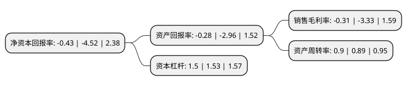

> 本页面由自动化程序生成于 2022年5月20日 01:28
> 内容可能存在错误，如有bug请提交issue至：https://github.com/Eroleice/doc-pi/issues
{.is-warning}

# 上市公司基本情况

## 基本资料

上海交运集团股份有限公司（以下简称“交运股份”）成立于1993年09月24日，上海市。于1993年09月28日在上交所主板上市。

交运股份注册资本1,028,492.944万元，主营业务为运输业与物流服务，汽车零部件制造与汽车后服务及水上旅游服务。以下是详细信息：

- 公司名称: 上海交运集团股份有限公司
- 股票代码: 600676.SH
- 所在地: 上海 - 上海市
- 成立日期: 1993年09月24日
- 注册资本: 1,028,492.944万元
- 法定代表人: 樊建林
- 主营业务: 主营业务为运输业与物流服务，汽车零部件制造与汽车后服务及水上旅游服务
- 公司官网: www.cnsjy.com
- 公司介绍: 公司的主营业务是现代物流业、客运旅游业、汽车零部件制造业和汽车后服务业。公司货运业务主要是承接各类化学危险物品运输，城市便捷货运出租等。省际客运业务主要是由高速客运公司以及以恒丰路客运站、东大名路客运站、申东客运站等站公司组成，经营上海至全国几十个城市的高速客运班线和公路快件运输。公司的汽车零部件制造主要由轿车精冲及复杂型面金属结构件、轿车车身冲压件和轿车动力系统部分零部件总成三大系列构成，公司是上海通用、上海大众、一汽大众等国内一流整车厂商的主要供货商之一。

## 股东及高管情况

上市公司第一大股东为上海久事(集团)有限公司，持股373,767,497股，占比36.34%，为上市公司实际控制人。

截至2022年03月31日，上市公司的前十大股东中，共有5名自然人股东，5名机构股东，其中5%以上大股东共有2名。上市公司前十大股东明细如下：

> 截至2022年03月31日，上市公司前十大股东信息如下：

| 股东名称 | 持股数量（股） | 持股比例 |
| --- | --- | --- |
| 上海久事(集团)有限公司 | 373,767,497 | 36.34% |
| 上海久事旅游(集团)有限公司 | 102,826,193 | 10% |
| 上海汽车工业(集团)总公司 | 50,000,000 | 4.86% |
| 上海地产(集团)有限公司 | 9,173,669 | 0.89% |
| 刘伟 | 7,817,600 | 0.76% |
| 朱建明 | 7,300,610 | 0.71% |
| 上海埃森化工有限公司 | 5,931,146 | 0.58% |
| 周麟骅 | 4,150,100 | 0.4% |
| 夏瑞平 | 4,000,000 | 0.39% |
| 俞琳 | 3,050,000 | 0.3% |

## 利润表分析

上市公司2021年总收入为75.09亿元，净利润为-0.24亿元，**未实现盈利**。

## 杜邦分析

> 数据列示周期：2021年 | 2020年 | 2019年
{.is-info}

上市公司的净资产收益率在近一年有所下降，下降幅度为-90.49%，其变化情况分解如下：
- 上市公司的销售毛利率在近一年下降了-90.69%，可能是生产效率的下降、商品原材料价格上涨或商品价格的下跌所致。
- 上市公司的资产周转率在近一年上升了1.12%，可能是源自于更快的销售回款或库存管理效果提升。
- 上市公司的财务杠杆比率在近一年下降了-1.96%，可能是减少负债降低财务费用。

