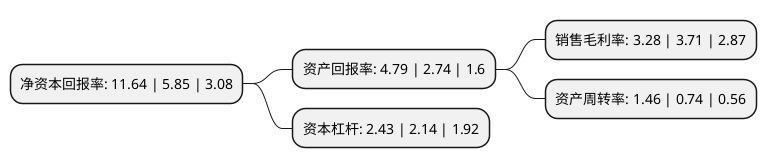

> 本页面由自动化程序生成于 2022年5月20日 01:29
> 内容可能存在错误，如有bug请提交issue至：https://github.com/Eroleice/doc-pi/issues
{.is-warning}

# 上市公司基本情况

## 基本资料

上海新动力汽车科技股份有限公司（以下简称“动力新科”）成立于1993年12月27日，上海市。于1994年03月11日在上交所主板上市。

动力新科注册资本163,153.573万元，主营业务:柴油机及其配件的生产及销售。以下是详细信息：

- 公司名称: 上海新动力汽车科技股份有限公司
- 股票代码: 600841.SH
- 所在地: 上海 - 上海市
- 成立日期: 1993年12月27日
- 注册资本: 163,153.573万元
- 法定代表人: 蓝青松
- 主营业务: 主营业务:柴油机及其配件的生产及销售
- 公司官网: www.sdec.com.cn
- 公司介绍: 公司是一家从事发动机、零部件以及发电机组研发、制造的国家大型高新技术企业，拥有国家级技术中心和博士后工作站、国际一流的自动化生产线和乘用车标准的质量管理体系。目前拥有R、H、D、C、E、G、W等七大系列柴油、天然气发动机，功率覆盖50~1600kW，主要应用于工程机械、卡车、客车、发电设备、船舶、农业机械等领域。公司拥有国家级技术中心和博士后工作站，技术研发力量雄厚。公司营销服务网络遍布各地，历史悠久、服务便捷周到。公司1994年行业内第一个通过ISO质量体系认证，产品为中国名牌产品，东风商标为中国驰名商标。企业曾荣获“世界客车联盟最佳发动机制造商”、全国“五一”劳动奖状和“上海市最佳工业企业形象单位”等称号。

## 股东及高管情况

上市公司第一大股东为上海汽车集团股份有限公司，持股783,046,844股，占比47.99%，为上市公司实际控制人。

截至2022年03月31日，上市公司的前十大股东中，共有2名自然人股东，6名机构股东，2个产品账户，其中5%以上大股东共有2名。上市公司前十大股东明细如下：

> 截至2022年03月31日，上市公司前十大股东信息如下：

| 股东名称 | 持股数量（股） | 持股比例 |
| --- | --- | --- |
| 上海汽车集团股份有限公司 | 783,046,844 | 47.99% |
| 重庆机电控股(集团)公司 | 175,782,178 | 10.77% |
| 西藏瑞华资本管理有限公司 | 44,493,882 | 2.73% |
| 中国银河证券股份有限公司 | 17,964,404 | 1.1% |
| 无锡威孚高科技集团股份有限公司 | 12,987,600 | 0.8% |
| 共青城胜恒投资管理有限公司-胜恒九重风控策略1期私募股权投资基金 | 12,903,225 | 0.79% |
| 南京钢铁联合有限公司 | 11,123,470 | 0.68% |
| 中国人寿资管-中国银行-国寿资产-PIPE2020保险资产管理产品 | 11,123,470 | 0.68% |
| 郭伟松 | 11,012,235 | 0.67% |
| 刘志强 | 8,667,800 | 0.53% |

## 利润表分析

上市公司2021年总收入为244.01亿元，净利润为8亿元，实现盈利。

## 杜邦分析

> 数据列示周期：2021年 | 2020年 | 2019年
{.is-info}

上市公司的净资产收益率在近一年有所上升，上升幅度为98.97%，其变化情况分解如下：
- 上市公司的销售毛利率在近一年下降了-11.59%，可能是生产效率的下降、商品原材料价格上涨或商品价格的下跌所致。
- 上市公司的资产周转率在近一年上升了97.3%，可能是源自于更快的销售回款或库存管理效果提升。
- 上市公司的财务杠杆比率在近一年上升了13.55%，可能是增加负债扩大生产规模。

