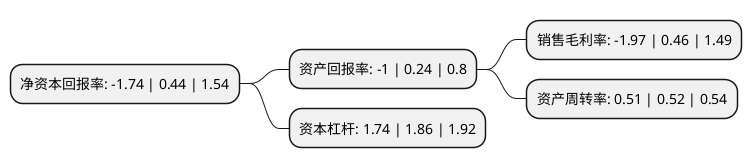

> 本页面由自动化程序生成于 2022年5月20日 01:30
> 内容可能存在错误，如有bug请提交issue至：https://github.com/Eroleice/doc-pi/issues
{.is-warning}

# 上市公司基本情况

## 基本资料

渤海汽车系统股份有限公司（以下简称“渤海汽车”）成立于1999年12月31日，滨州市。于2004年04月07日在上交所主板上市。

渤海汽车注册资本95,051.552万元，活塞及组件，专用数控机床，轻量化汽车零部件，汽车轮毂，汽车空调，减震器，排气系统，油箱，启停电池等多个产品的设计，开发，制造及销售以下是详细信息：

- 公司名称: 渤海汽车系统股份有限公司
- 股票代码: 600960.SH
- 所在地: 山东 - 滨州市
- 成立日期: 1999年12月31日
- 注册资本: 95,051.552万元
- 法定代表人: 谢伟
- 主营业务: 活塞及组件，专用数控机床，轻量化汽车零部件，汽车轮毂，汽车空调，减震器，排气系统，油箱，启停电池等多个产品的设计，开发，制造及销售
- 公司官网: www.bhpiston.com
- 公司介绍: 公司主要从事活塞及组件、专用数控机床、轻量化汽车零部件、汽车轮毂、汽车空调、减震器、排气系统、油箱、启停电池等多个产品的设计、开发、制造及销售，实现了汽车动力总成、底盘总成、热交换系统的产业布局，并试水新能源汽车零部件。公司子公司滨州渤海活塞有限公司是国内最大的活塞生产企业，多年来一直保持国内活塞产品产销量第一的位置，是国内极少数具备大批量生产欧Ⅳ、欧Ⅴ标准活塞产品能力的企业之一。公司子公司泰安启程是国内主要的铝合金车轮出口生产企业之一，产品主要出口到国际AM市场，并在国际AM市场上享有较高的声誉，在国际汽车铝轮AM细分市场上，处于国内企业前列。公司子公司海纳川(滨州)轻量化汽车部件有限公司是轻量化汽车部件研发生产基地，聚焦中高端市场，核心产品及研发方向定位于铝合金车身结构件(减震塔、前后轮罩、前后纵梁、AB柱等)、底盘部件(副车架等)。公司子公司博海精机专注于汽车零部件制造的专用设备研发和自动化、智能化工程，拥有50多年的专用设备研制经验以及国内领先的研发制造装备和检测能力，主要产品已出口到东南亚、美洲、俄罗斯等市场。

## 股东及高管情况

上市公司第一大股东为北京海纳川汽车部件股份有限公司，持股219,038,871股，占比23.04%，**疑似为**上市公司实际控制人。

截至2022年03月31日，上市公司的前十大股东中，共有4名自然人股东，4名机构股东，2个产品账户，其中5%以上大股东共有2名。上市公司前十大股东明细如下：

> 未能通过持股比例判定出上市公司实际控制人（持股30%以上）
> 可能存在通过间接持股、联合持股、协议控制等方式拥有实际控制权的主体，具体请参考上市公司定期公告！
{.is-warning}

> 截至2022年03月31日，上市公司前十大股东信息如下：

| 股东名称 | 持股数量（股） | 持股比例 |
| --- | --- | --- |
| 北京海纳川汽车部件股份有限公司 | 219,038,871 | 23.04% |
| 北京汽车集团有限公司 | 206,390,009 | 21.71% |
| 广西铁投创新资本投资有限公司 | 18,973,214 | 2% |
| 吴卫林 | 17,870,041 | 1.88% |
| 滨州安泰控股集团有限公司 | 11,906,976 | 1.25% |
| 杨舢 | 7,901,100 | 0.83% |
| 陆波 | 7,177,390 | 0.76% |
| 北京东海中矿投资管理有限公司-东海中矿2号私募投资基金 | 6,731,823 | 0.71% |
| 北京忠诚志业资本管理有限公司-旗鱼资本专项1期私募基金 | 5,635,014 | 0.59% |
| 吴蓓蕾 | 4,871,000 | 0.51% |

## 利润表分析

上市公司2021年总收入为44.14亿元，净利润为-0.88亿元，**未实现盈利**。

## 杜邦分析

> 数据列示周期：2021年 | 2020年 | 2019年
{.is-info}

上市公司的净资产收益率在近一年有所下降，下降幅度为-495.45%，其变化情况分解如下：
- 上市公司的销售毛利率在近一年下降了-528.26%，可能是生产效率的下降、商品原材料价格上涨或商品价格的下跌所致。
- 上市公司的资产周转率在近一年下降了-1.92%，可能是源自于更慢的销售回款或库存管理效果下降。
- 上市公司的财务杠杆比率在近一年下降了-6.45%，可能是减少负债降低财务费用。

