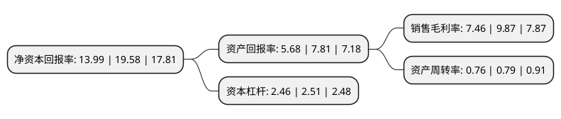

> 本页面由自动化程序生成于 2022年5月20日 01:30
> 内容可能存在错误，如有bug请提交issue至：https://github.com/Eroleice/doc-pi/issues
{.is-warning}

# 上市公司基本情况

## 基本资料

赛轮集团股份有限公司（以下简称“赛轮轮胎”）成立于2002年11月18日，青岛市。于2011年06月30日在上交所主板上市。

赛轮轮胎注册资本306,348.477万元，主营业务为全钢载重子午胎，半钢子午胎和工程子午胎的研发，制造和销售;轮胎制造技术的开发，转让和相关服务以及轮胎循环利用相关产品的研发，生产和销售。目前轮胎生产销售业务方面的主要产品为全钢载重子午线轮胎和半钢子午线轮胎等，技术转让业务方面的主要产品为子午线轮胎制造技术，循环利用业务方面主要是翻新胎，胎面胶和胶粉等循环利用产品。以下是详细信息：

- 公司名称: 赛轮集团股份有限公司
- 股票代码: 601058.SH
- 所在地: 山东 - 青岛市
- 成立日期: 2002年11月18日
- 注册资本: 306,348.477万元
- 法定代表人: 袁仲雪
- 主营业务: 主营业务为全钢载重子午胎，半钢子午胎和工程子午胎的研发，制造和销售;轮胎制造技术的开发，转让和相关服务以及轮胎循环利用相关产品的研发，生产和销售目前轮胎生产销售业务方面的主要产品为全钢载重子午线轮胎和半钢子午线轮胎等，技术转让业务方面的主要产品为子午线轮胎制造技术，循环利用业务方面主要是翻新胎，胎面胶和胶粉等循环利用产品
- 公司官网: www.sailungroup.com
- 公司介绍: 公司是一家主营全钢载重子午胎、半钢子午胎和工程子午胎的研发、制造和销售的新型轮胎企业，中国首家轮胎资源循环利用示范基地。公司系列产品具备了高速、节油、长寿命、安全、舒适、抗载、抗冲击等优越的技术性能，形成覆盖全国的销售网络，产品销往欧、美、亚、非等多个国家和地区。公司在同行业中率先采用管控一体化网络系统，应用网络化、智能化的计算机信息系统对轮胎生产制造、技术品质控制、能源动力、企业运营管理、产品仓储物流、轮胎销售与售后服务等各项业务进行全方位信息化控制与管理。“SAILUN”牌全钢子午线轮胎荣获“中国名牌产品”称号，“SAILUN”商标被认定为“山东省著名商标”。公司获得授权专利多项。

## 股东及高管情况

上市公司第一大股东为瑞元鼎实投资有限公司，持股413,825,992股，占比13.51%，**疑似为**上市公司实际控制人。

截至2022年03月31日，上市公司的前十大股东中，共有3名自然人股东，3名机构股东，3个产品账户，1个海外主体，其中5%以上大股东共有3名。上市公司前十大股东明细如下：

> 未能通过持股比例判定出上市公司实际控制人（持股30%以上）
> 可能存在通过间接持股、联合持股、协议控制等方式拥有实际控制权的主体，具体请参考上市公司定期公告！
{.is-warning}

> 截至2022年03月31日，上市公司前十大股东信息如下：

| 股东名称 | 持股数量（股） | 持股比例 |
| --- | --- | --- |
| 瑞元鼎实投资有限公司 | 413,825,992 | 13.51% |
| 新华联控股有限公司 | 294,931,682 | 9.63% |
| 袁仲雪 | 219,249,164 | 7.16% |
| 中国农业银行股份有限公司-大成新锐产业混合型证券投资基金 | 85,769,083 | 2.8% |
| 青岛煜明投资中心(有限合伙) | 77,418,000 | 2.53% |
| 延万华 | 73,050,112 | 2.38% |
| 香港中央结算有限公司(陆股通) | 61,056,829 | 1.99% |
| 广发证券股份有限公司-大成睿景灵活配置混合型证券投资基金 | 60,432,277 | 1.97% |
| 杜玉岱 | 57,911,385 | 1.89% |
| 全国社保基金一零一组合 | 44,736,877 | 1.46% |

## 利润表分析

上市公司2021年总收入为179.98亿元，净利润为13.42亿元，实现盈利。

## 杜邦分析

> 数据列示周期：2021年 | 2020年 | 2019年
{.is-info}

上市公司的净资产收益率在近一年有所下降，下降幅度为-28.55%，其变化情况分解如下：
- 上市公司的销售毛利率在近一年下降了-24.42%，可能是生产效率的下降、商品原材料价格上涨或商品价格的下跌所致。
- 上市公司的资产周转率在近一年下降了-3.8%，可能是源自于更慢的销售回款或库存管理效果下降。
- 上市公司的财务杠杆比率在近一年下降了-1.99%，可能是减少负债降低财务费用。

