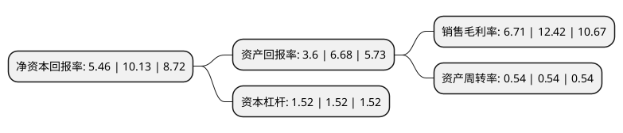

> 本页面由自动化程序生成于 2022年5月20日 01:30
> 内容可能存在错误，如有bug请提交issue至：https://github.com/Eroleice/doc-pi/issues
{.is-warning}

# 上市公司基本情况

## 基本资料

三角轮胎股份有限公司（以下简称“三角轮胎”）成立于2001年02月22日，威海市。于2016年09月09日在上交所主板上市。

三角轮胎注册资本80,000万元，主营业务为各种轮胎的研发，制造和销售。主要产品包括商用车胎，乘用车胎，斜交工程胎，子午工程胎和子午工程巨胎5大类，近4，200个品种。以下是详细信息：

- 公司名称: 三角轮胎股份有限公司
- 股票代码: 601163.SH
- 所在地: 山东 - 威海市
- 成立日期: 2001年02月22日
- 注册资本: 80,000万元
- 法定代表人: 丁木
- 主营业务: 主营业务为各种轮胎的研发，制造和销售主要产品包括商用车胎，乘用车胎，斜交工程胎，子午工程胎和子午工程巨胎5大类，近4，200个品种
- 公司官网: www.triangle.com.cn
- 公司介绍: 公司是国内轮胎制造行业的领先企业，业务范围覆盖商用车轮胎、乘用车轮胎、斜交工程胎、子午工程胎和巨胎等。公司建有国家级技术开发中心、国家级工业设计中心、博士后科研工作站、美国技术研发中心，承建轮胎行业唯一的国家工程实验室，是中国轮胎产业技术创新战略联盟主体。公司始终专注于轮胎科技创新，致力于研发、设计、制造和销售适于全球不同地域、不同消费者、不同使用要求的道路和非道路轮胎产品。公司是国家高新技术企业，是中国子午胎技术的先行者和领导者，拥有的国内外专利技术数量居同行业前列，同时成为国家标准和行业标准的主要制订者。三角已经成为工程子午胎和巨胎全球供应商之一，与卡特彼勒、特雷克斯、斗山、现代、沃尔沃等公司建立全球合作。

## 股东及高管情况

上市公司第一大股东为三角集团有限公司，持股454,739,750股，占比56.84%，为上市公司实际控制人。

截至2022年03月31日，上市公司的前十大股东中，共有6名自然人股东，4名机构股东，其中5%以上大股东共有1名。上市公司前十大股东明细如下：

> 截至2022年03月31日，上市公司前十大股东信息如下：

| 股东名称 | 持股数量（股） | 持股比例 |
| --- | --- | --- |
| 三角集团有限公司 | 454,739,750 | 56.84% |
| 中国重汽集团济南投资有限公司 | 35,065,717 | 4.38% |
| 单国玲 | 15,332,750 | 1.92% |
| 丁木 | 13,957,525 | 1.74% |
| 王福凤 | 13,857,525 | 1.73% |
| 侯汝成 | 13,337,480 | 1.67% |
| 王文浩 | 6,938,220 | 0.87% |
| 陈青山 | 3,360,000 | 0.42% |
| 中国国际金融香港资产管理有限公司-客户资金 | 3,276,422 | 0.41% |
| 工银资管(全球)有限公司-客户资金(交易所) | 3,056,500 | 0.38% |

## 利润表分析

上市公司2021年总收入为89.54亿元，净利润为6亿元，实现盈利。

## 杜邦分析

> 数据列示周期：2021年 | 2020年 | 2019年
{.is-info}

上市公司的净资产收益率在近一年有所下降，下降幅度为-46.1%，其变化情况分解如下：
- 上市公司的销售毛利率在近一年下降了-45.97%，可能是生产效率的下降、商品原材料价格上涨或商品价格的下跌所致。
- 上市公司的资产周转率在近一年下降了0%，可能是源自于更慢的销售回款或库存管理效果下降。
- 上市公司的财务杠杆比率在近一年下降了0%，可能是减少负债降低财务费用。

