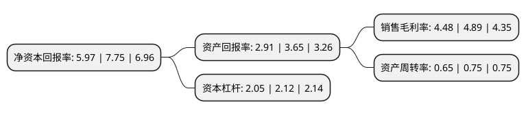

> 本页面由自动化程序生成于 2022年5月20日 01:30
> 内容可能存在错误，如有bug请提交issue至：https://github.com/Eroleice/doc-pi/issues
{.is-warning}

# 上市公司基本情况

## 基本资料

长春英利汽车工业股份有限公司（以下简称“英利汽车”）成立于2006年12月21日，长春市。于2021年04月15日在上交所主板上市。

英利汽车注册资本149,425.316万元，主营业务为车身结构零部件及防撞系统零部件的设计，研发，制造及销售，主要产品包含金属零部件和非金属零部件两大类以下是详细信息：

- 公司名称: 长春英利汽车工业股份有限公司
- 股票代码: 601279.SH
- 所在地: 吉林 - 长春市
- 成立日期: 2006年12月21日
- 注册资本: 149,425.316万元
- 法定代表人: 林启彬
- 主营业务: 主营业务为车身结构零部件及防撞系统零部件的设计，研发，制造及销售，主要产品包含金属零部件和非金属零部件两大类
- 公司官网: www.engley.com
- 公司介绍: 公司专注于实现汽车零部件的轻量化，主营业务为车身结构零部件及防撞系统零部件的设计、研发、制造及销售，主要产品包含金属零部件和非金属零部件两大类，金属零部件包括仪表板骨架、防撞梁、门槛、EV电池下壳体以及其他车身冲压件等；非金属零部件包括前端框架、车底护板、备胎仓、EV电池上壳体、电瓶托盘、轮罩等。除汽车零部件外，公司也生产少量汽车零部件相关的模具。公司建立了研发本部，具备了较强的产品同步开发和试验评价能力，并能够有效控制产品成本，能够满足整车制造商不同阶段的开发要求。目前，公司业务在汽车工业较为发达的吉林省、辽宁省、天津市、江苏省、浙江省、四川省、湖南省、山东省和广东省等地均有布局，已在华南、华中、华北、华东以及东北地区建立全面的生产配套网络，公司业务布局与客户地域分布相匹配。公司主要客户为中高端品牌，包括一汽大众、北京奔驰、上汽大众、上汽通用、吉利汽车、沃尔沃亚太、华晨宝马、广汽菲克等多个知名整车制造商。

## 股东及高管情况

上市公司第一大股东为开曼英利工业股份有限公司，持股1,298,704,372股，占比86.91%，为上市公司实际控制人。

截至2022年03月31日，上市公司的前十大股东中，共有4名自然人股东，4名机构股东，2个产品账户，其中5%以上大股东共有1名。上市公司前十大股东明细如下：

> 截至2022年03月31日，上市公司前十大股东信息如下：

| 股东名称 | 持股数量（股） | 持股比例 |
| --- | --- | --- |
| 开曼英利工业股份有限公司 | 1,298,704,372 | 86.91% |
| 吉林省银河生物产业创业投资基金合伙企业(有限合伙) | 11,132,683 | 0.75% |
| 中信证券投资有限公司 | 9,277,126 | 0.62% |
| 金石智娱股权投资(杭州)合伙企业(有限合伙) | 9,277,126 | 0.62% |
| 海通吉禾私募股权投资基金管理有限责任公司-海通(吉林)股权投资基金合伙企业(有限合伙) | 8,906,146 | 0.6% |
| 上海昂巨资产管理有限公司-上海胡桐投资中心(有限合伙) | 7,421,788 | 0.5% |
| 许志勇 | 601,500 | 0.04% |
| 蔡占岐 | 480,000 | 0.03% |
| 邹敬园 | 438,400 | 0.03% |
| 戴庆康 | 432,300 | 0.03% |

## 利润表分析

上市公司2021年总收入为45.95亿元，净利润为2.05亿元，实现盈利。

## 杜邦分析

> 数据列示周期：2021年 | 2020年 | 2019年
{.is-info}

上市公司的净资产收益率在近一年有所下降，下降幅度为-22.97%，其变化情况分解如下：
- 上市公司的销售毛利率在近一年下降了-8.38%，可能是生产效率的下降、商品原材料价格上涨或商品价格的下跌所致。
- 上市公司的资产周转率在近一年下降了-13.33%，可能是源自于更慢的销售回款或库存管理效果下降。
- 上市公司的财务杠杆比率在近一年下降了-3.3%，可能是减少负债降低财务费用。

