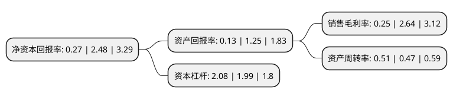

> 本页面由自动化程序生成于 2022年5月20日 01:31
> 内容可能存在错误，如有bug请提交issue至：https://github.com/Eroleice/doc-pi/issues
{.is-warning}

# 上市公司基本情况

## 基本资料

江苏通用科技股份有限公司（以下简称“通用股份”）成立于2002年08月19日，无锡市。于2016年09月19日在上交所主板上市。

通用股份注册资本107,479.667万元，主营业务:全钢子午胎，斜交胎的研发，生产和销售;主要产品:全钢子午胎和斜交胎两大类。以下是详细信息：

- 公司名称: 江苏通用科技股份有限公司
- 股票代码: 601500.SH
- 所在地: 江苏 - 无锡市
- 成立日期: 2002年08月19日
- 注册资本: 107,479.667万元
- 法定代表人: 顾萃
- 主营业务: 主营业务:全钢子午胎，斜交胎的研发，生产和销售;主要产品:全钢子午胎和斜交胎两大类
- 公司官网: www.ty-tyre.com
- 公司介绍: 公司是一家专注各种轮胎研发、生产和销售的现代化高新技术企业。公司拥有稳定、专业的营销团队和完善的营销网络，在全国开发了万余家形象店、招牌店，是中国卡车轮胎替换市场的领先企业。公司旗下拥有“千里马、赤兔马、骐马、喜达通、通运”等知名品牌，其中“千里马”载重汽车轮胎被评为江苏省名牌产品，“千里马”品牌荣获国家工商总局授予“中国驰名商标”称号。公司属于江苏省高新技术企业，承担国家和江苏省火炬计划等项目，成立了江苏省全钢载重子午线轮胎工程技术研究中心，专门从事轮胎等高分子材料领域的高新技术研发。公司先后通过国家强制性认证(3C认证)、欧盟经济委员会ECE产品认证、ISO9001：2008版国家质量认证体系、美国DOT认证、ISO/TS16949：2009美国质量认证、ISO14001：2004环境管理体系认证等。

## 股东及高管情况

上市公司第一大股东为红豆集团有限公司，持股539,848,300股，占比50.23%，为上市公司实际控制人。

截至2022年03月31日，上市公司的前十大股东中，共有3名自然人股东，4名机构股东，3个产品账户，其中5%以上大股东共有2名。上市公司前十大股东明细如下：

> 截至2022年03月31日，上市公司前十大股东信息如下：

| 股东名称 | 持股数量（股） | 持股比例 |
| --- | --- | --- |
| 红豆集团有限公司 | 539,848,300 | 50.23% |
| 安庆市同安产业招商投资基金(有限合伙) | 106,935,126 | 9.95% |
| 国联信托股份有限公司 | 26,542,100 | 2.47% |
| 无锡红豆国际投资有限公司 | 20,000,000 | 1.86% |
| 顾萃 | 7,739,800 | 0.72% |
| 上海宽投资产管理有限公司-宽投天王星25号私募证券投资基金 | 7,696,300 | 0.72% |
| 宁波宁聚资产管理中心(有限合伙)-宁聚量化多策略证券投资基金 | 4,760,000 | 0.44% |
| 浙商产融(武汉)投资有限公司 | 4,380,500 | 0.41% |
| 鲍黎平 | 3,077,440 | 0.29% |
| 何芳 | 2,599,000 | 0.24% |

## 利润表分析

上市公司2021年总收入为42.55亿元，净利润为0.1亿元，实现盈利。

## 杜邦分析

> 数据列示周期：2021年 | 2020年 | 2019年
{.is-info}

上市公司的净资产收益率在近一年有所下降，下降幅度为-89.11%，其变化情况分解如下：
- 上市公司的销售毛利率在近一年下降了-90.53%，可能是生产效率的下降、商品原材料价格上涨或商品价格的下跌所致。
- 上市公司的资产周转率在近一年上升了8.51%，可能是源自于更快的销售回款或库存管理效果提升。
- 上市公司的财务杠杆比率在近一年上升了4.52%，可能是增加负债扩大生产规模。

